# Sessions 6-8: Agile Development (6 hours)

## Learning Objectives
- Understand the Agile philosophy and principles
- Learn Scrum framework roles, events, and artifacts
- Understand Extreme Programming (XP) practices
- Master Atlassian Jira for project management
- Apply Agile methodology to web development

---

## Introduction to Agile Development

### What is Agile?

**Agile** is an iterative approach to project management and software development that helps teams deliver value to customers faster with fewer headaches.

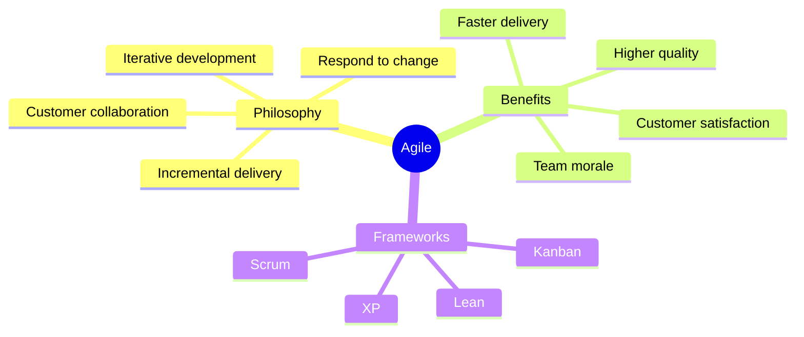

### Traditional vs Agile

| Aspect | Traditional (Waterfall) | Agile |
|--------|------------------------|-------|
| **Approach** | Sequential, linear | Iterative, incremental |
| **Requirements** | Fixed upfront | Evolving |
| **Delivery** | Single delivery at end | Continuous releases |
| **Customer Involvement** | Limited | Continuous |
| **Documentation** | Extensive | Just enough |
| **Change** | Resistance | Embraced |
| **Testing** | End phase | Continuous |
| **Risk** | High (late discovery) | Low (early feedback) |

---

## Agile Manifesto

### Four Core Values

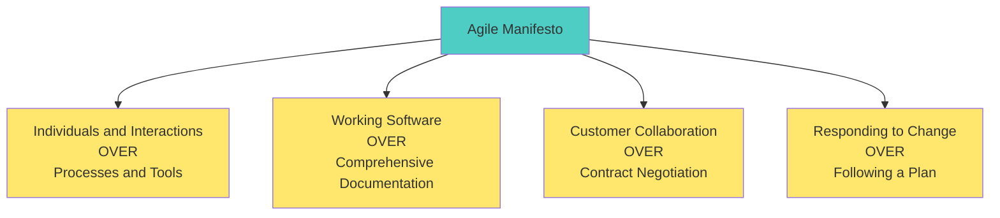

| Value | Emphasis | Not Ignoring |
|-------|----------|--------------|
| **Individuals and Interactions** | Human communication | Processes still matter |
| **Working Software** | Functional product | Documentation where needed |
| **Customer Collaboration** | Partnership | Contracts protect both parties |
| **Responding to Change** | Adaptability | Plans provide direction |

### 12 Agile Principles

| # | Principle | Focus |
|---|-----------|-------|
| 1 | Highest priority is customer satisfaction through early and continuous delivery | **Customer Value** |
| 2 | Welcome changing requirements, even late in development | **Adaptability** |
| 3 | Deliver working software frequently (weeks rather than months) | **Frequent Delivery** |
| 4 | Business people and developers must work together daily | **Collaboration** |
| 5 | Build projects around motivated individuals | **Trust & Support** |
| 6 | Most efficient method is face-to-face conversation | **Communication** |
| 7 | Working software is the primary measure of progress | **Results Focus** |
| 8 | Agile processes promote sustainable development | **Pace** |
| 9 | Continuous attention to technical excellence and good design | **Quality** |
| 10 | Simplicity—maximizing work not done—is essential | **Simplicity** |
| 11 | Best architectures emerge from self-organizing teams | **Self-Organization** |
| 12 | Regular reflection on how to become more effective | **Improvement** |

---

## Agile Development Components

### Key Agile Components

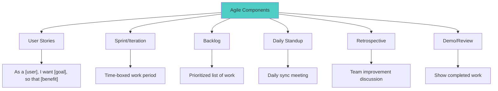

### User Stories

Format:
```
As a [type of user],
I want [goal/desire],
So that [benefit/reason].
```

**Examples:**

| User Story | Acceptance Criteria |
|------------|---------------------|
| As a customer, I want to reset my password so that I can regain access if I forget it | - Reset link sent to email<br>- Link expires in 24 hours<br>- Password must meet complexity rules |
| As an admin, I want to view sales reports so that I can track business performance | - Filter by date range<br>- Export to PDF/Excel<br>- Shows charts and graphs |

### Story Points & Estimation

| Story Points | Relative Effort | Example |
|--------------|-----------------|---------|
| 1 | Very small | Change button text |
| 2 | Small | Add new field to form |
| 3 | Medium | New report page |
| 5 | Large | User authentication |
| 8 | Very large | Payment integration |
| 13 | Extra large | New module |

---

## Benefits of Agile

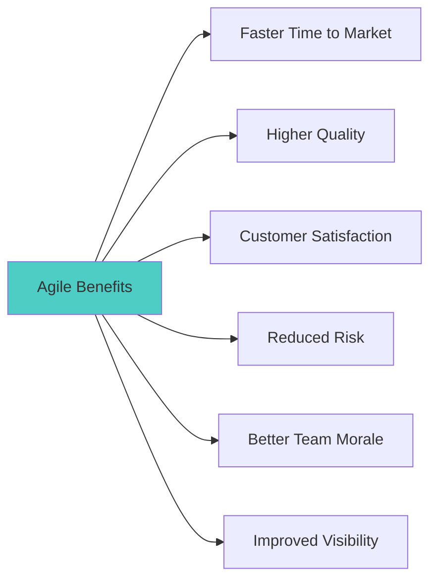

| Benefit | Description |
|---------|-------------|
| **Faster Delivery** | Working software delivered in weeks |
| **Flexibility** | Adapt to changing requirements |
| **Quality** | Continuous testing and feedback |
| **Transparency** | Regular demos and progress updates |
| **Risk Reduction** | Early identification of issues |
| **Customer Focus** | Continuous stakeholder involvement |
| **Team Empowerment** | Self-organizing teams |

---

## Agile Tools for Web Development

| Tool | Purpose | Key Features |
|------|---------|--------------|
| **Jira** | Project Management | Sprints, backlog, boards, reports |
| **Trello** | Kanban Boards | Simple cards, lists, drag-drop |
| **Azure DevOps** | Full ALM | Repos, pipelines, boards, tests |
| **GitHub Projects** | Issue Tracking | Integrated with repos |
| **Slack** | Communication | Channels, integrations |
| **Confluence** | Documentation | Wiki, templates |

---

## Scrum Framework

### Scrum Overview

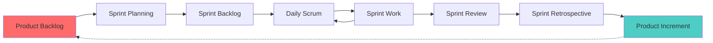

### Scrum Roles

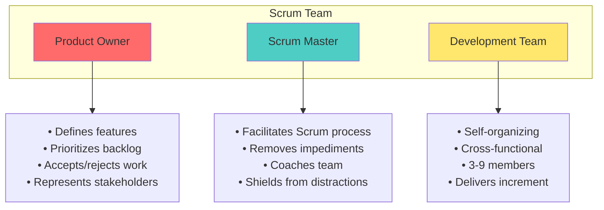

| Role | Responsibilities |
|------|------------------|
| **Product Owner** | • Define product vision<br/>• Manage product backlog<br/>• Prioritize features<br/>• Accept/reject work<br/>• Communicate with stakeholders |
| **Scrum Master** | • Facilitate Scrum events<br/>• Remove blockers<br/>• Coach the team<br/>• Protect the team<br/>• Ensure Scrum practices |
| **Development Team** | • Deliver product increments<br/>• Self-organize<br/>• Cross-functional skills<br/>• Estimate work<br/>• Make technical decisions |

### Scrum Events

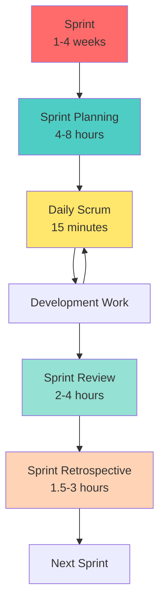

| Event | Duration | Purpose | Participants |
|-------|----------|---------|--------------|
| **Sprint** | 1-4 weeks | Time-boxed iteration | Entire team |
| **Sprint Planning** | Max 8 hours | Plan sprint work | PO, SM, Dev Team |
| **Daily Scrum** | 15 minutes | Sync and plan day | Dev Team, SM |
| **Sprint Review** | Max 4 hours | Demo completed work | All + Stakeholders |
| **Sprint Retrospective** | Max 3 hours | Improve process | PO, SM, Dev Team |

### Daily Scrum (Standup)

**Three Questions:**

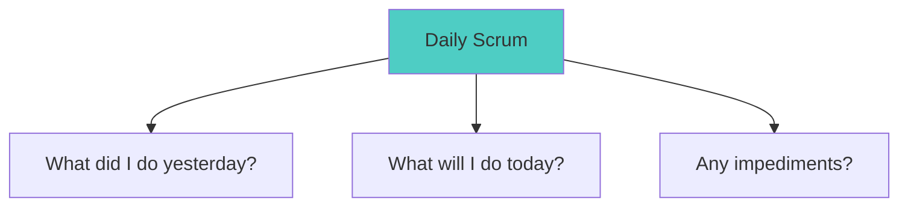

**Rules:**
- Same time, same place daily
- Maximum 15 minutes
- Standing (traditionally)
- Focus on work, not status

### Scrum Artifacts

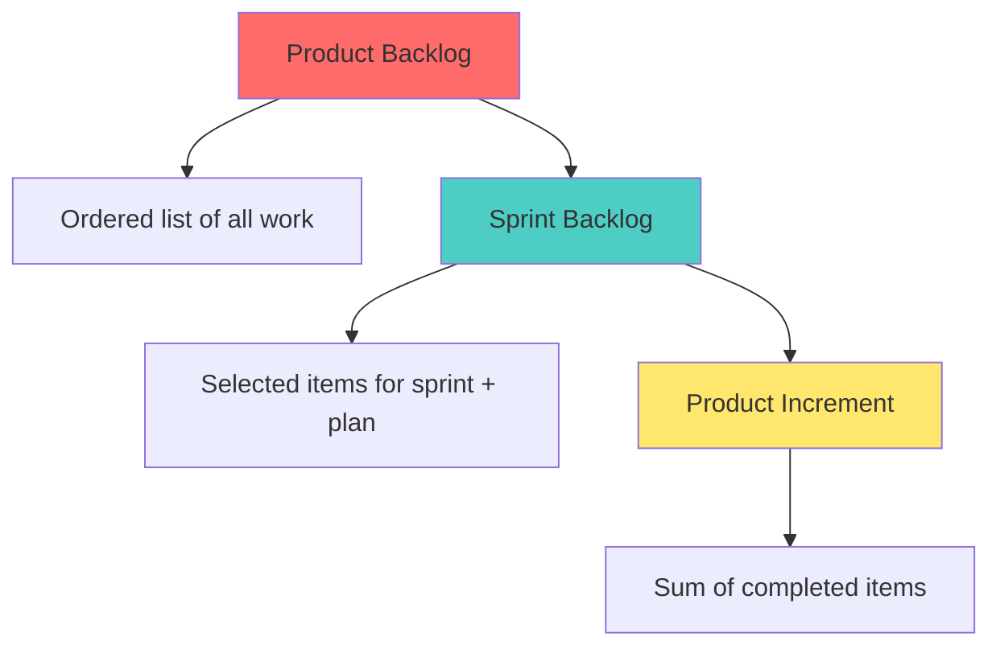

| Artifact | Description | Owner |
|----------|-------------|-------|
| **Product Backlog** | Ordered list of everything needed in product | Product Owner |
| **Sprint Backlog** | Items selected for sprint + delivery plan | Development Team |
| **Product Increment** | Sum of all completed backlog items | Team |

### Sprint Retrospective Questions

| Category | Sample Questions |
|----------|------------------|
| **What went well?** | - Good collaboration<br/>- Met sprint goal<br/>- Quality code |
| **What could be improved?** | - Better testing<br/>- More clear requirements<br/>- Communication |
| **Action items** | - Add code review checklist<br/>- Daily PO availability<br/>- Improve CI pipeline |

---

## Extreme Programming (XP)

### XP Overview

**Extreme Programming** takes proven practices to "extreme" levels for rapid, high-quality software development.

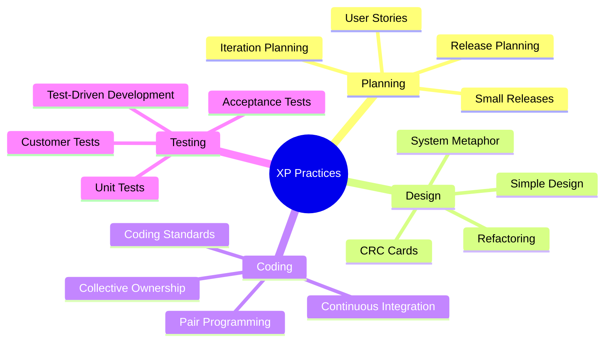

### Key XP Practices

| Practice | Description |
|----------|-------------|
| **Pair Programming** | Two developers, one computer |
| **Test-Driven Development (TDD)** | Write tests before code |
| **Continuous Integration** | Integrate code multiple times daily |
| **Refactoring** | Improve code without changing behavior |
| **Simple Design** | Simplest solution that works |
| **Collective Code Ownership** | Anyone can modify any code |
| **Coding Standards** | Consistent code style |
| **40-Hour Week** | Sustainable pace |

### Pair Programming

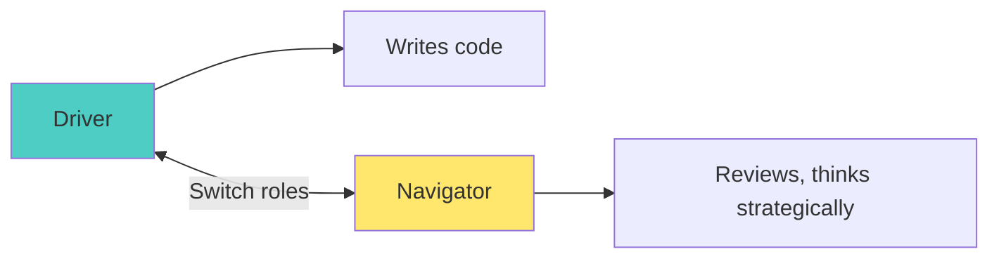

**Benefits:**
- Fewer bugs
- Knowledge sharing
- Better design
- Instant code review

### Test-Driven Development (TDD)

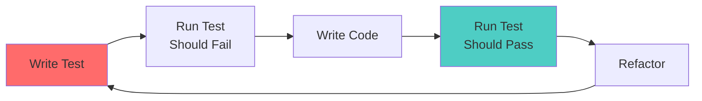

**Red-Green-Refactor Cycle:**
1. **Red**: Write failing test
2. **Green**: Write minimal code to pass
3. **Refactor**: Improve code quality

---

## Scrum vs XP Comparison

| Aspect | Scrum | XP |
|--------|-------|---|
| **Iteration Length** | 1-4 weeks | 1-2 weeks |
| **Change During Sprint** | Not encouraged | Allowed (swap equal-sized stories) |
| **Order of Features** | Product Owner decides | Team can change |
| **Engineering Practices** | Not prescribed | Pair programming, TDD, refactoring |
| **Focus** | Project management | Engineering practices |
| **Team Size** | 3-9 developers | 2-12 developers |

---

## Atlassian Jira

### Jira Overview

**Jira** is the #1 agile project management tool used by teams to plan, track, and release software.

### Jira Concepts

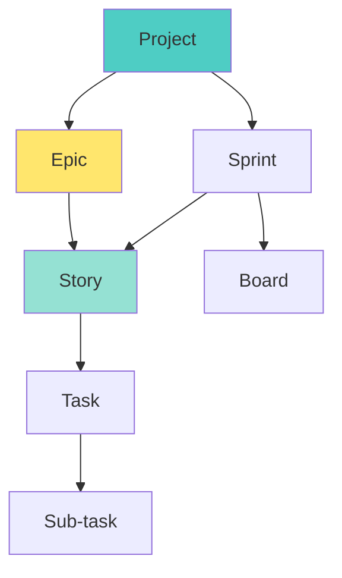

| Concept | Description | Example |
|---------|-------------|---------|
| **Project** | Container for all work | "E-Commerce Website" |
| **Epic** | Large body of work | "User Authentication" |
| **Story** | User story/requirement | "As a user, I want to login" |
| **Task** | Unit of work | "Create login form" |
| **Sub-task** | Breakdown of task | "Add email validation" |
| **Sprint** | Time-boxed iteration | "Sprint 5 (Jan 1-14)" |
| **Board** | Visual workflow | Scrum/Kanban board |

### Creating a Project in Jira

1. **Navigate**: Projects → Create Project
2. **Choose Template**: Scrum, Kanban, or Basic
3. **Configure**: Set project name, key, lead
4. **Setup Board**: Configure columns and swim lanes

### Jira Workflow

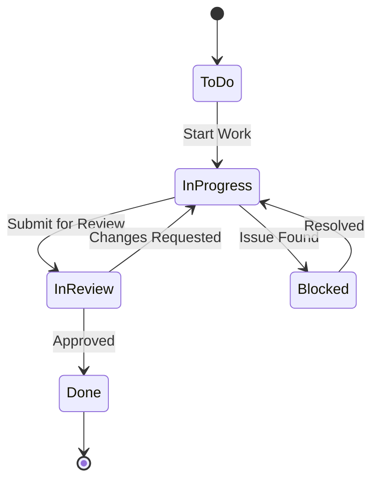

### Creating Sprint with Tasks

**Steps:**
1. **Create Epic**: Large feature (e.g., "Shopping Cart")
2. **Add Stories**: Break epic into user stories
3. **Add Tasks/Sub-tasks**: Technical tasks for each story
4. **Estimate**: Assign story points
5. **Create Sprint**: Define sprint duration
6. **Add to Sprint**: Move stories to sprint
7. **Start Sprint**: Set goals, begin work

### Jira Board Views

| View | Purpose |
|------|---------|
| **Backlog** | Manage and prioritize stories |
| **Active Sprint** | Current sprint board |
| **Reports** | Burndown, velocity, cumulative flow |
| **Timeline** | Gantt-style view |

---

## Case Study: Web Application Using Agile

### Project: E-Commerce Website

**Team:**
- 1 Product Owner
- 1 Scrum Master
- 4 Developers

**Sprint Length:** 2 weeks

### Sprint 0: Setup

| Task | Description |
|------|-------------|
| Setup development environment | IDE, Git, Node.js |
| Create project repository | GitHub with branching strategy |
| Setup Jira project | Create board, add initial stories |
| Define Definition of Done | Acceptance criteria |

### Product Backlog (Initial)

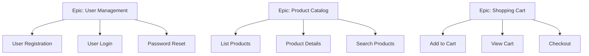

### Sprint 1 Execution

**Sprint Goal:** Complete user registration and login

| Day | Activity |
|-----|----------|
| Day 1 | Sprint Planning - Select stories, create tasks |
| Day 2-3 | Develop registration backend |
| Day 4-5 | Develop login functionality |
| Day 6-7 | Frontend integration |
| Day 8 | Testing and bug fixes |
| Day 9 | Sprint Review - Demo to stakeholders |
| Day 10 | Sprint Retrospective |

### Sprint Burndown Chart

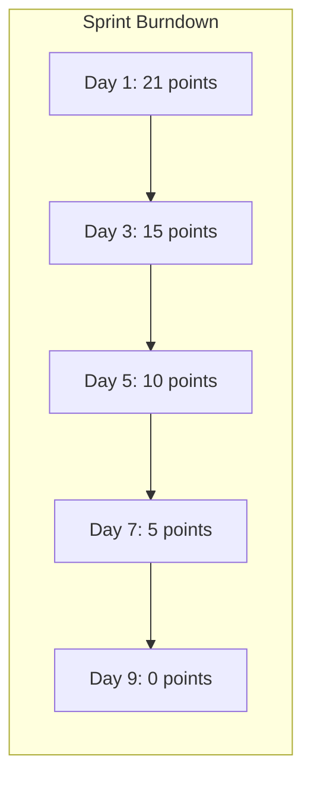

### Sprint Retrospective Example

| What Went Well | What to Improve | Actions |
|----------------|-----------------|---------|
| Good team collaboration | Need better test coverage | Add unit tests for all new code |
| Met sprint goal | Requirements unclear initially | PO to provide acceptance criteria upfront |
| Clean code reviews | Deployment issues | Setup CI/CD pipeline |

---

## CCEE Exam Focus Points

> [!IMPORTANT]
> **Key Concepts for MCQs:**
> - Four Agile Manifesto values
> - Scrum roles: Product Owner, Scrum Master, Dev Team
> - Scrum events: Sprint, Planning, Daily, Review, Retro
> - Scrum artifacts: Product Backlog, Sprint Backlog, Increment
> - User story format: "As a..., I want..., So that..."
> - XP practices: Pair Programming, TDD, CI
> - Daily Scrum: 15 minutes, 3 questions

> [!TIP]
> **Common Exam Questions:**
> - Who prioritizes the backlog? (Product Owner)
> - What is sprint duration? (1-4 weeks)
> - Daily Scrum duration? (15 minutes)
> - XP practice where two developers work together? (Pair Programming)
> - Write test before code? (TDD)

---

## Quick Reference

### Scrum Cheat Sheet

| Term | Definition |
|------|------------|
| Sprint | Time-boxed iteration (1-4 weeks) |
| Velocity | Story points completed per sprint |
| Burndown | Chart showing work remaining |
| Epic | Large user story |
| Spike | Research/exploration task |
| Grooming | Refining/estimating backlog |

### Agile vs Waterfall Quick Compare

| Waterfall | Agile |
|-----------|-------|
| Sequential | Iterative |
| Rigid | Flexible |
| Document-heavy | Working software focus |
| Late feedback | Continuous feedback |

---

*End of Sessions 6-8: Agile Development*
