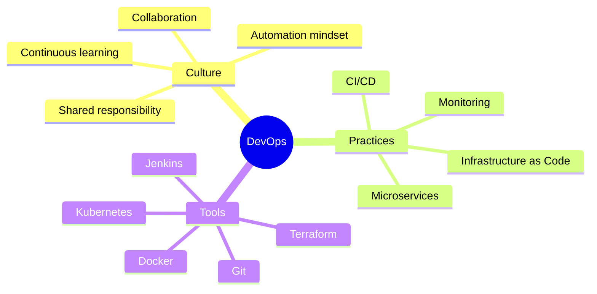
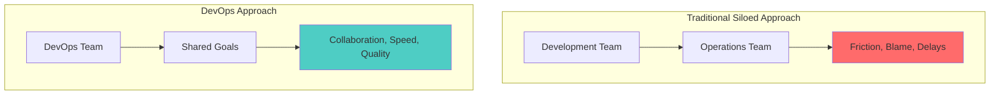
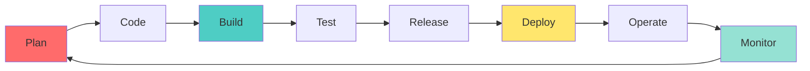
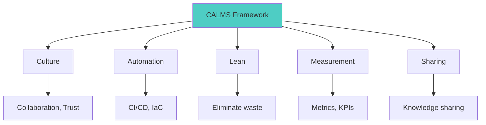
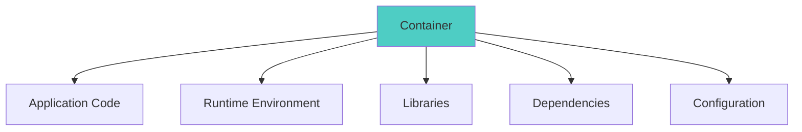
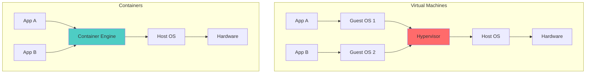
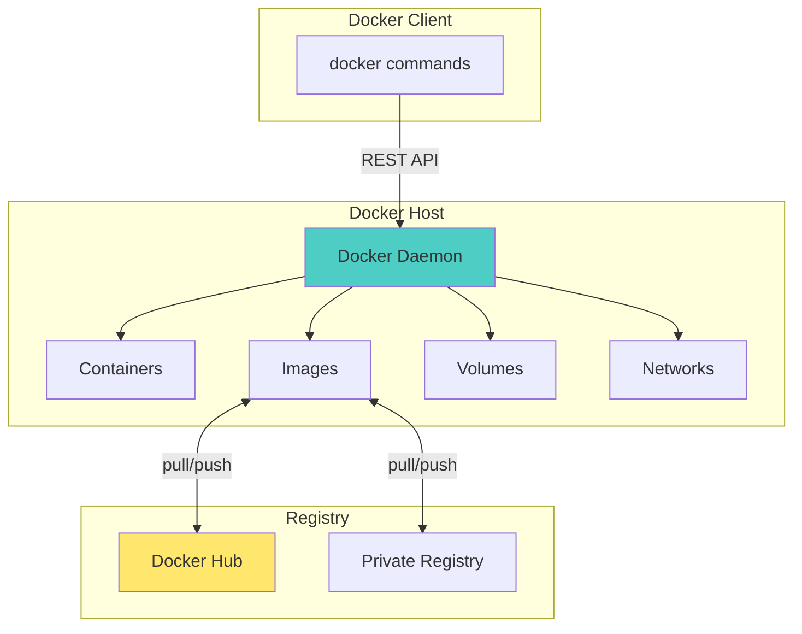
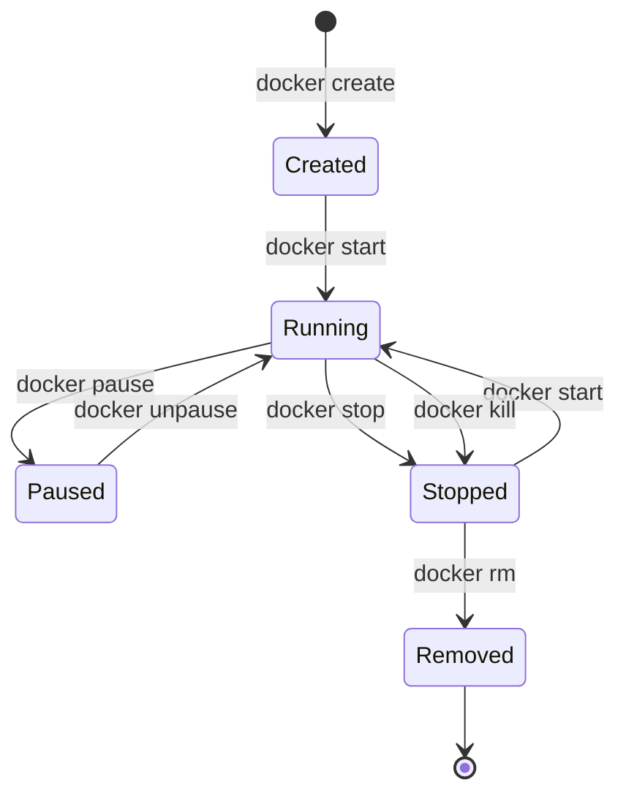
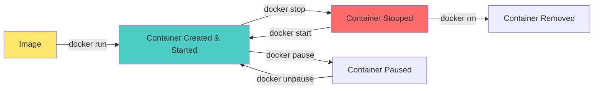

# Sessions 9-10: DevOps & Docker (4 hours)

## Learning Objectives
- Understand DevOps philosophy and culture
- Learn DevOps ecosystem and phases
- Master containerization concepts
- Build and manage Docker containers
- Understand Docker image lifecycle

---

## Introduction to DevOps

### What is DevOps?

**DevOps** = **Dev**elopment + **Op**erations

A culture, set of practices, and tools that increase an organization's ability to deliver applications and services at high velocity.



### Traditional vs DevOps



| Aspect | Traditional | DevOps |
|--------|-------------|--------|
| **Team Structure** | Siloed (Dev vs Ops) | Integrated teams |
| **Deployment** | Manual, infrequent | Automated, frequent |
| **Feedback** | Slow | Fast, continuous |
| **Responsibility** | "Throw over the wall" | Shared ownership |
| **Risk** | Big releases = high risk | Small releases = low risk |
| **Recovery** | Hours/Days | Minutes |

---

## DevOps Ecosystem

### DevOps Toolchain



| Phase | Tools | Purpose |
|-------|-------|---------|
| **Plan** | Jira, Trello, Azure Boards | Project management |
| **Code** | Git, GitHub, GitLab | Version control |
| **Build** | Maven, Gradle, npm | Compile, package |
| **Test** | JUnit, Selenium, Jest | Automated testing |
| **Release** | Jenkins, GitLab CI, CircleCI | CI/CD pipelines |
| **Deploy** | Docker, Kubernetes, Ansible | Deployment automation |
| **Operate** | Terraform, Puppet, Chef | Infrastructure management |
| **Monitor** | Prometheus, Grafana, ELK | Logging, monitoring |

### DevOps Practices

| Practice | Description |
|----------|-------------|
| **Continuous Integration (CI)** | Frequently merge code + automated build/test |
| **Continuous Delivery (CD)** | Always in deployable state |
| **Continuous Deployment** | Automatic production deployment |
| **Infrastructure as Code (IaC)** | Manage infra using code |
| **Configuration Management** | Consistent system configuration |
| **Monitoring & Logging** | Observe system behavior |
| **Microservices** | Small, independent services |

---

## DevOps Phases (CALMS)



| Pillar | Description |
|--------|-------------|
| **Culture** | Shared responsibility, collaboration |
| **Automation** | Automate repetitive tasks |
| **Lean** | Eliminate waste, continuous improvement |
| **Measurement** | Track metrics for improvement |
| **Sharing** | Share knowledge and tools |

### DevOps Metrics

| Metric | Description | Target |
|--------|-------------|--------|
| **Deployment Frequency** | How often you deploy | Multiple times/day |
| **Lead Time** | Code commit to production | < 1 day |
| **MTTR** | Mean Time to Recovery | < 1 hour |
| **Change Failure Rate** | % of changes causing failures | < 15% |

---

## Introduction to Containerization

### What is Containerization?

**Containerization** is packaging an application with all its dependencies into a container for consistent deployment.



### Virtual Machines vs Containers



| Aspect | Virtual Machines | Containers |
|--------|------------------|------------|
| **Size** | GBs | MBs |
| **Startup Time** | Minutes | Seconds |
| **OS** | Full OS per VM | Shared host OS |
| **Performance** | Overhead | Near-native |
| **Isolation** | Strong (hardware level) | Process level |
| **Resource Usage** | High | Low |
| **Portability** | Limited | High |
| **Density** | Low (few VMs per host) | High (many containers) |

### Benefits of Containers

```mermaid
mindmap
  root((Container Benefits))
    Portability
      Works everywhere
      Dev to Prod consistency
    Efficiency
      Lightweight
      Fast startup
      Less resources
    Isolation
      App separation
      Security
    Scalability
      Quick scaling
      Microservices
    DevOps
      CI/CD friendly
      Reproducible builds
```



---

## Introduction to Docker

### What is Docker?

**Docker** is an open-source platform for developing, shipping, and running applications in containers.

### Docker Architecture



### Docker Components

| Component | Description |
|-----------|-------------|
| **Docker Engine** | Runtime that manages containers |
| **Docker Client** | CLI to interact with Docker |
| **Docker Daemon** | Background service managing containers |
| **Docker Image** | Read-only template for containers |
| **Docker Container** | Running instance of an image |
| **Docker Registry** | Storage for Docker images |
| **Docker Hub** | Public registry |
| **Dockerfile** | Script to build images |

---

## Creating Docker Images with Dockerfile

### What is a Dockerfile?

A **Dockerfile** is a text file with instructions to build a Docker image.

### Dockerfile Syntax

```dockerfile
# Base image
FROM node:18-alpine

# Maintainer info
LABEL maintainer="your.email@example.com"

# Set working directory
WORKDIR /app

# Copy package files
COPY package*.json ./

# Install dependencies
RUN npm install

# Copy application code
COPY . .

# Expose port
EXPOSE 3000

# Environment variable
ENV NODE_ENV=production

# Default command
CMD ["node", "server.js"]
```

### Dockerfile Instructions

| Instruction | Purpose | Example |
|-------------|---------|---------|
| `FROM` | Base image | `FROM ubuntu:22.04` |
| `WORKDIR` | Set working directory | `WORKDIR /app` |
| `COPY` | Copy files from host | `COPY . /app` |
| `ADD` | Copy + extract archives | `ADD app.tar.gz /app` |
| `RUN` | Execute command (build time) | `RUN apt-get update` |
| `CMD` | Default command (run time) | `CMD ["python", "app.py"]` |
| `ENTRYPOINT` | Main executable | `ENTRYPOINT ["java", "-jar"]` |
| `EXPOSE` | Document port | `EXPOSE 8080` |
| `ENV` | Set environment variable | `ENV DB_HOST=localhost` |
| `VOLUME` | Create mount point | `VOLUME ["/data"]` |
| `ARG` | Build-time variable | `ARG VERSION=1.0` |
| `USER` | Set user | `USER appuser` |

### RUN vs CMD vs ENTRYPOINT

| Instruction | When Executed | Purpose |
|-------------|---------------|---------|
| `RUN` | Build time | Install packages, setup |
| `CMD` | Container start | Default command (overridable) |
| `ENTRYPOINT` | Container start | Main command (not easily overridden) |

### Multi-Stage Build

```dockerfile
# Build stage
FROM maven:3.8-jdk-11 AS build
WORKDIR /app
COPY pom.xml .
COPY src ./src
RUN mvn clean package -DskipTests

# Runtime stage
FROM openjdk:11-jre-slim
WORKDIR /app
COPY --from=build /app/target/*.jar app.jar
EXPOSE 8080
CMD ["java", "-jar", "app.jar"]
```

**Benefits:**
- Smaller final image
- Build tools not in production
- Better security

---

## Container Lifecycle

### Container States



### Lifecycle Commands Flow



---

## Essential Docker Commands

### Image Commands

```bash
# List images
docker images
docker image ls

# Pull image from registry
docker pull nginx:latest
docker pull ubuntu:22.04

# Build image from Dockerfile
docker build -t myapp:1.0 .
docker build -t myapp:latest -f Dockerfile.prod .

# Tag image
docker tag myapp:1.0 username/myapp:1.0

# Push image to registry
docker push username/myapp:1.0

# Remove image
docker rmi nginx:latest
docker image rm nginx:latest

# Remove unused images
docker image prune
docker image prune -a
```

### Container Commands

```bash
# List running containers
docker ps
docker container ls

# List all containers
docker ps -a
docker container ls -a

# Run container
docker run nginx                       # Foreground
docker run -d nginx                    # Detached (background)
docker run -d --name web nginx         # With name
docker run -d -p 8080:80 nginx         # Port mapping
docker run -d -p 8080:80 -p 443:443 nginx  # Multiple ports
docker run -d -v /host/path:/container/path nginx  # Volume mount
docker run -d -e DB_HOST=localhost nginx  # Environment variable
docker run -it ubuntu bash             # Interactive terminal

# Stop container
docker stop web
docker stop $(docker ps -q)            # Stop all

# Start stopped container
docker start web

# Restart container
docker restart web

# Remove container
docker rm web
docker rm -f web                       # Force remove running

# Remove all stopped containers
docker container prune

# View logs
docker logs web
docker logs -f web                     # Follow logs
docker logs --tail 100 web             # Last 100 lines

# Execute command in running container
docker exec -it web bash
docker exec web ls -la

# Copy files
docker cp web:/app/log.txt ./log.txt
docker cp ./config.json web:/app/

# Inspect container
docker inspect web
```

### System Commands

```bash
# Docker info
docker info
docker version

# Disk usage
docker system df

# Clean up
docker system prune
docker system prune -a --volumes

# View events
docker events
```

---

## Lab Exercises

### Exercise 1: Install and Configure Docker

```bash
# Verify Docker installation
docker --version

# Run hello-world
docker run hello-world

# Check Docker info
docker info
```

### Exercise 2: Create Docker Image

**Project Structure:**
```
myapp/
├── Dockerfile
├── server.js
└── package.json
```

**server.js:**
```javascript
const http = require('http');
const server = http.createServer((req, res) => {
    res.writeHead(200);
    res.end('Hello from Docker!');
});
server.listen(3000);
console.log('Server running on port 3000');
```

**package.json:**
```json
{
    "name": "myapp",
    "version": "1.0.0",
    "main": "server.js",
    "scripts": {
        "start": "node server.js"
    }
}
```

**Dockerfile:**
```dockerfile
FROM node:18-alpine
WORKDIR /app
COPY package*.json ./
RUN npm install
COPY . .
EXPOSE 3000
CMD ["npm", "start"]
```

**Build and Run:**
```bash
# Build image
docker build -t myapp:1.0 .

# Run container
docker run -d -p 8080:3000 --name myapp myapp:1.0

# Test
curl http://localhost:8080
```

### Exercise 3: Docker Container Management

```bash
# List images
docker images

# List containers
docker ps -a

# Start container
docker start myapp

# Stop container
docker stop myapp

# Connect to container
docker exec -it myapp sh

# View logs
docker logs myapp

# Remove container
docker rm myapp

# Remove image
docker rmi myapp:1.0
```

### Exercise 4: Copy Website to Container

```bash
# Run nginx container
docker run -d -p 8080:80 --name webserver nginx

# Copy website files
docker cp ./website/. webserver:/usr/share/nginx/html/

# Verify
curl http://localhost:8080

# Or with volume mount
docker run -d -p 8080:80 -v $(pwd)/website:/usr/share/nginx/html nginx
```

---

## Docker Compose (Introduction)

### What is Docker Compose?

Tool for defining and running multi-container applications.

### docker-compose.yml Example

```yaml
version: '3.8'

services:
  web:
    build: .
    ports:
      - "8080:3000"
    environment:
      - DB_HOST=db
    depends_on:
      - db
    
  db:
    image: mysql:8.0
    environment:
      MYSQL_ROOT_PASSWORD: secret
      MYSQL_DATABASE: myapp
    volumes:
      - db-data:/var/lib/mysql

volumes:
  db-data:
```

### Compose Commands

```bash
# Start services
docker-compose up
docker-compose up -d

# Stop services
docker-compose down

# View logs
docker-compose logs

# List services
docker-compose ps

# Build/rebuild
docker-compose build
```

---

## Command Quick Reference

### Image Commands

| Command | Description |
|---------|-------------|
| `docker images` | List images |
| `docker pull <image>` | Download image |
| `docker build -t <name> .` | Build image |
| `docker rmi <image>` | Remove image |
| `docker image prune` | Remove unused images |

### Container Commands

| Command | Description |
|---------|-------------|
| `docker ps` | List running containers |
| `docker ps -a` | List all containers |
| `docker run <image>` | Create and start container |
| `docker start <container>` | Start stopped container |
| `docker stop <container>` | Stop running container |
| `docker rm <container>` | Remove container |
| `docker logs <container>` | View container logs |
| `docker exec -it <container> bash` | Execute command |

### Common Run Options

| Option | Description | Example |
|--------|-------------|---------|
| `-d` | Detached mode | `docker run -d nginx` |
| `--name` | Container name | `docker run --name web nginx` |
| `-p` | Port mapping | `docker run -p 8080:80 nginx` |
| `-v` | Volume mount | `docker run -v /host:/container nginx` |
| `-e` | Environment variable | `docker run -e DEBUG=1 nginx` |
| `-it` | Interactive terminal | `docker run -it ubuntu bash` |

---

## CCEE Exam Focus Points

> [!IMPORTANT]
> **Key Concepts for MCQs:**
> - DevOps = Development + Operations
> - CI = Continuous Integration (merge + build + test)
> - CD = Continuous Delivery/Deployment
> - Containers are lightweight, share host OS
> - Docker Image = Template, Container = Running instance
> - Dockerfile builds images
> - `docker run` = create + start
> - `-d` = detached, `-p` = port mapping, `-v` = volume

> [!TIP]
> **Common Exam Questions:**
> - Difference between VM and Container?
> - What does `docker build` do?
> - Which command runs container in background? (`-d`)
> - Dockerfile instruction to set base image? (`FROM`)
> - How to map port 80 to 8080? (`-p 8080:80`)

---

*End of Sessions 9-10: DevOps & Docker*
