# Session 1: Introduction to Operating Systems

## What is an Operating System?

An **Operating System (OS)** is system software that acts as an intermediary between computer hardware and application software/users.

### Key Characteristics:
- **System Software**: Manages hardware and provides services to applications
- **Resource Manager**: Allocates CPU, memory, I/O devices, and storage
- **Interface Provider**: Offers a user-friendly interface to interact with hardware

### How is OS Different from Application Software?

| Operating System | Application Software |
|-----------------|---------------------|
| Manages hardware resources | Uses resources provided by OS |
| Runs continuously | Runs when needed |
| Low-level operations | High-level operations |
| Platform-dependent | Often platform-independent |
| Examples: Windows, Linux | Examples: MS Word, Chrome |

### Why is OS Hardware Dependent?

> [!IMPORTANT]
> OS is hardware-dependent because it directly interacts with hardware components through device drivers and must be compiled for specific processor architectures (x86, ARM, etc.)

**Reasons:**
1. **Direct Hardware Access**: OS needs to know exact hardware specifications
2. **Device Drivers**: Hardware-specific code to control devices
3. **Instruction Set Architecture (ISA)**: Different CPUs have different instruction sets
4. **Memory Management**: Hardware-specific memory addressing

---

## Components of an Operating System

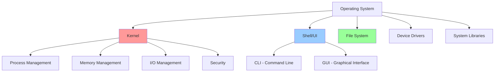

### 1. **Kernel** (Core Component)
- Heart of the OS
- Manages system resources
- Provides low-level services
- Types: Monolithic, Microkernel, Hybrid

### 2. **Shell/User Interface**
- **CLI (Command Line Interface)**: Text-based (e.g., Bash, CMD)
- **GUI (Graphical User Interface)**: Visual (e.g., Windows Explorer, GNOME)

### 3. **File System**
- Organizes and stores data
- Examples: NTFS, ext4, FAT32, APFS

### 4. **Device Drivers**
- Software that controls hardware devices
- Acts as translator between OS and hardware

### 5. **System Libraries**
- Pre-written code for common operations
- Examples: libc, glibc

---

## Basic Computer Organization for OS

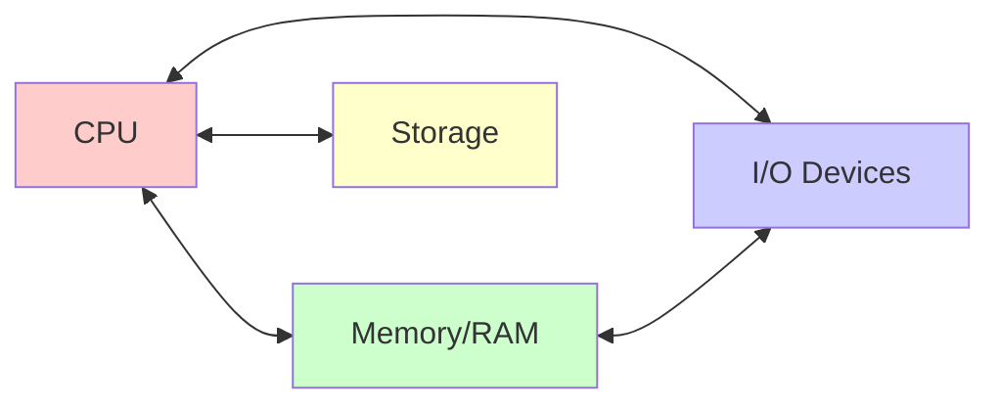

### Essential Components:

1. **CPU (Central Processing Unit)**
   - Executes instructions
   - Contains ALU, Control Unit, Registers
   - Operates in User Mode or Kernel Mode

2. **Memory (RAM)**
   - Temporary storage for running programs
   - Fast access, volatile

3. **Storage (Hard Disk/SSD)**
   - Permanent data storage
   - Slower than RAM, non-volatile

4. **I/O Devices**
   - Input: Keyboard, Mouse
   - Output: Monitor, Printer
   - Both: Network Card, USB

5. **Bus System**
   - Data Bus: Transfers data
   - Address Bus: Specifies memory locations
   - Control Bus: Carries control signals

---

## Examples of Operating Systems

### 1. **Desktop OS**
- **Windows** (10, 11): Most popular for personal computers
- **macOS**: Apple's desktop OS
- **Linux** (Ubuntu, Fedora): Open-source, customizable

**Characteristics:**
- User-friendly GUI
- Multi-tasking
- Support for wide range of applications

### 2. **Server OS**
- **Windows Server**: Enterprise-level server management
- **Linux Server** (RHEL, CentOS, Ubuntu Server): Web servers, databases
- **Unix** (Solaris, AIX): Legacy enterprise systems

**Characteristics:**
- High reliability and uptime
- Advanced security features
- Support for multiple concurrent users
- Network services (DNS, DHCP, Web servers)

### 3. **Mobile OS**
- **Android**: Google's Linux-based OS
- **iOS**: Apple's mobile OS
- **HarmonyOS**: Huawei's OS

**Characteristics:**
- Touch-optimized interface
- Power management for battery life
- App ecosystem
- Connectivity features (WiFi, Bluetooth, Cellular)

### 4. **Embedded OS**
- **Embedded Linux**: IoT devices, routers
- **VxWorks**: Industrial automation
- **FreeRTOS**: Microcontrollers

**Characteristics:**
- Minimal resource usage
- Specific-purpose design
- Often real-time capabilities
- No user interface in many cases

### 5. **Real-Time OS (RTOS)**
- **QNX**: Automotive systems
- **RTLinux**: Industrial control
- **VxWorks**: Aerospace, defense

**Characteristics:**
- **Deterministic**: Guaranteed response time
- **Time-critical**: Must meet strict deadlines
- **Hard RTOS**: Missing deadline = system failure (e.g., airbag systems)
- **Soft RTOS**: Missing deadline = degraded performance (e.g., video streaming)

### Comparison: Why Are These Different?

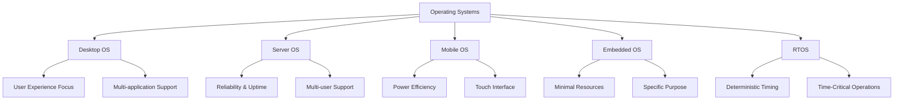

---

## Functions of an Operating System

### 1. **Process Management**
- Creating and deleting processes
- Scheduling processes on CPU
- Process synchronization
- Inter-process communication (IPC)

### 2. **Memory Management**
- Allocating and deallocating memory
- Keeping track of memory usage
- Virtual memory management
- Memory protection

### 3. **File System Management**
- Creating, deleting, reading, writing files
- Directory management
- Access control and permissions
- File backup and recovery

### 4. **I/O Device Management**
- Managing device drivers
- Buffering and caching
- Spooling (e.g., print queue)
- Device allocation and deallocation

### 5. **Security and Protection**
- User authentication
- Access control
- Encryption
- Malware protection

### 6. **Networking**
- Network protocols (TCP/IP)
- Network connections
- Data transmission
- Network security

### 7. **User Interface**
- Command-line interface (CLI)
- Graphical user interface (GUI)
- System utilities

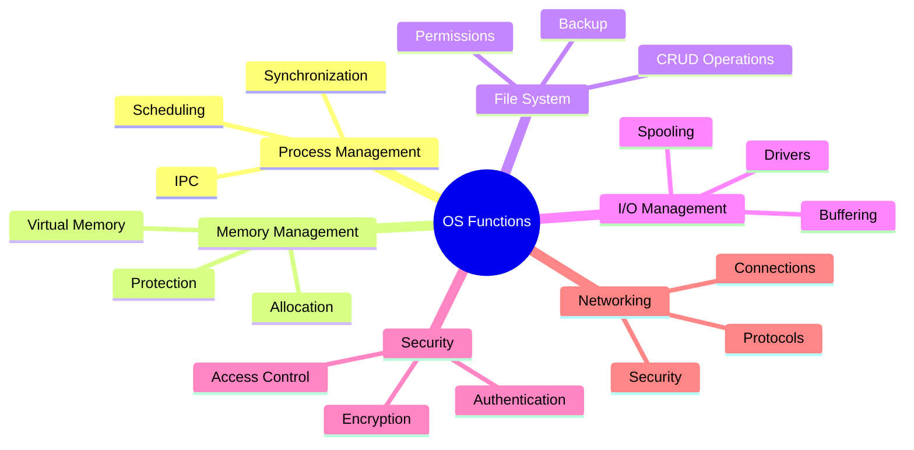

---

## User Space vs Kernel Space

### Architecture Overview

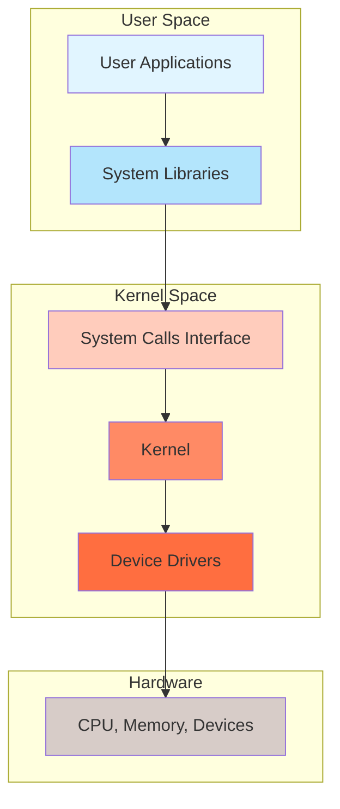

### User Space
- **Definition**: Memory area where user applications run
- **Privileges**: Limited access to hardware
- **Protection**: Cannot directly access kernel memory or hardware
- **Examples**: Web browsers, text editors, games

### Kernel Space
- **Definition**: Memory area where kernel and drivers run
- **Privileges**: Full access to all hardware and memory
- **Protection**: Protected from user applications
- **Examples**: Process scheduler, memory manager, device drivers

> [!CAUTION]
> User programs cannot directly access kernel space. Any attempt results in a protection fault and program termination.

---

## User Mode vs Kernel Mode

### CPU Operating Modes

| Aspect | User Mode | Kernel Mode |
|--------|-----------|-------------|
| **Access Level** | Restricted | Unrestricted |
| **Memory Access** | Limited to user space | Full memory access |
| **Instructions** | Non-privileged only | All instructions |
| **Hardware Access** | Through system calls | Direct access |
| **Crash Impact** | Only application crashes | System crash possible |
| **Also Called** | Unprivileged mode | Privileged/Supervisor mode |

### Mode Switching

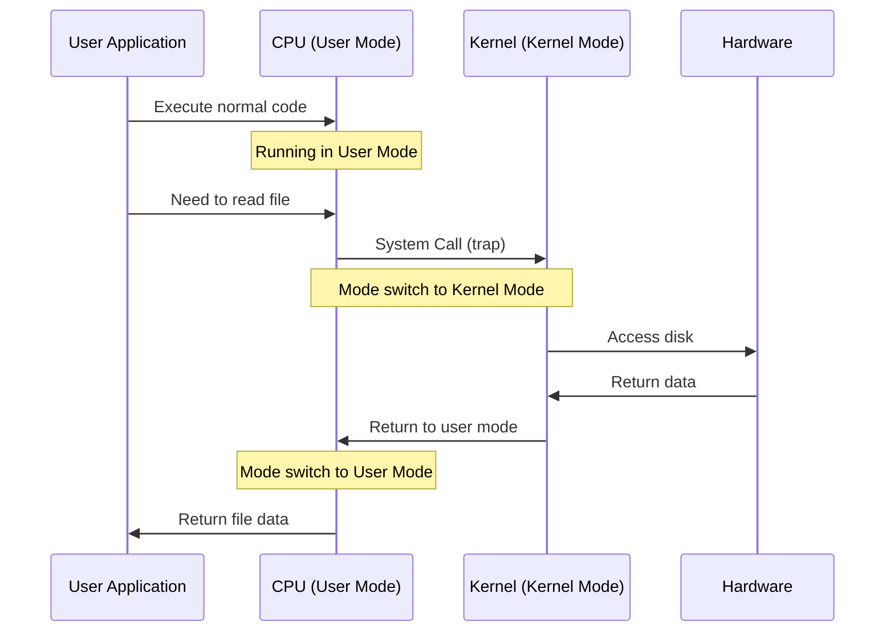

### How Mode Switching Works:
1. Application needs privileged operation (e.g., read file)
2. Application makes **system call**
3. CPU switches from User Mode to Kernel Mode
4. Kernel executes the operation
5. CPU switches back to User Mode
6. Control returns to application

---

## Interrupts

### What is an Interrupt?

An **interrupt** is a signal to the CPU that an event needs immediate attention, causing the CPU to temporarily stop its current task.

### Types of Interrupts

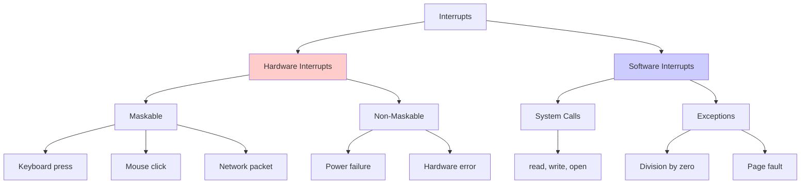

### 1. **Hardware Interrupts**
- Generated by hardware devices
- **Maskable**: Can be ignored/disabled temporarily
- **Non-Maskable (NMI)**: Cannot be ignored (critical errors)

**Examples:**
- Timer interrupt (for scheduling)
- Keyboard interrupt (key pressed)
- Disk I/O completion

### 2. **Software Interrupts**
- Generated by software/programs
- **System Calls**: Intentional interrupts to request OS services
- **Exceptions**: Error conditions (divide by zero, invalid memory access)

### Interrupt Handling Process

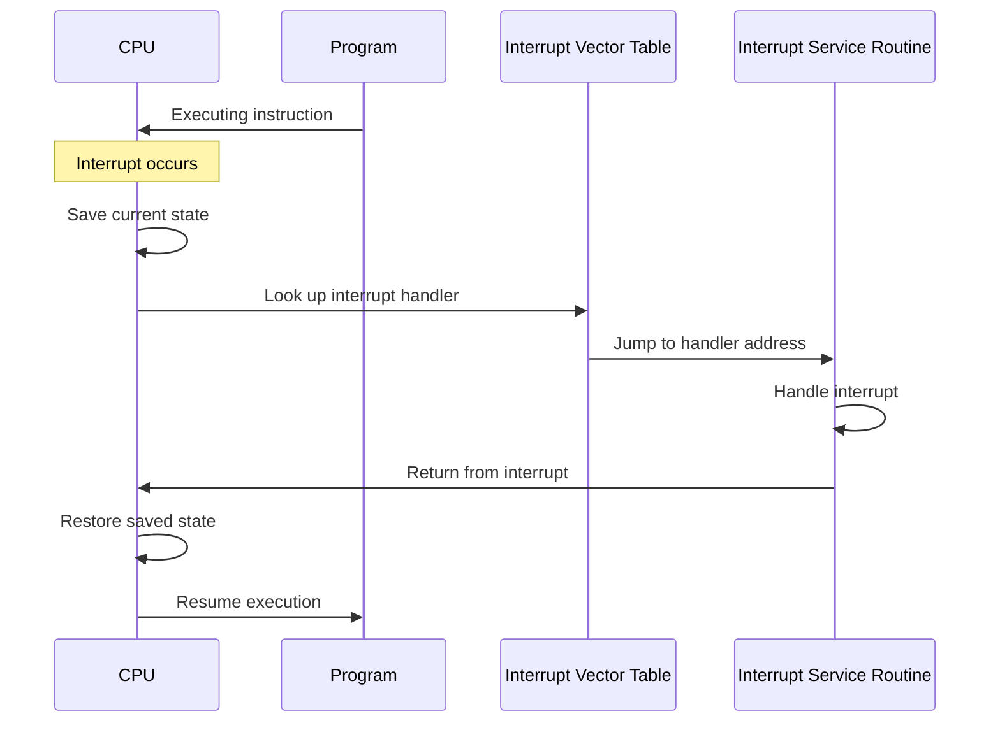

**Steps:**
1. **Interrupt occurs**: Hardware or software generates interrupt
2. **Save state**: CPU saves current program state (registers, PC)
3. **Identify interrupt**: Check interrupt vector table
4. **Execute ISR**: Run Interrupt Service Routine (handler)
5. **Restore state**: Restore saved program state
6. **Resume**: Continue executing interrupted program

---

## System Calls

### What are System Calls?

**System calls** are the programming interface between user applications and the kernel. They allow programs to request services from the OS.

> [!IMPORTANT]
> System calls are the ONLY way for user programs to access kernel services and hardware resources.

### Categories of System Calls

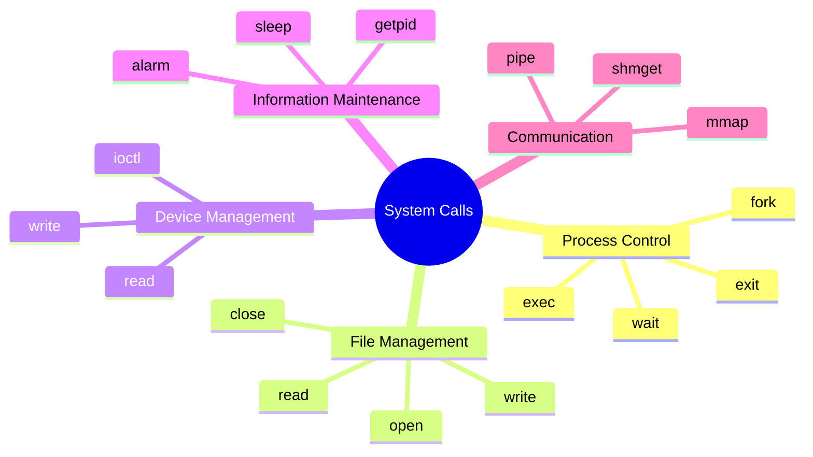

### 1. **Process Control**
- `fork()`: Create new process
- `exec()`: Execute a program
- `exit()`: Terminate process
- `wait()`: Wait for child process

### 2. **File Management**
- `open()`: Open file
- `read()`: Read from file
- `write()`: Write to file
- `close()`: Close file
- `lseek()`: Move file pointer

### 3. **Device Management**
- `ioctl()`: Device-specific operations
- `read()`: Read from device
- `write()`: Write to device

### 4. **Information Maintenance**
- `getpid()`: Get process ID
- `alarm()`: Set alarm
- `sleep()`: Suspend execution
- `time()`: Get system time

### 5. **Communication**
- `pipe()`: Create pipe for IPC
- `shmget()`: Get shared memory
- `mmap()`: Map files to memory
- `socket()`: Create network socket

### System Call Execution Flow

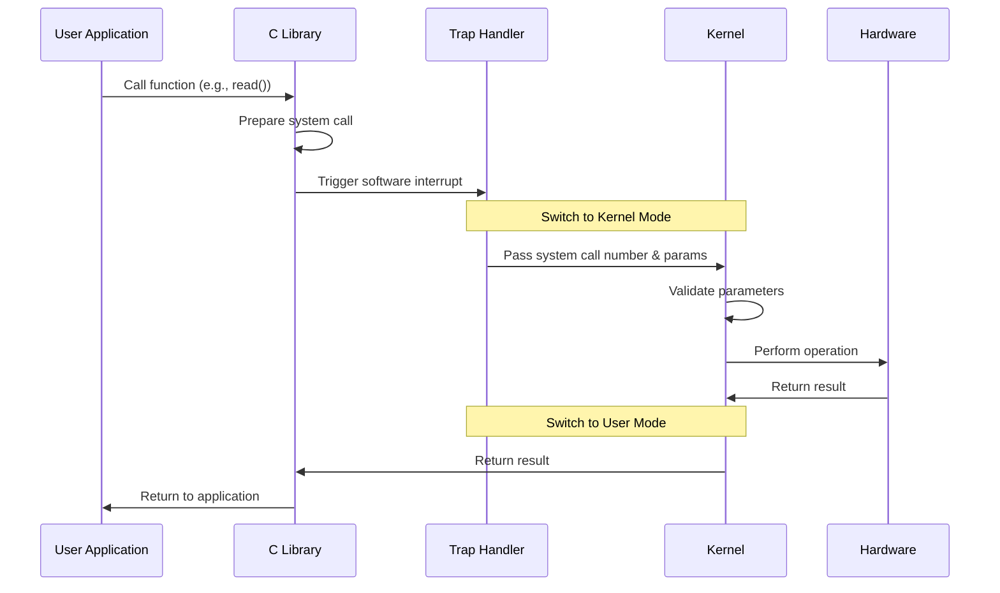

### Example: Reading a File

```c
// User program
#include <fcntl.h>
#include <unistd.h>

int main() {
    int fd;
    char buffer[100];
    
    // System call: open
    fd = open("file.txt", O_RDONLY);
    
    // System call: read
    read(fd, buffer, 100);
    
    // System call: close
    close(fd);
    
    return 0;
}
```

**What happens:**
1. `open()` triggers system call to kernel
2. Kernel validates permissions
3. Kernel opens file and returns file descriptor
4. `read()` triggers another system call
5. Kernel reads data from disk
6. Data copied to user buffer
7. `close()` releases resources

---

## Key Concepts Summary

### Interrupts vs System Calls

| Aspect | Interrupts | System Calls |
|--------|-----------|--------------|
| **Trigger** | Asynchronous (unpredictable) | Synchronous (programmed) |
| **Source** | Hardware or exceptions | User programs |
| **Purpose** | Handle events | Request OS services |
| **Examples** | Keyboard press, timer | read(), write(), fork() |
| **Initiated by** | External events | Program instruction |

### User Mode vs Kernel Mode

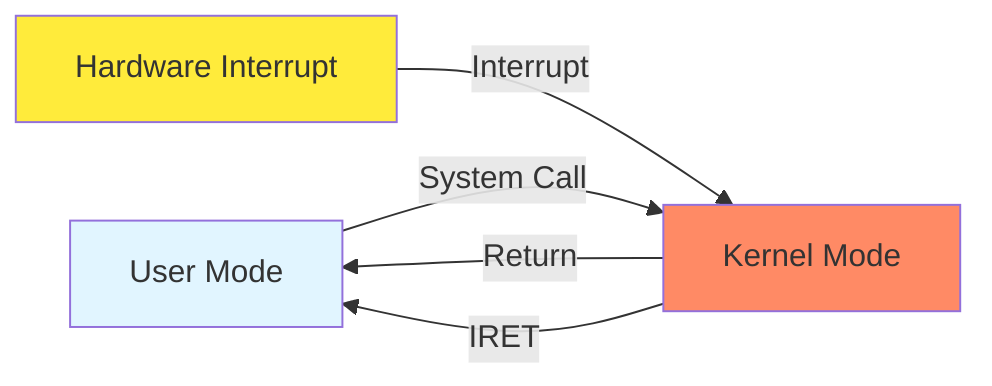

---

## Practice Questions

### Multiple Choice Questions

1. **Which of the following is NOT a function of an operating system?**
   - A) Process Management
   - B) Memory Management
   - C) Compiling Programs
   - D) I/O Management
   
   **Answer: C** - Compiling is done by compilers, not the OS

2. **What is the primary difference between User Mode and Kernel Mode?**
   - A) Speed of execution
   - B) Access privileges to hardware
   - C) Memory size
   - D) Number of processes
   
   **Answer: B** - Kernel mode has unrestricted hardware access

3. **Which type of interrupt cannot be ignored by the CPU?**
   - A) Maskable interrupt
   - B) Software interrupt
   - C) Non-maskable interrupt
   - D) Timer interrupt
   
   **Answer: C** - NMI cannot be disabled

4. **What mechanism allows user programs to request OS services?**
   - A) Direct hardware access
   - B) System calls
   - C) Interrupts
   - D) Polling
   
   **Answer: B** - System calls are the interface to kernel services

5. **Which OS is an example of RTOS?**
   - A) Windows 10
   - B) Android
   - C) QNX
   - D) Ubuntu
   
   **Answer: C** - QNX is a real-time OS

### Short Answer Questions

1. **Explain why an OS is hardware-dependent.**
2. **Differentiate between kernel space and user space.**
3. **What happens when a system call is made?**
4. **Why do we need both user mode and kernel mode?**
5. **Compare desktop OS with embedded OS.**

---

## Important Points to Remember

> [!NOTE]
> **For CCEE Exam:**
> - Understand the difference between interrupts and system calls
> - Know the components of an OS and their functions
> - Be clear about user/kernel mode and space
> - Memorize examples of different types of OS
> - Understand why OS is hardware-dependent

> [!TIP]
> **Study Strategy:**
> - Draw diagrams to visualize concepts
> - Create comparison tables for different OS types
> - Practice explaining mode switching process
> - Memorize common system calls and their purposes

---

## Additional Resources

- **Practice**: Try identifying system calls in simple C programs
- **Explore**: Check your own OS type and components
- **Research**: Look up the kernel type of Linux (monolithic) vs Windows (hybrid)

---

*End of Session 1 Notes*
