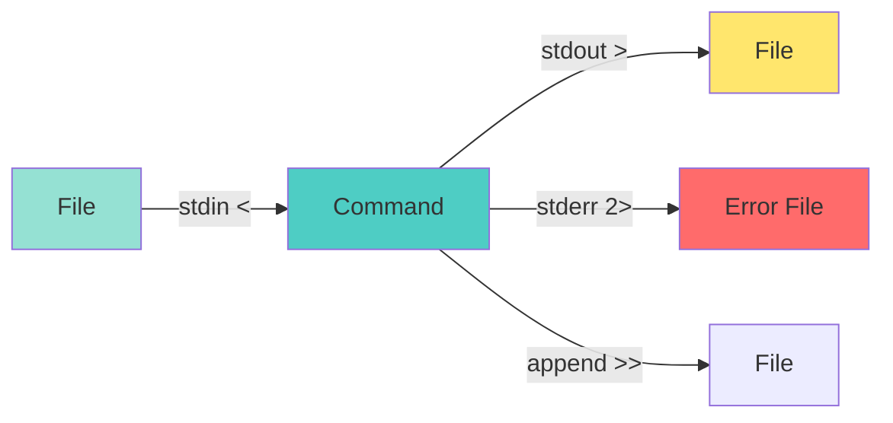
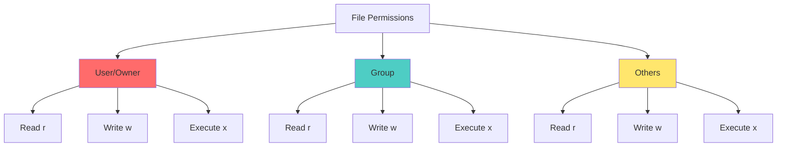
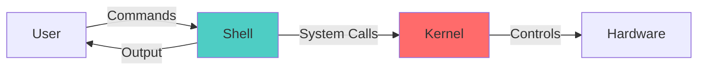
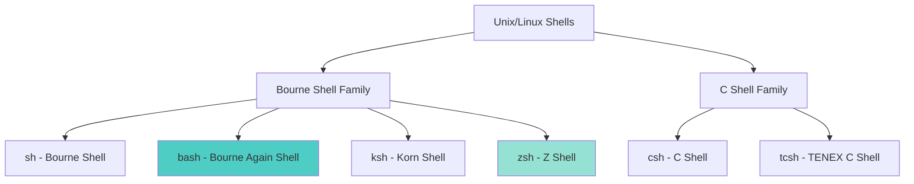

# Session 2: Introduction to Linux & Shell Programming

## Working Basics of File System

### Linux File System Hierarchy

```mermaid
graph TD
    A[/ Root] --> B[/bin]
    A --> C[/etc]
    A --> D[/home]
    A --> E[/var]
    A --> F[/usr]
    A --> G[/tmp]
    A --> H[/dev]
    A --> I[/proc]
    
    B --> B1[Essential binaries]
    C --> C1[Configuration files]
    D --> D1[User home directories]
    E --> E1[Variable data]
    F --> F1[User programs]
    G --> G1[Temporary files]
    H --> H1[Device files]
    I --> I1[Process information]
    
    style A fill:#ff6b6b
    style B fill:#4ecdc4
    style C fill:#ffe66d
    style D fill:#95e1d3
```

### Key Directories

| Directory | Purpose | Examples |
|-----------|---------|----------|
| `/` | Root directory | Top of file system hierarchy |
| `/bin` | Essential user binaries | ls, cp, mv, cat |
| `/sbin` | System binaries | fsck, reboot, iptables |
| `/etc` | Configuration files | passwd, hosts, fstab |
| `/home` | User home directories | /home/user1, /home/user2 |
| `/root` | Root user's home | Root's personal files |
| `/usr` | User programs | /usr/bin, /usr/lib |
| `/var` | Variable data | logs, databases, emails |
| `/tmp` | Temporary files | Cleared on reboot |
| `/dev` | Device files | /dev/sda, /dev/null |
| `/proc` | Process information | /proc/cpuinfo, /proc/meminfo |
| `/boot` | Boot loader files | kernel, initrd |
| `/lib` | System libraries | Shared libraries |
| `/opt` | Optional software | Third-party applications |
| `/mnt` | Mount points | Temporary mounts |
| `/media` | Removable media | USB drives, CD-ROMs |

### File System Concepts

#### 1. **Everything is a File**
- Regular files
- Directories (special files)
- Devices (character and block devices)
- Sockets
- Pipes

#### 2. **Path Types**

**Absolute Path**: Starts from root (`/`)
```bash
/home/user/documents/file.txt
```

**Relative Path**: Starts from current directory
```bash
documents/file.txt
./file.txt
../parent_dir/file.txt
```

#### 3. **Special Path Symbols**

| Symbol | Meaning |
|--------|---------|
| `/` | Root directory |
| `~` | Home directory |
| `.` | Current directory |
| `..` | Parent directory |
| `-` | Previous directory |

---

## Basic Linux Commands

### File and Directory Commands

#### Navigation Commands

```bash
# Print Working Directory
pwd

# Change Directory
cd /path/to/directory
cd ~                    # Go to home directory
cd ..                   # Go to parent directory
cd -                    # Go to previous directory

# List files
ls                      # List files in current directory
ls -l                   # Long format (detailed)
ls -a                   # Show hidden files
ls -lh                  # Human-readable sizes
ls -R                   # Recursive listing
ls -lt                  # Sort by modification time
```

**ls -l Output Explained:**
```
-rw-r--r-- 1 user group 1024 Jan 1 12:00 file.txt
│││││││││  │ │    │     │    │           │
│││││││││  │ │    │     │    │           └─ Filename
│││││││││  │ │    │     │    └─ Modification time
│││││││││  │ │    │     └─ Size in bytes
│││││││││  │ │    └─ Group
│││││││││  │ └─ Owner
│││││││││  └─ Number of links
││││││││└─ Others permissions (r--)
│││││└└─ Group permissions (r--)
│││└└─ Owner permissions (rw-)
│└─ File type (- = regular file)
```

#### File Operations

```bash
# Create empty file
touch filename.txt

# Copy files
cp source.txt destination.txt
cp -r source_dir/ dest_dir/     # Copy directory recursively
cp -i file.txt dest/            # Interactive (prompt before overwrite)
cp -v file.txt dest/            # Verbose (show what's being copied)

# Move/Rename files
mv oldname.txt newname.txt
mv file.txt /path/to/directory/
mv -i file.txt dest/            # Interactive mode

# Remove files
rm file.txt
rm -r directory/                # Remove directory recursively
rm -f file.txt                  # Force remove (no prompt)
rm -rf directory/               # Force remove directory (DANGEROUS!)
rm -i file.txt                  # Interactive mode

# Create directory
mkdir newdir
mkdir -p path/to/nested/dir     # Create parent directories

# Remove directory
rmdir emptydir                  # Only removes empty directories
rm -r directory/                # Remove non-empty directory
```

#### Viewing File Contents

```bash
# Display entire file
cat file.txt
cat file1.txt file2.txt         # Concatenate multiple files

# Display with line numbers
cat -n file.txt

# View file page by page
less file.txt                   # Better for large files
more file.txt                   # Older pager

# View first/last lines
head file.txt                   # First 10 lines
head -n 20 file.txt             # First 20 lines
tail file.txt                   # Last 10 lines
tail -n 20 file.txt             # Last 20 lines
tail -f logfile.txt             # Follow file (live updates)

# Word count
wc file.txt                     # Lines, words, characters
wc -l file.txt                  # Count lines only
wc -w file.txt                  # Count words only
```

### File Search Commands

```bash
# Find files
find /path -name "filename"
find . -name "*.txt"            # Find all .txt files
find /home -type f              # Find only files
find /home -type d              # Find only directories
find . -size +10M               # Files larger than 10MB
find . -mtime -7                # Modified in last 7 days

# Search inside files
grep "pattern" file.txt
grep -i "pattern" file.txt      # Case-insensitive
grep -r "pattern" directory/    # Recursive search
grep -n "pattern" file.txt      # Show line numbers
grep -v "pattern" file.txt      # Invert match (lines NOT matching)
grep -c "pattern" file.txt      # Count matches

# Locate files (faster than find)
locate filename
updatedb                        # Update locate database
```

### System Information Commands

```bash
# Display date and time
date
date "+%Y-%m-%d %H:%M:%S"

# Show calendar
cal
cal 2024

# Display logged-in users
who
whoami                          # Current user
w                               # Detailed user info

# System information
uname -a                        # All system info
uname -r                        # Kernel version
hostname                        # Computer name

# Disk usage
df -h                           # Disk space (human-readable)
du -h directory/                # Directory size
du -sh directory/               # Summary of directory size

# Memory usage
free -h                         # RAM usage

# Process information
ps                              # Current user processes
ps aux                          # All processes
top                             # Real-time process monitor
htop                            # Enhanced top (if installed)
```

### File Permissions and Ownership

```bash
# View permissions
ls -l file.txt

# Change permissions
chmod 755 file.txt
chmod u+x script.sh             # Add execute for user
chmod g-w file.txt              # Remove write for group
chmod o+r file.txt              # Add read for others
chmod a+x file.txt              # Add execute for all

# Change ownership
chown user file.txt
chown user:group file.txt
chown -R user:group directory/  # Recursive

# Change group
chgrp group file.txt
```

---

## Operators in Linux

### 1. Redirection Operators



#### Output Redirection

```bash
# Redirect stdout to file (overwrite)
ls > output.txt
echo "Hello" > file.txt

# Redirect stdout to file (append)
ls >> output.txt
echo "World" >> file.txt

# Redirect stderr to file
command 2> error.txt

# Redirect both stdout and stderr
command > output.txt 2>&1
command &> output.txt           # Shorter syntax

# Redirect to /dev/null (discard output)
command > /dev/null
command 2> /dev/null
command &> /dev/null
```

#### Input Redirection

```bash
# Read input from file
wc -l < file.txt
sort < unsorted.txt

# Here document
cat << EOF
Line 1
Line 2
EOF

# Here string
grep "pattern" <<< "string to search"
```

### 2. Pipe Operator (`|`)

Sends output of one command as input to another.

```bash
# Basic pipe
ls -l | less
ps aux | grep firefox

# Multiple pipes
cat file.txt | grep "error" | wc -l

# Common pipe combinations
ls -l | sort -k5 -n             # Sort by file size
history | grep "git"            # Search command history
ps aux | grep python | grep -v grep

# Advanced examples
cat /var/log/syslog | grep "error" | sort | uniq -c
find . -name "*.txt" | xargs grep "pattern"
```

### 3. Command Chaining Operators

```bash
# Semicolon (;) - Run commands sequentially
command1 ; command2 ; command3

# AND (&&) - Run next command only if previous succeeds
mkdir newdir && cd newdir
make && make install

# OR (||) - Run next command only if previous fails
ping -c 1 google.com || echo "No internet"
cd /tmp || mkdir /tmp

# Combining operators
mkdir test && cd test || echo "Failed"
```

### 4. Background and Foreground Operators

```bash
# Run command in background
command &
firefox &

# Bring to foreground
fg

# Send to background
bg

# List background jobs
jobs
```

---

## File Permissions

### Understanding Permissions



### Permission Types

| Permission | Symbol | Numeric | File | Directory |
|------------|--------|---------|------|-----------|
| **Read** | r | 4 | View file contents | List directory contents |
| **Write** | w | 2 | Modify file | Create/delete files in directory |
| **Execute** | x | 1 | Run as program | Enter directory (cd) |
| **None** | - | 0 | No permission | No permission |

### Permission Notation

#### Symbolic Notation
```
-rw-r--r--
│││ │ │ │
│││ │ │ └─ Others: read
│││ │ └─── Group: read
│││ └───── Owner: read, write
││└─────── Owner permissions
│└──────── Group permissions
└───────── Others permissions
```

#### Numeric (Octal) Notation

```
Permission = User + Group + Others
755 = rwxr-xr-x
│││
││└─ Others: 5 (r-x) = 4+0+1
│└── Group: 5 (r-x) = 4+0+1
└─── Owner: 7 (rwx) = 4+2+1
```

**Common Permission Values:**

| Octal | Binary | Symbolic | Meaning |
|-------|--------|----------|---------|
| 0 | 000 | --- | No permission |
| 1 | 001 | --x | Execute only |
| 2 | 010 | -w- | Write only |
| 3 | 011 | -wx | Write and execute |
| 4 | 100 | r-- | Read only |
| 5 | 101 | r-x | Read and execute |
| 6 | 110 | rw- | Read and write |
| 7 | 111 | rwx | Read, write, and execute |

### chmod Command

#### Numeric Mode

```bash
chmod 755 file.txt              # rwxr-xr-x
chmod 644 file.txt              # rw-r--r--
chmod 600 file.txt              # rw-------
chmod 777 file.txt              # rwxrwxrwx (dangerous!)
chmod 000 file.txt              # --------- (no access)

# Recursive
chmod -R 755 directory/
```

#### Symbolic Mode

```bash
# Add permissions
chmod u+x file.txt              # Add execute for user
chmod g+w file.txt              # Add write for group
chmod o+r file.txt              # Add read for others
chmod a+x file.txt              # Add execute for all

# Remove permissions
chmod u-x file.txt              # Remove execute from user
chmod g-w file.txt              # Remove write from group
chmod o-r file.txt              # Remove read from others

# Set exact permissions
chmod u=rwx file.txt            # User: rwx
chmod g=rx file.txt             # Group: r-x
chmod o=r file.txt              # Others: r--

# Multiple changes
chmod u+x,g-w,o=r file.txt
```

**Who symbols:**
- `u` = user/owner
- `g` = group
- `o` = others
- `a` = all (ugo)

### chown and chgrp Commands

```bash
# Change owner
chown newuser file.txt
chown -R newuser directory/

# Change owner and group
chown newuser:newgroup file.txt
chown user: file.txt            # Change to user's default group

# Change group only
chgrp newgroup file.txt
chgrp -R newgroup directory/
```

### Special Permissions

#### 1. **Setuid (SUID)** - 4000

```bash
chmod 4755 file                 # rwsr-xr-x
chmod u+s file

# File executes with owner's permissions
# Example: /usr/bin/passwd
```

#### 2. **Setgid (SGID)** - 2000

```bash
chmod 2755 directory            # rwxr-sr-x
chmod g+s directory

# Files created in directory inherit group
```

#### 3. **Sticky Bit** - 1000

```bash
chmod 1777 directory            # rwxrwxrwt
chmod +t directory

# Only owner can delete files (e.g., /tmp)
```

### Access Control Lists (ACL)

More fine-grained permissions than traditional Unix permissions.

```bash
# View ACL
getfacl file.txt

# Set ACL
setfacl -m u:username:rw file.txt       # Give user rw permission
setfacl -m g:groupname:rx file.txt      # Give group rx permission

# Remove ACL
setfacl -x u:username file.txt

# Remove all ACL
setfacl -b file.txt

# Recursive ACL
setfacl -R -m u:username:rw directory/

# Default ACL for directory
setfacl -d -m u:username:rw directory/
```

---

## Network Commands

### Basic Network Commands

```bash
# Test connectivity
ping google.com
ping -c 4 google.com            # Send 4 packets

# Trace route
traceroute google.com
tracepath google.com

# DNS lookup
nslookup google.com
dig google.com
host google.com

# Network interfaces
ifconfig                        # Older command
ip addr show                    # Modern command
ip link show

# Network statistics
netstat -tuln                   # Show listening ports
ss -tuln                        # Modern alternative to netstat

# Download files
wget http://example.com/file.zip
curl -O http://example.com/file.zip
```

### Remote Access Commands

#### 1. **SSH (Secure Shell)**

```bash
# Connect to remote server
ssh username@hostname
ssh user@192.168.1.100

# Specify port
ssh -p 2222 user@hostname

# Execute command on remote server
ssh user@hostname 'ls -l'

# SSH with key
ssh -i ~/.ssh/id_rsa user@hostname

# Copy SSH key to server
ssh-copy-id user@hostname

# SSH tunneling
ssh -L 8080:localhost:80 user@hostname
```

#### 2. **SCP (Secure Copy)**

```bash
# Copy file to remote server
scp file.txt user@hostname:/path/to/destination/

# Copy file from remote server
scp user@hostname:/path/to/file.txt ./

# Copy directory recursively
scp -r directory/ user@hostname:/path/

# Specify port
scp -P 2222 file.txt user@hostname:/path/
```

#### 3. **SFTP (Secure FTP)**

```bash
# Connect to SFTP server
sftp user@hostname

# SFTP commands (after connection)
ls                              # List remote files
lls                             # List local files
cd /path                        # Change remote directory
lcd /path                       # Change local directory
get file.txt                    # Download file
put file.txt                    # Upload file
mkdir newdir                    # Create remote directory
rm file.txt                     # Delete remote file
bye                             # Exit
```

#### 4. **FTP (File Transfer Protocol)**

```bash
# Connect to FTP server
ftp hostname

# FTP commands (after connection)
user username                   # Login
ls                              # List files
cd directory                    # Change directory
get file.txt                    # Download file
put file.txt                    # Upload file
mget *.txt                      # Download multiple files
mput *.txt                      # Upload multiple files
binary                          # Switch to binary mode
ascii                           # Switch to ASCII mode
bye                             # Exit
```

#### 5. **Telnet** (Insecure - avoid if possible)

```bash
# Connect to telnet server
telnet hostname
telnet hostname port

# Test port connectivity
telnet google.com 80
```

#### 6. **Finger**

```bash
# Get user information
finger username
finger username@hostname

# Note: Rarely used today due to security concerns
```

---

## System Variables

### Environment Variables

```bash
# View all environment variables
env
printenv

# View specific variable
echo $HOME
echo $PATH
echo $USER

# Set variable (temporary - current session only)
export MYVAR="value"
export PATH=$PATH:/new/path

# Unset variable
unset MYVAR
```

### Common Environment Variables

| Variable | Purpose | Example |
|----------|---------|---------|
| `$HOME` | User's home directory | /home/username |
| `$PATH` | Executable search path | /usr/bin:/bin:/usr/sbin |
| `$USER` | Current username | john |
| `$SHELL` | Current shell | /bin/bash |
| `$PWD` | Current directory | /home/user/documents |
| `$OLDPWD` | Previous directory | /home/user |
| `$HOSTNAME` | Computer name | mycomputer |
| `$LANG` | Language settings | en_US.UTF-8 |
| `$TERM` | Terminal type | xterm-256color |
| `$EDITOR` | Default text editor | vim |

### Shell Prompt Variables

#### PS1 - Primary Prompt

```bash
# View current PS1
echo $PS1

# Set simple prompt
export PS1="$ "

# Set prompt with username and hostname
export PS1="\u@\h:\w\$ "

# Colorful prompt
export PS1="\[\e[32m\]\u@\h\[\e[0m\]:\[\e[34m\]\w\[\e[0m\]\$ "
```

**PS1 Special Characters:**

| Code | Meaning |
|------|---------|
| `\u` | Username |
| `\h` | Hostname (short) |
| `\H` | Hostname (full) |
| `\w` | Current directory (full path) |
| `\W` | Current directory (basename) |
| `\d` | Date |
| `\t` | Time (24-hour) |
| `\T` | Time (12-hour) |
| `\$` | $ for user, # for root |
| `\n` | Newline |

**Colors in PS1:**

```bash
# Color codes
\[\e[30m\]  # Black
\[\e[31m\]  # Red
\[\e[32m\]  # Green
\[\e[33m\]  # Yellow
\[\e[34m\]  # Blue
\[\e[35m\]  # Magenta
\[\e[36m\]  # Cyan
\[\e[37m\]  # White
\[\e[0m\]   # Reset color
```

#### PS2 - Secondary Prompt

Displayed when command spans multiple lines.

```bash
# Default is usually ">"
export PS2="> "

# Custom
export PS2="... "
```

#### PS3 - Select Prompt

Used by `select` command in scripts.

```bash
export PS3="Please select an option: "
```

#### PS4 - Debug Prompt

Used when tracing script execution.

```bash
export PS4='+ '
```

### Making Variables Permanent

```bash
# For current user - edit ~/.bashrc or ~/.bash_profile
nano ~/.bashrc

# Add at the end:
export MYVAR="value"
export PATH=$PATH:/new/path
export PS1="\u@\h:\w\$ "

# Reload configuration
source ~/.bashrc

# For all users - edit /etc/environment (requires root)
sudo nano /etc/environment

# Add:
MYVAR="value"
```

---

## Introduction to Shell

### What is a Shell?

A **shell** is a command-line interpreter that provides a user interface to access OS services.



**Functions of Shell:**
1. Command interpretation
2. Script execution
3. Environment management
4. I/O redirection
5. Job control

### Types of Shells in Linux



#### 1. **sh (Bourne Shell)**
- Original Unix shell
- Simple and lightweight
- Limited features
- Path: `/bin/sh`

#### 2. **bash (Bourne Again Shell)** ⭐ Most Popular

- Default on most Linux distributions
- Enhanced version of sh
- Command history, tab completion
- Scripting capabilities
- Path: `/bin/bash`

#### 3. **zsh (Z Shell)**

- Modern, feature-rich
- Better auto-completion
- Themes and plugins (Oh My Zsh)
- Compatible with bash
- Path: `/bin/zsh`

#### 4. **ksh (Korn Shell)**

- Combines features of sh and csh
- Good for scripting
- Used in enterprise environments
- Path: `/bin/ksh`

#### 5. **csh (C Shell)**

- C-like syntax
- Good interactive features
- Less popular for scripting
- Path: `/bin/csh`

#### 6. **tcsh (TENEX C Shell)**

- Enhanced C shell
- Command-line editing
- Programmable completion
- Path: `/bin/tcsh`

### Check and Change Shell

```bash
# Check current shell
echo $SHELL

# List available shells
cat /etc/shells

# Change shell temporarily
bash
zsh
sh

# Change default shell permanently
chsh -s /bin/zsh
chsh -s /bin/bash
```

---

## Shell Variables

### Types of Variables

#### 1. **Local Variables**

Exist only in current shell session.

```bash
# Create local variable
NAME="John"
AGE=25

# Access variable
echo $NAME
echo "My name is $NAME and I am $AGE years old"

# Variable names are case-sensitive
name="Jane"  # Different from NAME
```

#### 2. **Environment Variables**

Available to child processes.

```bash
# Create environment variable
export PATH=$PATH:/new/path
export DATABASE_URL="postgresql://localhost/mydb"

# View all environment variables
env
printenv

# View specific variable
echo $PATH
```

#### 3. **Shell Variables**

Special variables set by shell.

```bash
$0      # Script name
$1-$9   # Command-line arguments
$#      # Number of arguments
$@      # All arguments as separate strings
$*      # All arguments as single string
$?      # Exit status of last command
$$      # Current process ID
$!      # PID of last background command
```

### Variable Operations

```bash
# Assignment
VAR="value"
VAR=123

# No spaces around =
# WRONG: VAR = "value"
# RIGHT: VAR="value"

# Using variables
echo $VAR
echo ${VAR}                     # Preferred for clarity

# String concatenation
FIRST="Hello"
LAST="World"
FULL="$FIRST $LAST"
echo $FULL                      # Hello World

# Command substitution
CURRENT_DATE=$(date)
FILES=$(ls)
USER_COUNT=`who | wc -l`        # Old syntax

# Arithmetic
NUM=10
NUM=$((NUM + 5))
echo $NUM                       # 15

# Read user input
read NAME
echo "Hello, $NAME"

# Read with prompt
read -p "Enter your name: " NAME
```

### Variable Scope

```bash
# Local to current shell
VAR="local"

# Export to child processes
export VAR="exported"

# Readonly variable
readonly CONST="cannot change"
CONST="new value"               # Error

# Unset variable
unset VAR
```

---

## Wildcard Symbols

Wildcards are special characters used for pattern matching.

### Common Wildcards

| Wildcard | Meaning | Example | Matches |
|----------|---------|---------|---------|
| `*` | Zero or more characters | `*.txt` | file.txt, document.txt, a.txt |
| `?` | Exactly one character | `file?.txt` | file1.txt, fileA.txt |
| `[...]` | Any character in brackets | `file[123].txt` | file1.txt, file2.txt, file3.txt |
| `[^...]` | Any character NOT in brackets | `file[^123].txt` | fileA.txt, fileX.txt |
| `[a-z]` | Range of characters | `file[a-z].txt` | filea.txt, fileb.txt |
| `{...}` | Brace expansion | `file{1,2,3}.txt` | file1.txt, file2.txt, file3.txt |

### Examples

```bash
# List all .txt files
ls *.txt

# List files starting with 'test'
ls test*

# List files with single character extension
ls *.?

# List files starting with a, b, or c
ls [abc]*

# List files NOT starting with a, b, or c
ls [^abc]*

# List files with numbers
ls *[0-9]*

# Multiple patterns
ls *.{txt,pdf,doc}

# Remove all .log files
rm *.log

# Copy all .jpg and .png files
cp *.{jpg,png} /destination/

# Find files with specific pattern
find . -name "test*.txt"
```

---

## Shell Metacharacters

Special characters with special meaning to the shell.

### List of Metacharacters

| Character | Name | Purpose |
|-----------|------|---------|
| `*` | Asterisk | Wildcard (zero or more characters) |
| `?` | Question mark | Wildcard (one character) |
| `[ ]` | Brackets | Character class |
| `|` | Pipe | Send output to another command |
| `>` | Greater than | Redirect output |
| `<` | Less than | Redirect input |
| `>>` | Double greater | Append output |
| `&` | Ampersand | Background process |
| `;` | Semicolon | Command separator |
| `&&` | Double ampersand | AND operator |
| `||` | Double pipe | OR operator |
| `( )` | Parentheses | Subshell |
| `{ }` | Braces | Command grouping |
| `$` | Dollar | Variable expansion |
| `` ` ` `` | Backticks | Command substitution |
| `\` | Backslash | Escape character |
| `'` | Single quote | Literal string |
| `"` | Double quote | String with expansion |
| `#` | Hash | Comment |

### Quoting

#### 1. **Single Quotes (`'...'`)**

Preserve literal value of all characters.

```bash
NAME="John"
echo 'Hello $NAME'              # Output: Hello $NAME
echo 'Current dir: $PWD'        # Output: Current dir: $PWD
```

#### 2. **Double Quotes (`"..."`)**

Preserve literal value except `$`, `` ` ``, `\`, and `!`.

```bash
NAME="John"
echo "Hello $NAME"              # Output: Hello John
echo "Current dir: $PWD"        # Output: Current dir: /home/user
```

#### 3. **Backslash (`\`)**

Escape single character.

```bash
echo "Price: \$100"             # Output: Price: $100
echo "Line 1\nLine 2"           # Output: Line 1\nLine 2
echo -e "Line 1\nLine 2"        # Output: Line 1
                                #         Line 2
```

### Examples

```bash
# Comments
# This is a comment
echo "Hello"  # Inline comment

# Command substitution
TODAY=$(date)
FILES=`ls`

# Subshell
(cd /tmp && ls)                 # cd doesn't affect current shell

# Command grouping
{ echo "Line 1"; echo "Line 2"; } > output.txt

# Escape special characters
echo "The price is \$50"
echo "Use \\ for backslash"
```

---

## Command Line Arguments

Arguments passed to a script or command.

### Positional Parameters

```bash
# Script: myscript.sh
#!/bin/bash

echo "Script name: $0"
echo "First argument: $1"
echo "Second argument: $2"
echo "Third argument: $3"
echo "Number of arguments: $#"
echo "All arguments: $@"
echo "All arguments (as string): $*"
echo "Process ID: $$"
```

**Running the script:**
```bash
./myscript.sh arg1 arg2 arg3

# Output:
# Script name: ./myscript.sh
# First argument: arg1
# Second argument: arg2
# Third argument: arg3
# Number of arguments: 3
# All arguments: arg1 arg2 arg3
# All arguments (as string): arg1 arg2 arg3
# Process ID: 12345
```

### Special Parameters

| Parameter | Meaning |
|-----------|---------|
| `$0` | Script name |
| `$1-$9` | Arguments 1-9 |
| `${10}` | Argument 10 and beyond |
| `$#` | Number of arguments |
| `$@` | All arguments (as separate words) |
| `$*` | All arguments (as single word) |
| `$?` | Exit status of last command |
| `$$` | Current process ID |
| `$!` | PID of last background job |
| `$_` | Last argument of previous command |

### Difference Between $@ and $*

```bash
#!/bin/bash

# With $@
for arg in "$@"; do
    echo "Arg: $arg"
done

# With $*
for arg in "$*"; do
    echo "Arg: $arg"
done
```

**Running:**
```bash
./script.sh "arg 1" "arg 2"

# $@ output:
# Arg: arg 1
# Arg: arg 2

# $* output:
# Arg: arg 1 arg 2
```

---

## Read and Echo Commands

### echo Command

Display text or variables.

```bash
# Basic echo
echo "Hello World"

# Without newline
echo -n "Hello"

# Enable escape sequences
echo -e "Line 1\nLine 2"
echo -e "Tab\there"

# Variables
NAME="John"
echo "Hello, $NAME"

# Escape characters
echo -e "\a"                    # Alert (bell)
echo -e "\b"                    # Backspace
echo -e "\n"                    # Newline
echo -e "\t"                    # Tab
echo -e "\\"                    # Backslash

# Colors
echo -e "\e[31mRed text\e[0m"
echo -e "\e[32mGreen text\e[0m"
echo -e "\e[34mBlue text\e[0m"
```

### read Command

Read user input.

```bash
# Basic read
read NAME
echo "Hello, $NAME"

# With prompt
read -p "Enter your name: " NAME

# Read multiple variables
read -p "Enter first and last name: " FIRST LAST

# Read password (hidden input)
read -sp "Enter password: " PASSWORD
echo

# Read with timeout
read -t 5 -p "Enter name (5 seconds): " NAME

# Read single character
read -n 1 -p "Press any key to continue..."

# Read into array
read -a ARRAY
echo ${ARRAY[0]}
echo ${ARRAY[1]}

# Read from file
while read line; do
    echo $line
done < file.txt
```

---

## Practice Questions

### Multiple Choice Questions

1. **Which command is used to change file permissions?**
   - A) chown
   - B) chmod
   - C) chgrp
   - D) chperm
   
   **Answer: B**

2. **What does the permission 755 mean?**
   - A) rwxr-xr-x
   - B) rw-r--r--
   - C) rwxrwxrwx
   - D) r-xr-xr-x
   
   **Answer: A**

3. **Which operator appends output to a file?**
   - A) >
   - B) >>
   - C) <
   - D) |
   
   **Answer: B**

4. **What is the default shell in most Linux distributions?**
   - A) sh
   - B) csh
   - C) bash
   - D) zsh
   
   **Answer: C**

5. **Which variable contains the current user's home directory?**
   - A) $USER
   - B) $HOME
   - C) $PWD
   - D) $PATH
   
   **Answer: B**

### Lab Practice Exercises

1. **File Operations:**
   ```bash
   # Create directory structure
   mkdir -p project/{src,bin,docs}
   
   # Create files
   touch project/src/main.c
   touch project/docs/README.md
   
   # Set permissions
   chmod 755 project/src/main.c
   chmod 644 project/docs/README.md
   ```

2. **Permission Management:**
   ```bash
   # Create test file
   touch testfile.txt
   
   # Set different permissions
   chmod 644 testfile.txt
   ls -l testfile.txt
   
   # Add execute permission
   chmod u+x testfile.txt
   ls -l testfile.txt
   ```

3. **Redirection and Pipes:**
   ```bash
   # Redirect output
   ls -l > filelist.txt
   
   # Append to file
   date >> filelist.txt
   
   # Use pipes
   cat /etc/passwd | grep $USER
   ps aux | grep bash | wc -l
   ```

4. **Shell Variables:**
   ```bash
   # Create variables
   NAME="Student"
   COURSE="Linux"
   
   # Use variables
   echo "Hello $NAME, welcome to $COURSE course"
   
   # Export variable
   export MY_VAR="test"
   bash -c 'echo $MY_VAR'
   ```

---

## Important Points to Remember

> [!IMPORTANT]
> **For CCEE Exam:**
> - Know common Linux commands and their options
> - Understand file permission notation (both symbolic and numeric)
> - Remember the difference between >, >>, and |
> - Know shell variable types and scope
> - Understand wildcard patterns

> [!TIP]
> **Study Strategy:**
> - Practice commands in a Linux terminal
> - Create a cheat sheet of common commands
> - Understand permission calculations
> - Practice writing simple shell scripts

---

*End of Session 2 Notes*
