# Sessions 4 & 5: Processes

## What is a Process?

A **process** is a program in execution. It's an active entity that requires resources to accomplish its task.

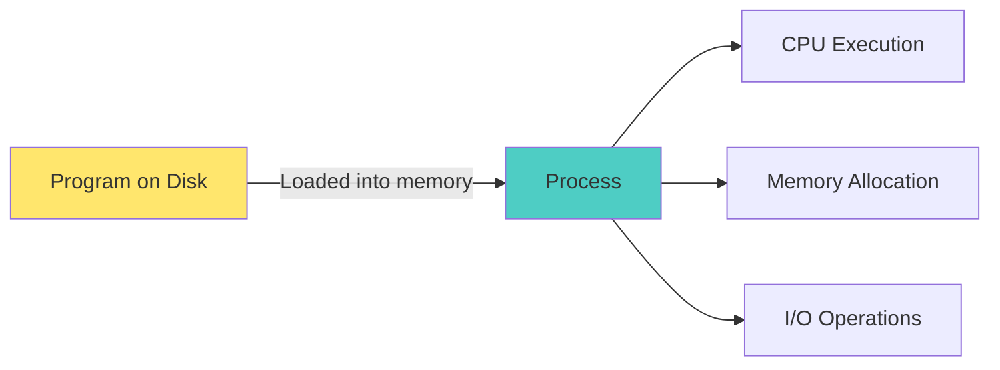

### Program vs Process

| Program | Process |
|---------|---------|
| Passive entity (code on disk) | Active entity (executing code) |
| Static | Dynamic |
| Stored in secondary storage | Loaded in primary memory |
| One program can create multiple processes | Each process has unique PID |
| Example: `notepad.exe` | Example: Running instance of notepad |

### Components of a Process

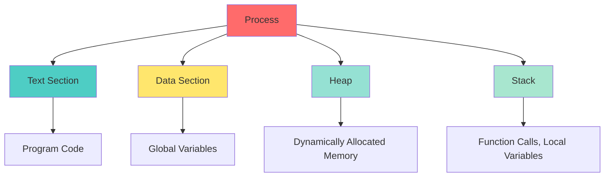

1. **Text Section**: Program code (instructions)
2. **Data Section**: Global and static variables
3. **Heap**: Dynamically allocated memory (malloc, new)
4. **Stack**: Function calls, local variables, return addresses

---

## Process States

### Process Life Cycle

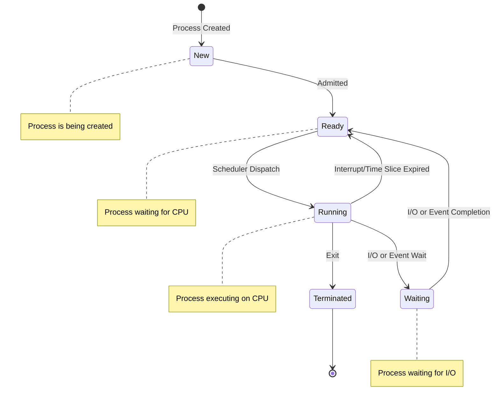

### Process States Explained

| State | Description | Example |
|-------|-------------|---------|
| **New** | Process is being created | Program just started loading |
| **Ready** | Process waiting for CPU assignment | Multiple processes ready to run |
| **Running** | Process instructions being executed | Currently executing on CPU |
| **Waiting/Blocked** | Process waiting for event/I/O | Waiting for disk read, user input |
| **Terminated** | Process finished execution | Program exited |

---

## Process Control Block (PCB)

The **PCB** is a data structure containing all information about a process.

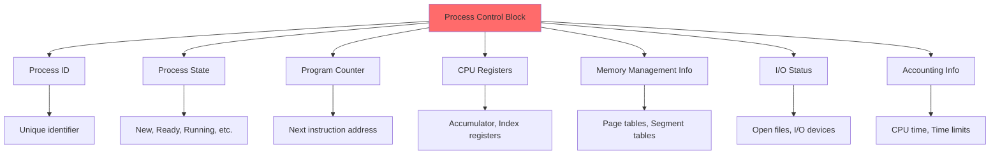

### PCB Contents:

1. **Process ID (PID)**: Unique identifier
2. **Process State**: Current state (ready, running, waiting)
3. **Program Counter**: Address of next instruction
4. **CPU Registers**: Contents of all process-centric registers
5. **CPU Scheduling Information**: Priority, scheduling queue pointers
6. **Memory Management Information**: Page tables, segment tables
7. **Accounting Information**: CPU time used, time limits
8. **I/O Status Information**: List of open files, I/O devices

---

## Preemptive vs Non-Preemptive Processes

### Non-Preemptive Scheduling

Process runs until it voluntarily releases CPU.

```mermaid
gantt
    title Non-Preemptive Scheduling
    dateFormat X
    axisFormat %L
    
    section CPU
    Process A :0, 5
    Process B :5, 8
    Process C :8, 12
```

**Characteristics:**
- Process runs to completion or until it blocks
- No forced context switching
- Simple to implement
- Poor response time
- Examples: FCFS, Shortest Job First (non-preemptive)

### Preemptive Scheduling

OS can interrupt running process and assign CPU to another process.

```mermaid
gantt
    title Preemptive Scheduling (Round Robin)
    dateFormat X
    axisFormat %L
    
    section CPU
    Process A :0, 2
    Process B :2, 4
    Process C :4, 6
    Process A :6, 8
    Process B :8, 10
```

**Characteristics:**
- Process can be interrupted
- Better response time
- More complex (requires context switching)
- Examples: Round Robin, Priority Scheduling (preemptive)

### Comparison

| Aspect | Preemptive | Non-Preemptive |
|--------|-----------|----------------|
| **Interruption** | Can be interrupted | Runs to completion |
| **Response Time** | Better | Worse |
| **Complexity** | Higher | Lower |
| **Context Switching** | Frequent | Rare |
| **Starvation** | Less likely | More likely |
| **Real-time Systems** | Suitable | Not suitable |

---

## Process vs Thread

### Comparison

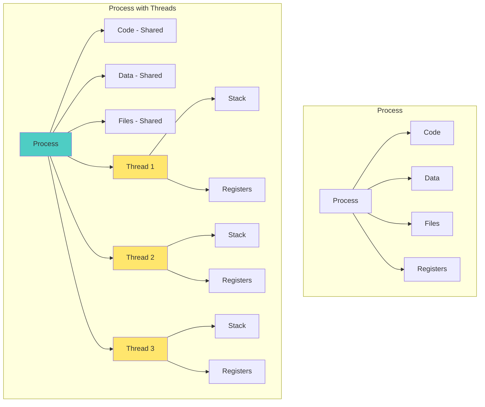

| Aspect | Process | Thread |
|--------|---------|--------|
| **Definition** | Independent program execution | Lightweight process within a process |
| **Memory** | Separate address space | Shared address space |
| **Communication** | IPC (pipes, sockets) | Direct (shared memory) |
| **Creation Time** | Slower | Faster |
| **Context Switching** | Expensive | Cheap |
| **Resource Sharing** | No | Yes (code, data, files) |
| **Independence** | Independent | Dependent on process |
| **Example** | Multiple browser instances | Multiple tabs in one browser |

### Benefits of Threads

1. **Responsiveness**: UI remains responsive while background tasks run
2. **Resource Sharing**: Threads share memory and resources
3. **Economy**: Cheaper to create and context switch
4. **Scalability**: Can utilize multiple processors

---

## Process Management

### Process Creation

Processes can create other processes (parent-child relationship).

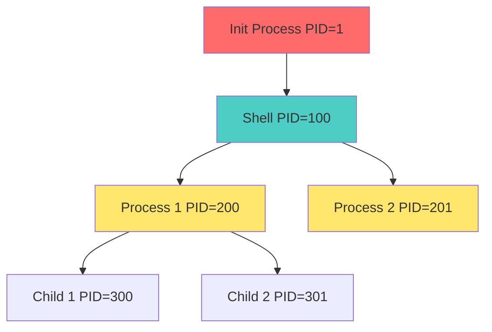

### Process Termination

**Normal Termination:**
- Process completes execution
- Calls `exit()` system call
- Returns exit status to parent

**Abnormal Termination:**
- Process killed by signal
- Segmentation fault
- Division by zero
- Parent terminates (orphan processes)

---

## Process Schedulers

### Types of Schedulers

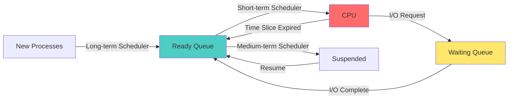

### 1. Long-Term Scheduler (Job Scheduler)

- **Function**: Selects processes from job pool and loads into memory
- **Frequency**: Executes infrequently (seconds, minutes)
- **Controls**: Degree of multiprogramming
- **Goal**: Good mix of I/O-bound and CPU-bound processes

### 2. Short-Term Scheduler (CPU Scheduler)

- **Function**: Selects process from ready queue and allocates CPU
- **Frequency**: Executes very frequently (milliseconds)
- **Speed**: Must be very fast
- **Goal**: Maximize CPU utilization

### 3. Medium-Term Scheduler

- **Function**: Swaps processes in/out of memory
- **Purpose**: Reduce degree of multiprogramming
- **Mechanism**: Swapping
- **Goal**: Improve process mix, free memory

---

## CPU Scheduling Algorithms

### 1. First-Come, First-Served (FCFS)

**Non-preemptive**: Processes executed in order of arrival.

```mermaid
gantt
    title FCFS Scheduling
    dateFormat X
    axisFormat %L ms
    
    section CPU
    P1 (24ms) :0, 24
    P2 (3ms) :24, 27
    P3 (3ms) :27, 30
```

**Example:**

| Process | Arrival Time | Burst Time |
|---------|-------------|------------|
| P1 | 0 | 24 |
| P2 | 0 | 3 |
| P3 | 0 | 3 |

**Gantt Chart:** P1 | P2 | P3

**Waiting Time:**
- P1 = 0
- P2 = 24
- P3 = 27
- **Average = (0 + 24 + 27) / 3 = 17 ms**

**Turnaround Time:**
- P1 = 24
- P2 = 27
- P3 = 30
- **Average = (24 + 27 + 30) / 3 = 27 ms**

**Advantages:**
- Simple to implement
- Fair (first come, first served)

**Disadvantages:**
- **Convoy Effect**: Short processes wait for long process
- Poor average waiting time
- Not suitable for time-sharing systems

### 2. Shortest Job First (SJF)

**Non-preemptive**: Process with smallest burst time executed first.

**Example:**

| Process | Arrival Time | Burst Time |
|---------|-------------|------------|
| P1 | 0 | 6 |
| P2 | 0 | 8 |
| P3 | 0 | 7 |
| P4 | 0 | 3 |

**Execution Order:** P4 | P1 | P3 | P2

```mermaid
gantt
    title SJF Scheduling
    dateFormat X
    axisFormat %L ms
    
    section CPU
    P4 (3ms) :0, 3
    P1 (6ms) :3, 9
    P3 (7ms) :9, 16
    P2 (8ms) :16, 24
```

**Waiting Time:**
- P1 = 3
- P2 = 16
- P3 = 9
- P4 = 0
- **Average = (3 + 16 + 9 + 0) / 4 = 7 ms**

**Advantages:**
- Minimum average waiting time
- Optimal algorithm

**Disadvantages:**
- **Starvation**: Long processes may never execute
- Difficult to predict burst time
- Not practical for short-term scheduling

### 3. Shortest Remaining Time First (SRTF)

**Preemptive version of SJF**: If new process arrives with shorter burst time, current process is preempted.

**Example:**

| Process | Arrival Time | Burst Time |
|---------|-------------|------------|
| P1 | 0 | 8 |
| P2 | 1 | 4 |
| P3 | 2 | 9 |
| P4 | 3 | 5 |

```mermaid
gantt
    title SRTF Scheduling
    dateFormat X
    axisFormat %L ms
    
    section CPU
    P1 :0, 1
    P2 :1, 5
    P4 :5, 10
    P1 :10, 17
    P3 :17, 26
```

**Advantages:**
- Better than SJF for time-sharing
- Minimum average waiting time

**Disadvantages:**
- More context switching overhead
- Starvation possible
- Requires knowledge of burst time

### 4. Priority Scheduling

Each process assigned a priority; highest priority process executed first.

**Example:**

| Process | Burst Time | Priority |
|---------|------------|----------|
| P1 | 10 | 3 |
| P2 | 1 | 1 |
| P3 | 2 | 4 |
| P4 | 1 | 5 |
| P5 | 5 | 2 |

**Execution Order (Lower number = Higher priority):** P2 | P5 | P1 | P3 | P4

```mermaid
gantt
    title Priority Scheduling
    dateFormat X
    axisFormat %L ms
    
    section CPU
    P2 (Pri=1) :0, 1
    P5 (Pri=2) :1, 6
    P1 (Pri=3) :6, 16
    P3 (Pri=4) :16, 18
    P4 (Pri=5) :18, 19
```

**Types:**
- **Preemptive**: Higher priority process can preempt
- **Non-preemptive**: Process runs to completion

**Problem: Starvation**
- Low priority processes may never execute

**Solution: Aging**
- Gradually increase priority of waiting processes

### 5. Round Robin (RR)

**Preemptive**: Each process gets small time quantum (time slice). After quantum expires, process preempted and added to end of ready queue.

**Example:** Time Quantum = 4 ms

| Process | Burst Time |
|---------|------------|
| P1 | 24 |
| P2 | 3 |
| P3 | 3 |

```mermaid
gantt
    title Round Robin (Quantum=4ms)
    dateFormat X
    axisFormat %L ms
    
    section CPU
    P1 :0, 4
    P2 :4, 7
    P3 :7, 10
    P1 :10, 14
    P1 :14, 18
    P1 :18, 22
    P1 :22, 26
    P1 :26, 30
```

**Waiting Time:**
- P1 = (0 + 6 + 6 + 6 + 6 + 6 + 6) = 36 - 24 = 6
- P2 = 4
- P3 = 7
- **Average = (6 + 4 + 7) / 3 = 5.67 ms**

**Advantages:**
- Fair allocation
- No starvation
- Good for time-sharing systems
- Better response time

**Disadvantages:**
- Higher average waiting time than SJF
- Context switching overhead
- Performance depends on time quantum

**Time Quantum Selection:**
- **Too large**: Becomes FCFS
- **Too small**: Too much context switching overhead
- **Typical**: 10-100 milliseconds

### 6. Multilevel Queue Scheduling

Processes divided into different queues based on properties.

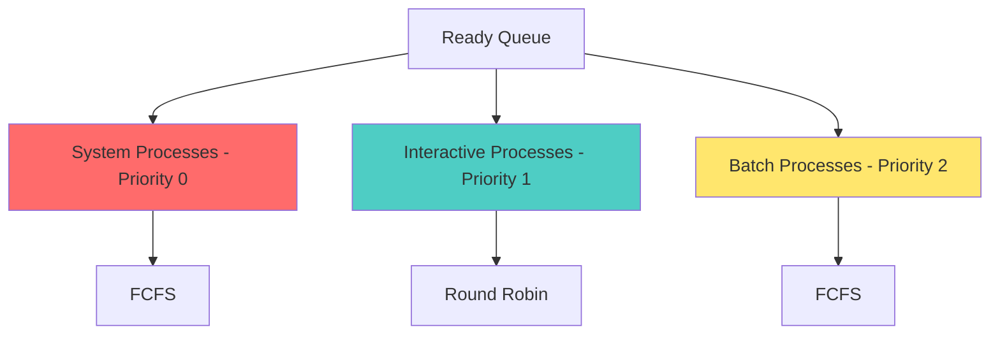

**Characteristics:**
- Each queue has its own scheduling algorithm
- Scheduling among queues (e.g., fixed priority)
- No movement between queues

### 7. Multilevel Feedback Queue

Similar to multilevel queue but processes can move between queues.

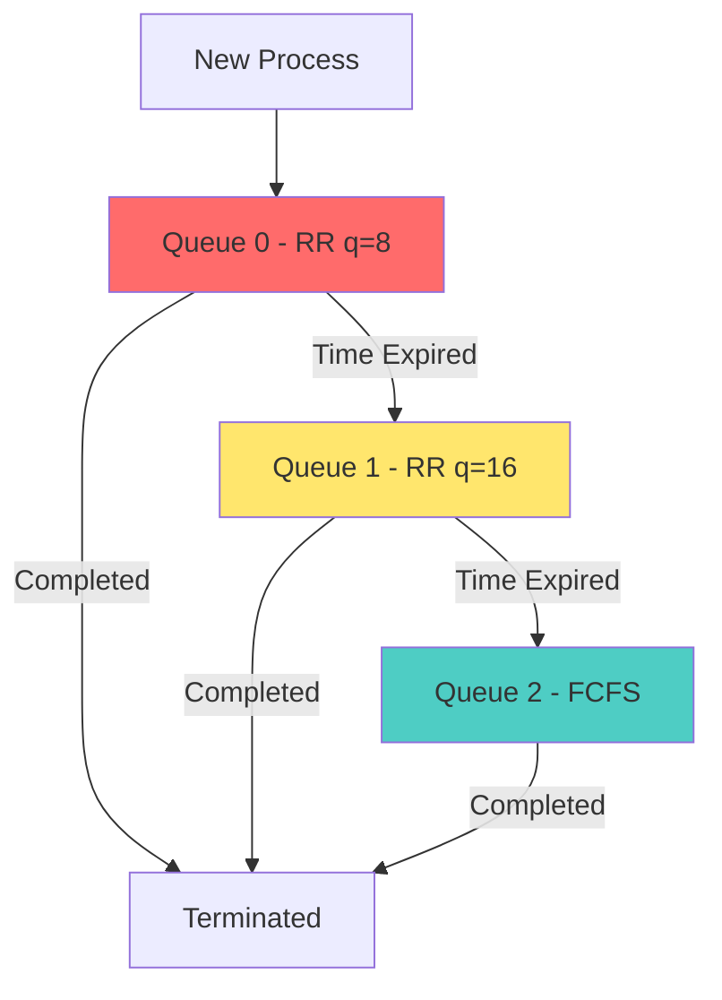

**Characteristics:**
- Processes can move between queues
- Aging implemented
- Prevents starvation
- Most general scheduling algorithm

---

## Scheduling Algorithm Comparison

| Algorithm | Preemptive | Avg Waiting Time | Starvation | Complexity |
|-----------|-----------|------------------|------------|------------|
| **FCFS** | No | High | No | Low |
| **SJF** | No | Minimum | Yes | Medium |
| **SRTF** | Yes | Low | Yes | Medium |
| **Priority** | Both | Varies | Yes | Medium |
| **Round Robin** | Yes | Medium | No | Low |
| **Multilevel Queue** | Yes | Varies | Possible | High |
| **Multilevel Feedback** | Yes | Low | No | Very High |

---

## Process Creation in Linux

### fork() System Call

Creates a new process (child) by duplicating calling process (parent).

```c
#include <stdio.h>
#include <unistd.h>

int main() {
    pid_t pid = fork();
    
    if (pid < 0) {
        // Fork failed
        fprintf(stderr, "Fork failed\n");
        return 1;
    }
    else if (pid == 0) {
        // Child process
        printf("Child process: PID = %d\n", getpid());
        printf("Child's parent PID = %d\n", getppid());
    }
    else {
        // Parent process
        printf("Parent process: PID = %d\n", getpid());
        printf("Parent created child with PID = %d\n", pid);
    }
    
    return 0;
}
```

**Output:**
```
Parent process: PID = 1234
Parent created child with PID = 1235
Child process: PID = 1235
Child's parent PID = 1234
```

**fork() Return Values:**
- **< 0**: Fork failed
- **= 0**: Child process
- **> 0**: Parent process (returns child's PID)

### Process Creation Flow

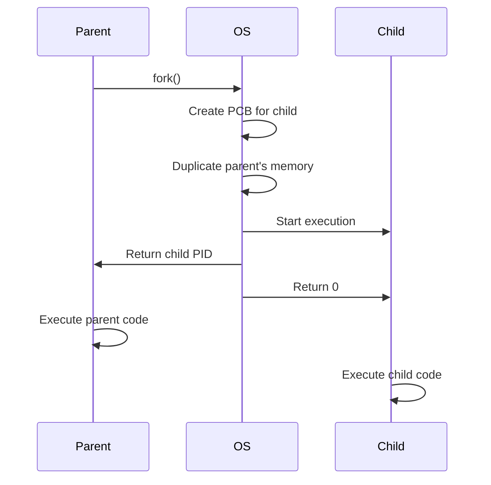

### exec() System Call Family

Replaces current process image with new program.

```c
#include <stdio.h>
#include <unistd.h>

int main() {
    pid_t pid = fork();
    
    if (pid == 0) {
        // Child process
        printf("Child: Executing ls command\n");
        execlp("/bin/ls", "ls", "-l", NULL);
        
        // This line only executes if exec fails
        fprintf(stderr, "Exec failed\n");
    }
    else {
        // Parent process
        printf("Parent: Waiting for child\n");
        wait(NULL);
        printf("Parent: Child completed\n");
    }
    
    return 0;
}
```

**exec() Family:**
- `execl()`: List of arguments
- `execlp()`: Uses PATH environment variable
- `execle()`: List + environment
- `execv()`: Array of arguments
- `execvp()`: Array + PATH
- `execve()`: Array + environment

### wait() and waitpid() System Calls

Parent waits for child to terminate.

```c
#include <stdio.h>
#include <unistd.h>
#include <sys/wait.h>

int main() {
    pid_t pid = fork();
    
    if (pid == 0) {
        // Child process
        printf("Child: PID = %d\n", getpid());
        sleep(2);
        printf("Child: Exiting\n");
        return 42;  // Exit status
    }
    else {
        // Parent process
        int status;
        printf("Parent: Waiting for child %d\n", pid);
        
        waitpid(pid, &status, 0);
        
        if (WIFEXITED(status)) {
            printf("Parent: Child exited with status %d\n", 
                   WEXITSTATUS(status));
        }
    }
    
    return 0;
}
```

**wait() vs waitpid():**
- `wait(&status)`: Wait for any child
- `waitpid(pid, &status, options)`: Wait for specific child

---

## Orphan and Zombie Processes

### Zombie Process

Process that has completed but still has entry in process table.

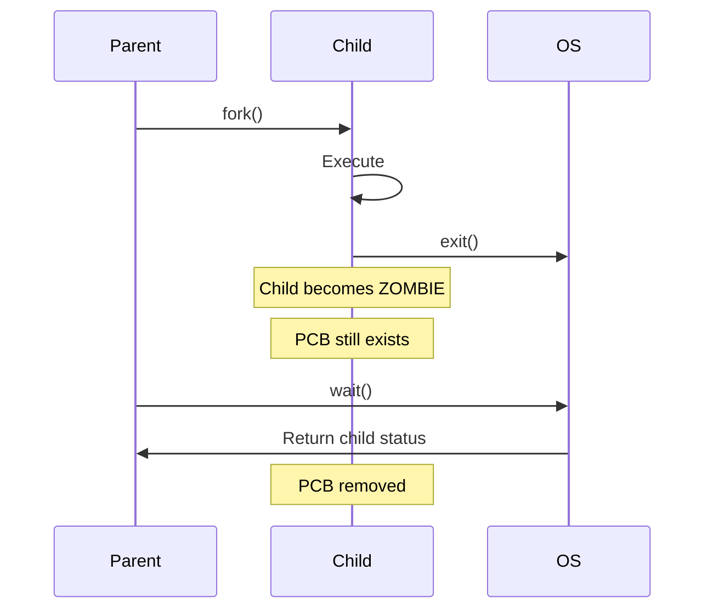

**Characteristics:**
- Process finished execution
- Exit status not yet read by parent
- Occupies entry in process table
- Cannot be killed (already dead!)

**Example:**
```c
#include <stdio.h>
#include <unistd.h>

int main() {
    pid_t pid = fork();
    
    if (pid == 0) {
        // Child exits immediately
        printf("Child exiting\n");
        return 0;
    }
    else {
        // Parent doesn't call wait()
        printf("Parent sleeping (child becomes zombie)\n");
        sleep(30);  // Child is zombie for 30 seconds
        printf("Parent exiting\n");
    }
    
    return 0;
}
```

**How to Check:**
```bash
ps aux | grep Z
# or
ps aux | grep defunct
```

### Orphan Process

Process whose parent has terminated.

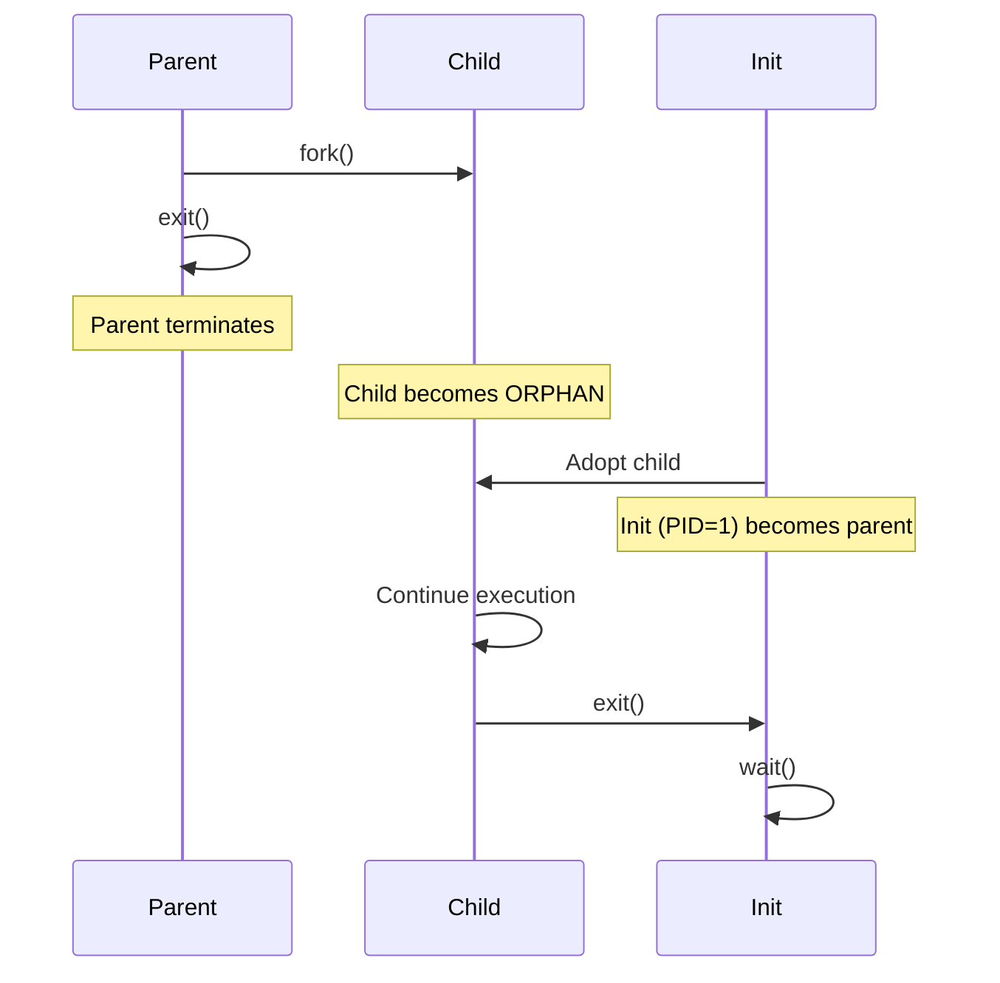

**Characteristics:**
- Parent terminated before child
- Adopted by init process (PID = 1)
- Not a problem (init will clean up)

**Example:**
```c
#include <stdio.h>
#include <unistd.h>

int main() {
    pid_t pid = fork();
    
    if (pid == 0) {
        // Child process
        sleep(2);
        printf("Child: My parent is %d\n", getppid());
        sleep(5);
        printf("Child: My parent is now %d (adopted by init)\n", 
               getppid());
    }
    else {
        // Parent exits immediately
        printf("Parent: Exiting (child becomes orphan)\n");
        return 0;
    }
    
    return 0;
}
```

### Comparison

| Aspect | Zombie | Orphan |
|--------|--------|--------|
| **Definition** | Child finished, parent alive | Parent finished, child alive |
| **Parent Status** | Alive but not calling wait() | Terminated |
| **Process State** | Terminated (defunct) | Running |
| **Problem** | Wastes process table entry | No problem |
| **Solution** | Parent should call wait() | Adopted by init |
| **Can be killed?** | No (already dead) | Yes |

---

## Practice Questions

### Multiple Choice Questions

1. **What is the return value of fork() in the child process?**
   - A) -1
   - B) 0
   - C) Child's PID
   - D) Parent's PID
   
   **Answer: B**

2. **Which scheduling algorithm has minimum average waiting time?**
   - A) FCFS
   - B) Round Robin
   - C) SJF
   - D) Priority
   
   **Answer: C**

3. **What is a zombie process?**
   - A) Process waiting for I/O
   - B) Process terminated but entry in process table
   - C) Process with no parent
   - D) Process in ready state
   
   **Answer: B**

4. **Which scheduler controls degree of multiprogramming?**
   - A) Short-term
   - B) Medium-term
   - C) Long-term
   - D) I/O scheduler
   
   **Answer: C**

5. **What is the convoy effect?**
   - A) Multiple processes waiting for long process in FCFS
   - B) Process starvation in priority scheduling
   - C) Context switching overhead
   - D) Deadlock situation
   
   **Answer: A**

### Calculation Problems

**Problem 1:** Calculate average waiting time for FCFS

| Process | Arrival Time | Burst Time |
|---------|-------------|------------|
| P1 | 0 | 5 |
| P2 | 1 | 3 |
| P3 | 2 | 8 |

**Solution:**
- P1: WT = 0
- P2: WT = 5 - 1 = 4
- P3: WT = 8 - 2 = 6
- **Average WT = (0 + 4 + 6) / 3 = 3.33 ms**

---

## Important Points to Remember

> [!IMPORTANT]
> **For CCEE Exam:**
> - Know all scheduling algorithms and their characteristics
> - Understand how to calculate waiting time and turnaround time
> - Remember fork() return values
> - Know difference between zombie and orphan processes
> - Understand preemptive vs non-preemptive scheduling

> [!TIP]
> **Study Strategy:**
> - Practice scheduling algorithm calculations
> - Draw Gantt charts for different algorithms
> - Write fork() programs and observe output
> - Understand process state transitions
> - Create comparison tables for algorithms

---

*End of Sessions 4-5 Notes*
