# Sessions 6 & 7: Memory Management

## Introduction to Memory Management

**Memory Management** is the process of controlling and coordinating computer memory, assigning portions called blocks to various running programs to optimize overall system performance.

### Why Memory Management?

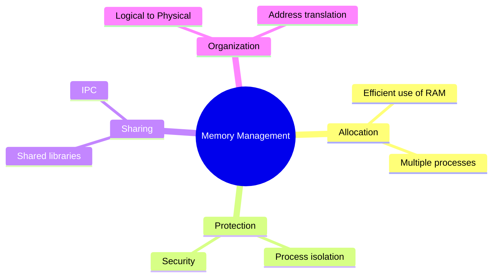

**Key Objectives:**
1. **Allocation**: Efficiently allocate memory to processes
2. **Protection**: Prevent processes from accessing each other's memory
3. **Sharing**: Allow controlled sharing of memory
4. **Organization**: Manage logical and physical addresses
5. **Relocation**: Load programs at different memory locations

---

## Types of Memory

### Memory Hierarchy

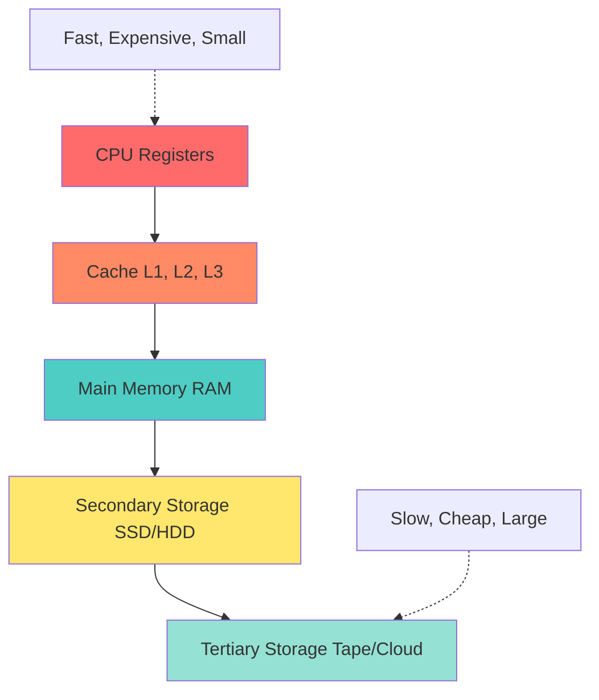

| Memory Type | Speed | Cost | Capacity | Volatile |
|-------------|-------|------|----------|----------|
| **Registers** | Fastest | Highest | Bytes | Yes |
| **Cache** | Very Fast | Very High | KB-MB | Yes |
| **RAM** | Fast | High | GB | Yes |
| **SSD** | Medium | Medium | GB-TB | No |
| **HDD** | Slow | Low | TB | No |
| **Tape/Cloud** | Slowest | Lowest | PB | No |

### Primary vs Secondary Memory

| Aspect | Primary Memory (RAM) | Secondary Memory (Disk) |
|--------|---------------------|------------------------|
| **Speed** | Fast (nanoseconds) | Slow (milliseconds) |
| **Volatility** | Volatile (data lost on power off) | Non-volatile |
| **Access** | Direct CPU access | Through I/O operations |
| **Cost** | Expensive | Cheap |
| **Capacity** | Limited (GB) | Large (TB) |
| **Purpose** | Active program execution | Long-term storage |

---

## Memory Allocation Techniques

### 1. Contiguous Allocation

Process allocated continuous block of memory.

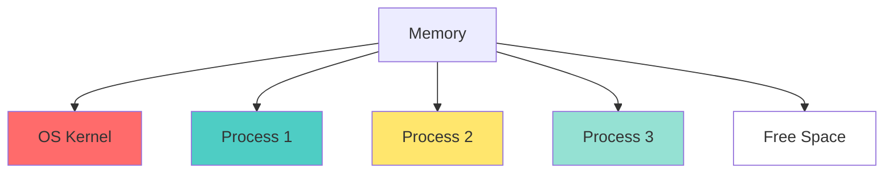

**Advantages:**
- Simple to implement
- Fast access (sequential)
- Minimal overhead

**Disadvantages:**
- External fragmentation
- Difficult to grow process size
- Inflexible

### 2. Non-Contiguous Allocation

Process allocated multiple non-contiguous blocks.

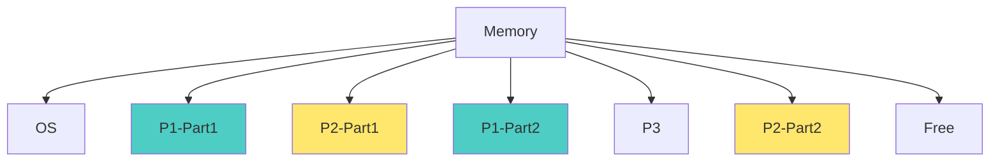

**Advantages:**
- No external fragmentation
- Flexible memory allocation
- Better memory utilization

**Disadvantages:**
- Complex implementation
- Overhead for address translation
- Slower access

---

## Dynamic Memory Allocation Algorithms

When a process requests memory, OS must decide which free block to allocate.

### Memory State Example

```
Memory: [OS][20K Free][P1: 50K][30K Free][P2: 40K][15K Free]
New Process needs: 25K
```

### 1. First Fit

Allocate **first** free block that is large enough.

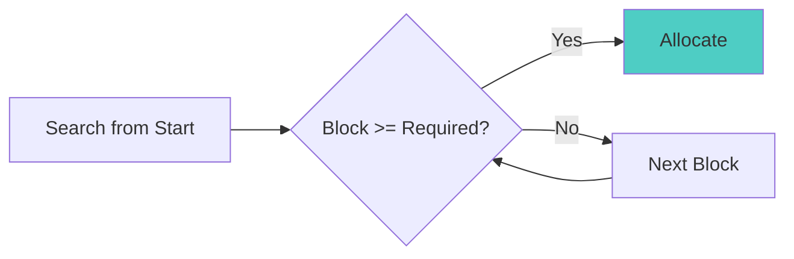

**Example:** Process needs 25K
```
Before: [OS][20K Free][P1][30K Free][P2][15K Free]
After:  [OS][20K Free][P1][25K P3][5K Free][P2][15K Free]
         ↑ Skip (too small)    ↑ Allocate here (first fit)
```

**Advantages:**
- Fast (stops at first fit)
- Simple to implement

**Disadvantages:**
- Creates small fragments at beginning
- May not be optimal

**Time Complexity:** O(n) worst case

### 2. Best Fit

Allocate **smallest** free block that is large enough.


**Example:** Process needs 25K
```
Before: [OS][20K Free][P1][30K Free][P2][15K Free]
After:  [OS][20K Free][P1][25K P3][5K Free][P2][15K Free]
         ↑ Too small      ↑ Best fit (smallest sufficient)
```

**Advantages:**
- Minimizes wasted space
- Better memory utilization

**Disadvantages:**
- Slower (must search all blocks)
- Creates many tiny fragments

**Time Complexity:** O(n)

### 3. Worst Fit

Allocate **largest** free block.


**Example:** Process needs 25K
```
Before: [OS][20K Free][P1][30K Free][P2][50K Free]
After:  [OS][20K Free][P1][30K Free][P2][25K P3][25K Free]
         ↑ Small          ↑ Medium      ↑ Worst fit (largest)
```

**Advantages:**
- Leftover fragments are larger (more usable)
- May reduce fragmentation in some cases

**Disadvantages:**
- Slowest (must search all)
- Wastes large blocks
- Generally performs poorly

**Time Complexity:** O(n)

### 4. Next Fit

Like First Fit but starts search from last allocation point.

**Advantages:**
- Distributes allocations more evenly
- Faster than First Fit on average

**Disadvantages:**
- More fragmentation than First Fit

### Comparison

| Algorithm | Speed | Memory Utilization | Fragmentation |
|-----------|-------|-------------------|---------------|
| **First Fit** | Fast | Medium | Medium |
| **Best Fit** | Slow | Best | High (tiny fragments) |
| **Worst Fit** | Slow | Worst | Low (large fragments) |
| **Next Fit** | Fast | Medium | High |

**Practical Use:** First Fit is most commonly used due to speed and reasonable performance.

---

## Fragmentation

### External Fragmentation

Free memory scattered in small blocks; total free memory sufficient but not contiguous.

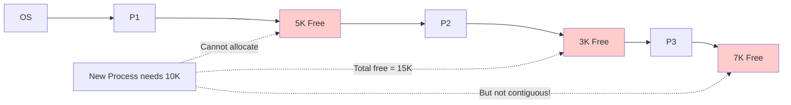

**Characteristics:**
- Occurs in dynamic partitioning
- Total free memory sufficient
- No single contiguous block large enough
- Reduces memory utilization

**Solution:** Compaction

### Internal Fragmentation

Allocated memory larger than requested; wasted space within partition.

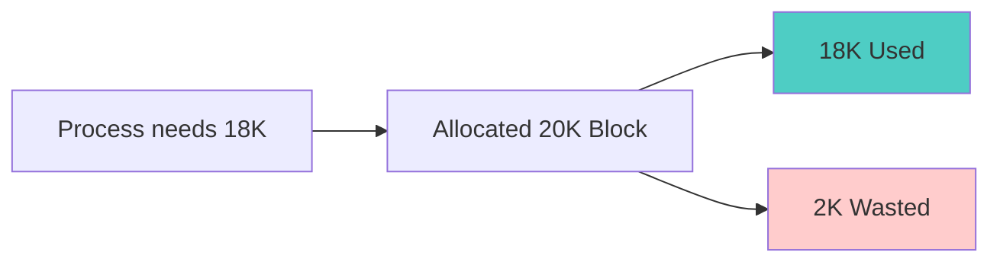

**Characteristics:**
- Occurs in fixed partitioning
- Memory allocated but not used
- Waste within allocated block
- Cannot be used by other processes

**Example:**
- Process needs: 18 KB
- Block size: 20 KB
- Internal fragmentation: 2 KB

**Solution:** Use smaller partition sizes or paging

### Comparison

| Aspect | External Fragmentation | Internal Fragmentation |
|--------|----------------------|----------------------|
| **Location** | Between partitions | Within partition |
| **Cause** | Dynamic allocation/deallocation | Fixed-size partitions |
| **Memory State** | Free but scattered | Allocated but unused |
| **Solution** | Compaction | Smaller partitions, Paging |
| **Occurs in** | Dynamic partitioning | Fixed partitioning |

---

## Compaction

Process of moving allocated memory to create one large free block.

### Before Compaction

```
[OS][P1][Free 5K][P2][Free 3K][P3][Free 7K]
Total Free: 15K (fragmented)
```

### After Compaction

```
[OS][P1][P2][P3][Free 15K]
Total Free: 15K (contiguous)
```

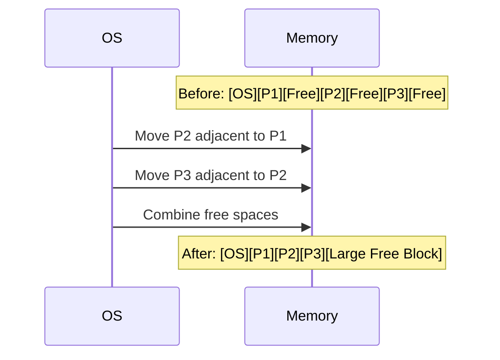

**Advantages:**
- Eliminates external fragmentation
- Creates large contiguous free block
- Improves memory utilization

**Disadvantages:**
- **Expensive**: Must move processes in memory
- **Time-consuming**: Proportional to memory size
- **Requires relocation**: Update all addresses
- **Blocks execution**: Processes must be stopped

**When to Compact:**
- When allocation fails due to fragmentation
- Periodically during low system load
- When fragmentation exceeds threshold

---

## Segmentation

Divide program into logical segments (code, data, stack, heap).

### Segmentation Concept

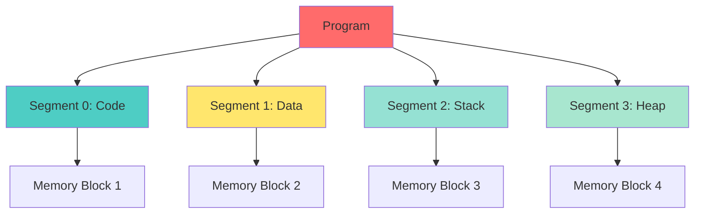

### Logical Address in Segmentation

```
Logical Address = <Segment Number, Offset>
```

**Example:**
- Segment 2, Offset 100
- Means: 100 bytes into Segment 2

### Segment Table

Maps logical segments to physical memory.

| Segment # | Base Address | Limit (Size) |
|-----------|-------------|--------------|
| 0 (Code) | 1000 | 500 |
| 1 (Data) | 2000 | 300 |
| 2 (Stack) | 3500 | 200 |
| 3 (Heap) | 4000 | 400 |

### Address Translation

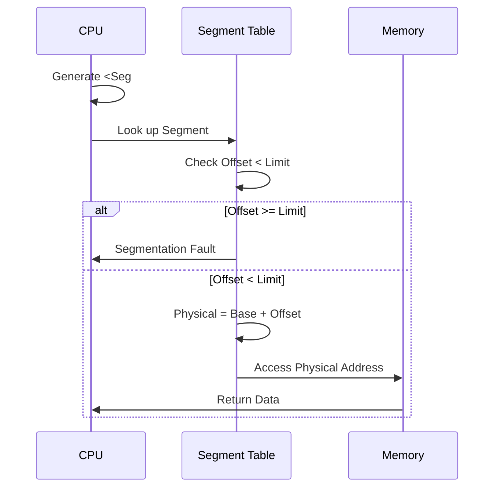

**Example:**
- Logical Address: <1, 50>
- Segment 1: Base = 2000, Limit = 300
- Offset 50 < Limit 300 ✓
- Physical Address = 2000 + 50 = 2050

### Hardware Requirements

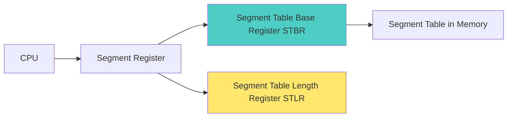

**Required Hardware:**
1. **Segment Table Base Register (STBR)**: Points to segment table in memory
2. **Segment Table Length Register (STLR)**: Number of segments
3. **Segment Registers**: Store current segment information

### Advantages of Segmentation

1. **Logical Division**: Matches program structure
2. **Protection**: Different segments can have different permissions
3. **Sharing**: Code segments can be shared between processes
4. **Dynamic Growth**: Segments can grow independently

### Disadvantages

1. **External Fragmentation**: Variable-size segments
2. **Complex Memory Management**: Must track multiple segments
3. **Overhead**: Segment table lookup

---

## Paging

Divide memory into fixed-size blocks called **pages** (logical) and **frames** (physical).

### Paging Concept

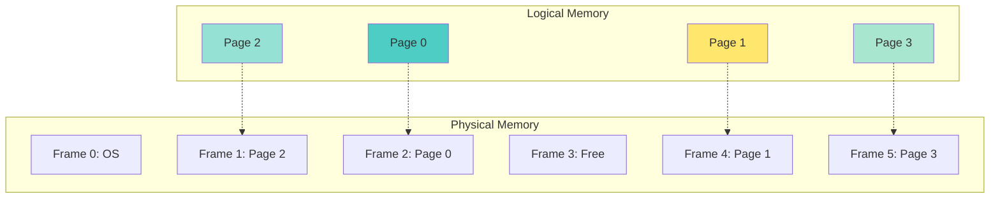

**Key Concepts:**
- **Page**: Fixed-size block of logical memory (typically 4KB)
- **Frame**: Fixed-size block of physical memory (same size as page)
- **Page Table**: Maps pages to frames

### Logical Address in Paging

```
Logical Address = <Page Number, Page Offset>
```

**Example:** 32-bit address, 4KB pages
- Address: 8196 (binary: 0010000000000100)
- Page size: 4096 bytes (2^12)
- Page number: 8196 / 4096 = 2
- Offset: 8196 % 4096 = 4
- Logical Address: <2, 4>

### Page Table

Maps page numbers to frame numbers.

| Page # | Frame # | Valid Bit |
|--------|---------|-----------|
| 0 | 2 | 1 |
| 1 | 4 | 1 |
| 2 | 1 | 1 |
| 3 | 5 | 1 |

### Address Translation

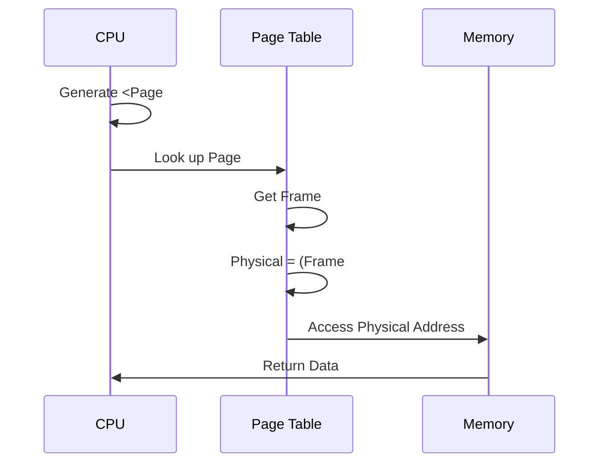

**Example:**
- Logical Address: <2, 4>
- Page 2 → Frame 1 (from page table)
- Page size: 4096 bytes
- Physical Address = (1 × 4096) + 4 = 4100

### Hardware Requirements

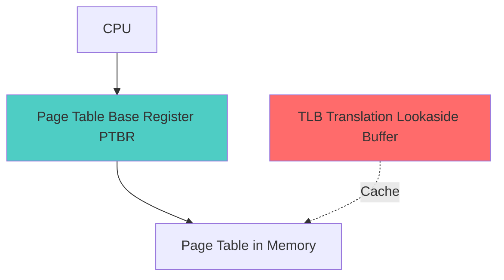

**Required Hardware:**
1. **Page Table Base Register (PTBR)**: Points to page table
2. **Page Table Length Register (PTLR)**: Size of page table
3. **Translation Lookaside Buffer (TLB)**: Cache for page table entries

### Translation Lookaside Buffer (TLB)

Fast cache for page table entries.

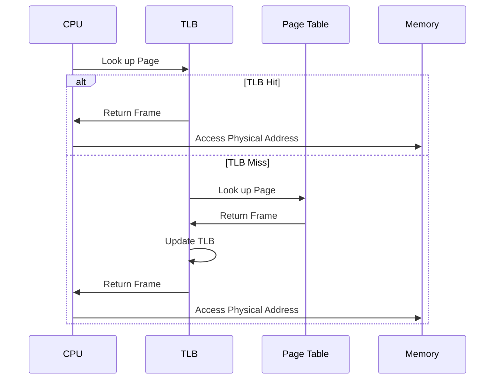

**TLB Characteristics:**
- Small (64-256 entries)
- Very fast (parallel search)
- High hit ratio (80-98%)
- Reduces memory access time significantly

**Effective Access Time:**
```
EAT = (TLB Hit Ratio × TLB Access Time) + 
      (TLB Miss Ratio × (TLB Access Time + Memory Access Time + Memory Access Time))
```

**Example:**
- TLB access time: 1 ns
- Memory access time: 100 ns
- TLB hit ratio: 90%

```
EAT = 0.9 × (1 + 100) + 0.1 × (1 + 100 + 100)
    = 0.9 × 101 + 0.1 × 201
    = 90.9 + 20.1
    = 111 ns
```

### Advantages of Paging

1. **No External Fragmentation**: Fixed-size pages
2. **Simple Allocation**: Any free frame can be used
3. **Protection**: Page-level permissions
4. **Sharing**: Pages can be shared between processes

### Disadvantages

1. **Internal Fragmentation**: Last page may not be fully used
2. **Overhead**: Page table storage
3. **Memory Access Time**: Additional memory access for page table

---

## Page Table Structure

### Single-Level Page Table

Simple but large for big address spaces.

**Problem:** For 32-bit address space with 4KB pages:
- Pages: 2^32 / 2^12 = 2^20 = 1M entries
- Page table size: 1M × 4 bytes = 4 MB per process!

### Multi-Level Page Table

Divide page table into multiple levels.

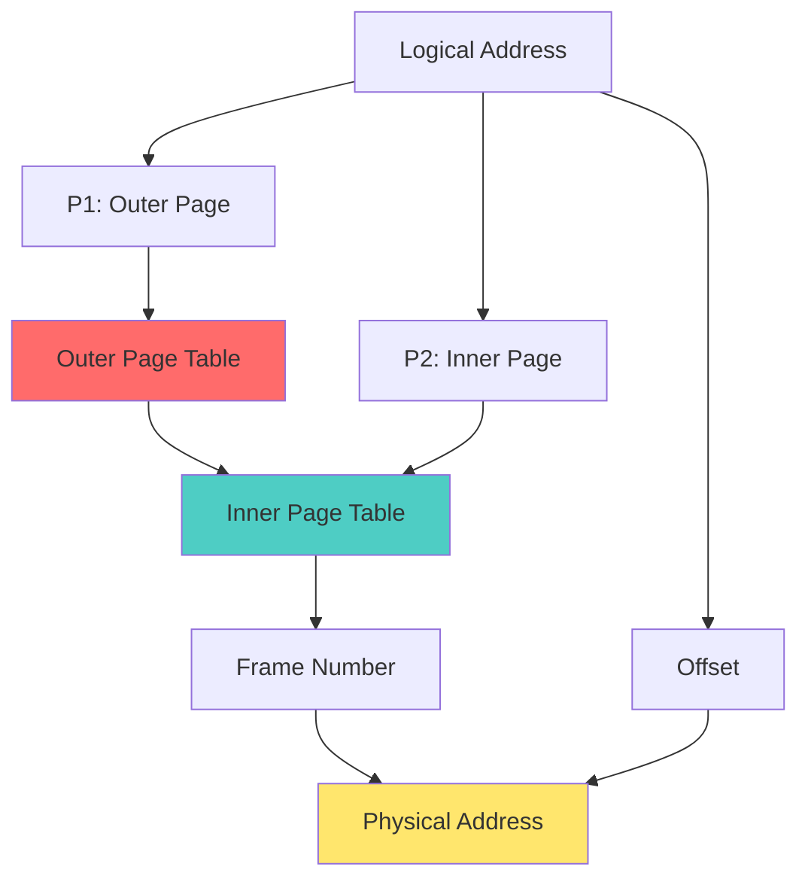

**Advantages:**
- Reduces page table size
- Only active pages need page tables
- Better memory utilization

### Inverted Page Table

One entry per frame (not per page).

| Frame # | Page # | Process ID |
|---------|--------|------------|
| 0 | - | OS |
| 1 | 2 | P1 |
| 2 | 0 | P1 |
| 3 | - | Free |
| 4 | 1 | P1 |

**Advantages:**
- Fixed size (one entry per frame)
- Saves memory

**Disadvantages:**
- Slower lookup (must search)
- Difficult to share pages

---

## Dirty Bit

Indicates if page has been modified since loaded into memory.

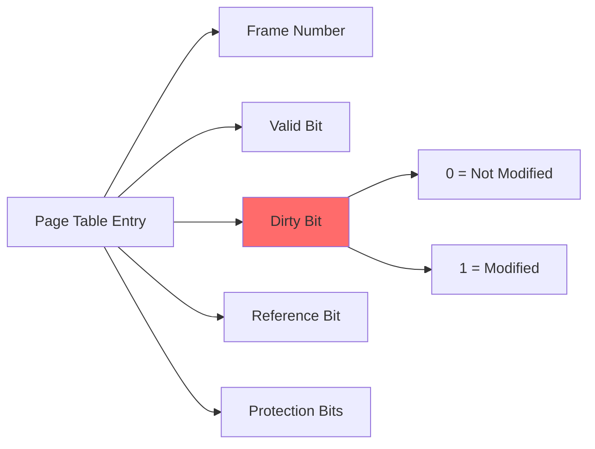

**Purpose:**
- Optimize page replacement
- If dirty bit = 0, no need to write back to disk
- If dirty bit = 1, must write to disk before replacement

**Example:**
```
Page loaded from disk → Dirty bit = 0
Process writes to page → Dirty bit = 1
Page replacement:
  - If dirty = 0: Just discard
  - If dirty = 1: Write to disk first
```

---

## Shared Pages and Reentrant Code

### Shared Pages

Multiple processes share same physical pages.

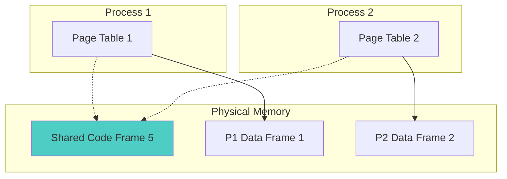

**Use Cases:**
- Shared libraries (libc, DLLs)
- System programs (editors, compilers)
- Read-only data

**Requirements:**
- Code must be reentrant
- Same logical page number in all processes
- Read-only protection

### Reentrant Code

Code that can be executed by multiple processes simultaneously without interference.

**Characteristics:**
1. **No Self-Modification**: Code doesn't modify itself
2. **No Global Variables**: Uses only local variables and parameters
3. **Read-Only**: Code segment is read-only
4. **Thread-Safe**: Can be called concurrently

**Example:**
```c
// Reentrant function
int add(int a, int b) {
    return a + b;  // Only uses parameters
}

// Non-reentrant function
int counter = 0;
int increment() {
    return ++counter;  // Uses global variable
}
```

**Benefits:**
- Saves memory (one copy for multiple processes)
- Faster loading (already in memory)
- Consistency (all processes use same version)

---

## Throttling

Controlling the rate of resource usage.

### Memory Throttling

Limiting memory allocation rate to prevent:
- Memory exhaustion
- Thrashing
- System instability

```mermaid
graph LR
    A[Process Requests Memory] --> B{Within Limit?}
    B -->|Yes| C[Allocate]
    B -->|No| D[Throttle/Delay]
    D --> E[Wait]
    E --> A
    
    style C fill:#4ecdc4
    style D fill:#ff6b6b
```

**Techniques:**
1. **Rate Limiting**: Maximum allocations per time period
2. **Quota System**: Maximum memory per process/user
3. **Priority-Based**: Higher priority gets more resources
4. **Adaptive**: Adjust based on system load

---

## I/O Management

### I/O Devices

```mermaid
graph TD
    A[I/O Devices] --> B[Block Devices]
    A --> C[Character Devices]
    
    B --> B1[Hard Disk]
    B --> B2[SSD]
    B --> B3[USB Drive]
    
    C --> C1[Keyboard]
    C --> C2[Mouse]
    C --> C3[Printer]
    
    style B fill:#4ecdc4
    style C fill:#ffe66d
```

**Block Devices:**
- Transfer data in blocks (512B, 4KB)
- Random access
- Examples: Disk, SSD

**Character Devices:**
- Transfer data character by character
- Sequential access
- Examples: Keyboard, mouse, serial port

### I/O Techniques

#### 1. Programmed I/O (Polling)

CPU continuously checks device status.

```mermaid
sequenceDiagram
    participant CPU
    participant Device
    
    loop Polling
        CPU->>Device: Check status
        Device->>CPU: Busy
    end
    Device->>CPU: Ready
    CPU->>Device: Transfer data
```

**Disadvantages:**
- Wastes CPU time
- Inefficient

#### 2. Interrupt-Driven I/O

Device sends interrupt when ready.

```mermaid
sequenceDiagram
    participant CPU
    participant Device
    
    CPU->>Device: Initiate I/O
    CPU->>CPU: Continue other work
    Device->>Device: Perform I/O
    Device->>CPU: Interrupt (I/O complete)
    CPU->>CPU: Handle interrupt
```

**Advantages:**
- CPU can do other work
- More efficient than polling

#### 3. Direct Memory Access (DMA)

Device transfers data directly to/from memory without CPU intervention.

```mermaid
sequenceDiagram
    participant CPU
    participant DMA
    participant Device
    participant Memory
    
    CPU->>DMA: Setup transfer
    CPU->>CPU: Continue other work
    DMA->>Device: Request data
    Device->>DMA: Send data
    DMA->>Memory: Write data
    DMA->>CPU: Interrupt (transfer complete)
```

**Advantages:**
- Minimal CPU involvement
- Very efficient for large transfers
- Used for disk I/O, network

### Buffering

Temporary storage area for I/O data.

**Types:**
1. **Single Buffer**: One buffer
2. **Double Buffer**: Two buffers (while one fills, other empties)
3. **Circular Buffer**: Ring of buffers

**Benefits:**
- Smooths speed differences
- Allows concurrent I/O and processing
- Improves performance

### Spooling

**S**imultaneous **P**eripheral **O**perations **On**-**L**ine

```mermaid
graph LR
    A[Process 1] --> B[Spool]
    C[Process 2] --> B
    D[Process 3] --> B
    B --> E[Printer]
    
    style B fill:#4ecdc4
```

**Example:** Print spooling
- Multiple processes send print jobs
- Jobs stored in spool (disk)
- Printer processes jobs one by one

**Benefits:**
- Multiple processes can use slow device
- Processes don't wait for device
- Jobs can be prioritized

---

## Practice Questions

### Multiple Choice Questions

1. **Which allocation algorithm is fastest?**
   - A) Best Fit
   - B) Worst Fit
   - C) First Fit
   - D) All same speed
   
   **Answer: C**

2. **What type of fragmentation occurs in paging?**
   - A) External
   - B) Internal
   - C) Both
   - D) None
   
   **Answer: B**

3. **What is the purpose of TLB?**
   - A) Store pages
   - B) Cache page table entries
   - C) Manage I/O
   - D) Handle interrupts
   
   **Answer: B**

4. **Dirty bit indicates:**
   - A) Page is in memory
   - B) Page has been modified
   - C) Page is shared
   - D) Page is protected
   
   **Answer: B**

5. **Which is NOT a requirement for reentrant code?**
   - A) No self-modification
   - B) No global variables
   - C) Must be fast
   - D) Read-only
   
   **Answer: C**

### Calculation Problems

**Problem 1:** Calculate physical address
- Logical address: <3, 100>
- Page size: 1024 bytes
- Page 3 → Frame 7
- Physical address = ?

**Solution:**
- Physical address = (Frame × Page Size) + Offset
- = (7 × 1024) + 100
- = 7168 + 100
- = **7268**

**Problem 2:** Memory allocation
- Free blocks: 10K, 4K, 20K, 18K, 7K, 9K
- Process needs: 12K
- First Fit: ?
- Best Fit: ?
- Worst Fit: ?

**Solution:**
- **First Fit**: 20K (first block ≥ 12K)
- **Best Fit**: 18K (smallest block ≥ 12K)
- **Worst Fit**: 20K (largest block)

---

## Important Points to Remember

> [!IMPORTANT]
> **For CCEE Exam:**
> - Understand difference between paging and segmentation
> - Know all allocation algorithms and their trade-offs
> - Remember fragmentation types and solutions
> - Understand TLB and its impact on performance
> - Know page table structures

> [!TIP]
> **Study Strategy:**
> - Practice address translation calculations
> - Draw memory allocation diagrams
> - Compare allocation algorithms with examples
> - Understand hardware requirements for paging/segmentation
> - Create comparison tables

---

*End of Sessions 6-7 Notes*
