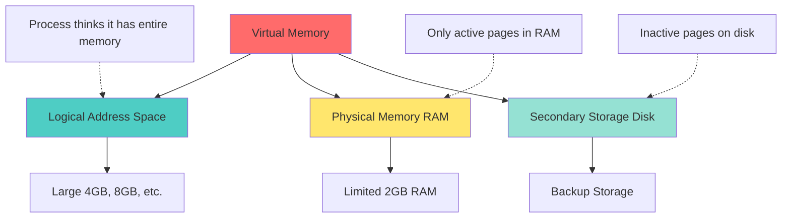
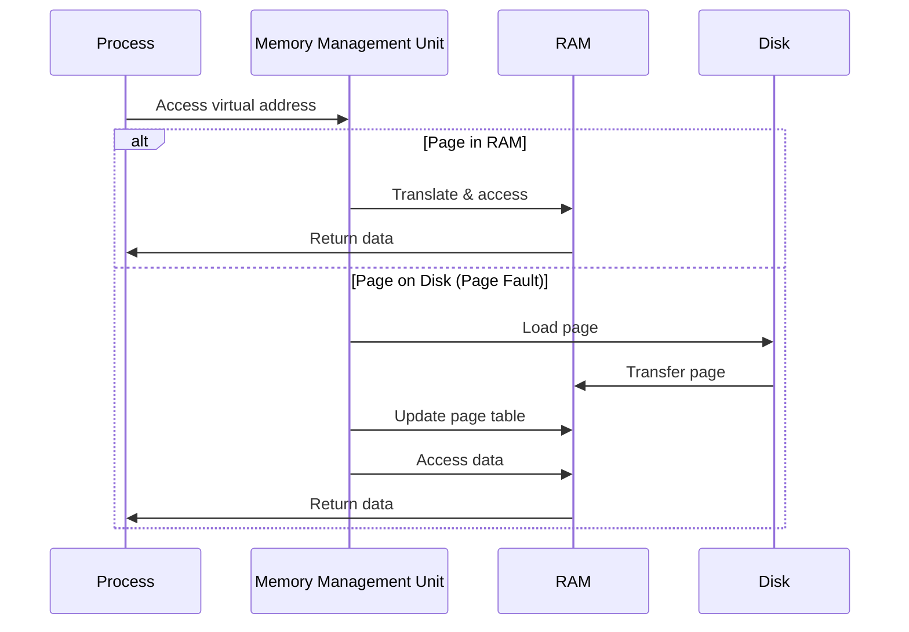
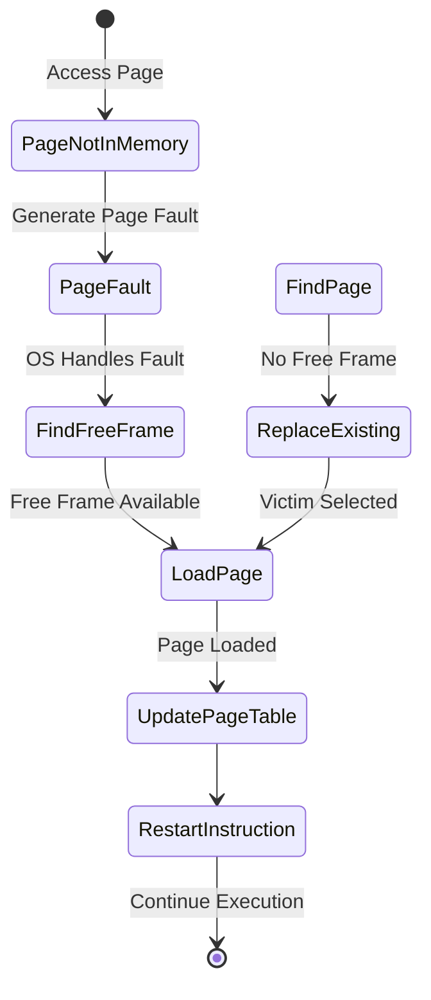
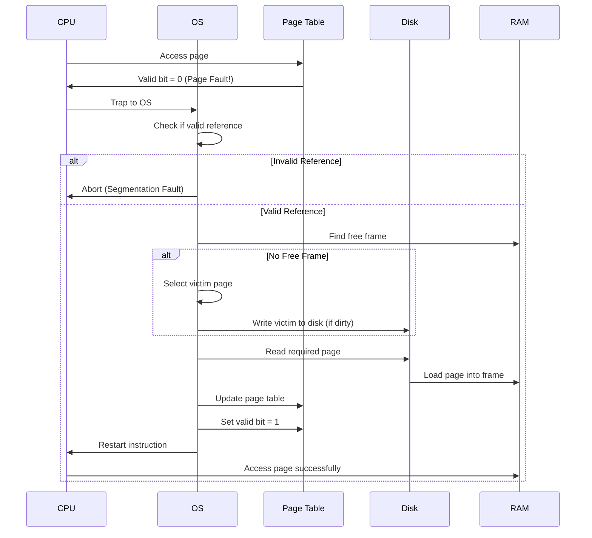
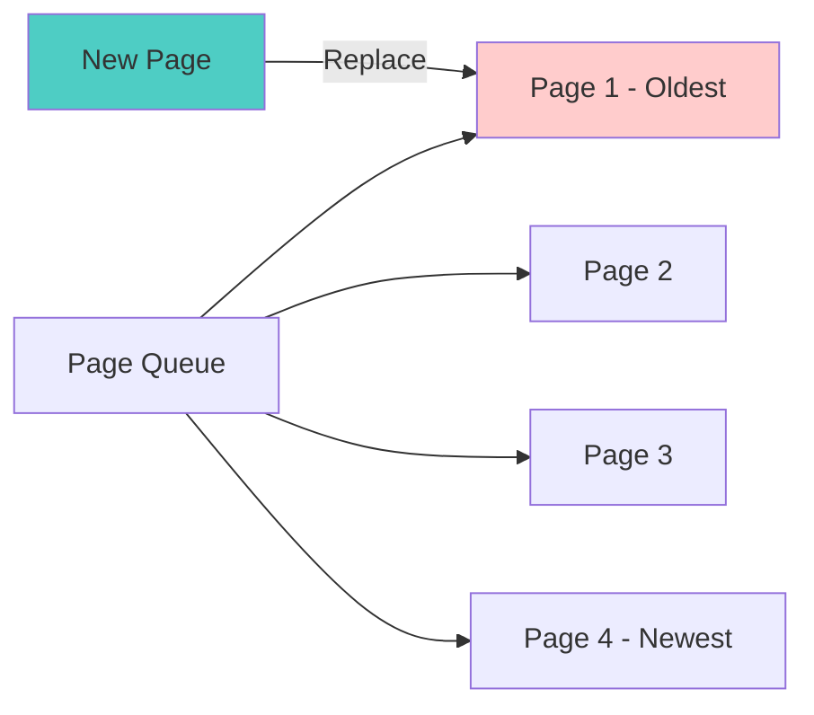
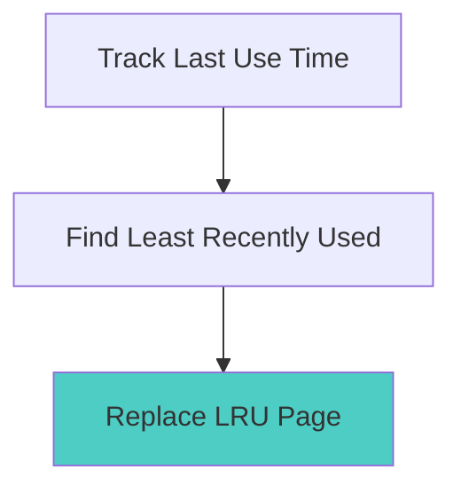
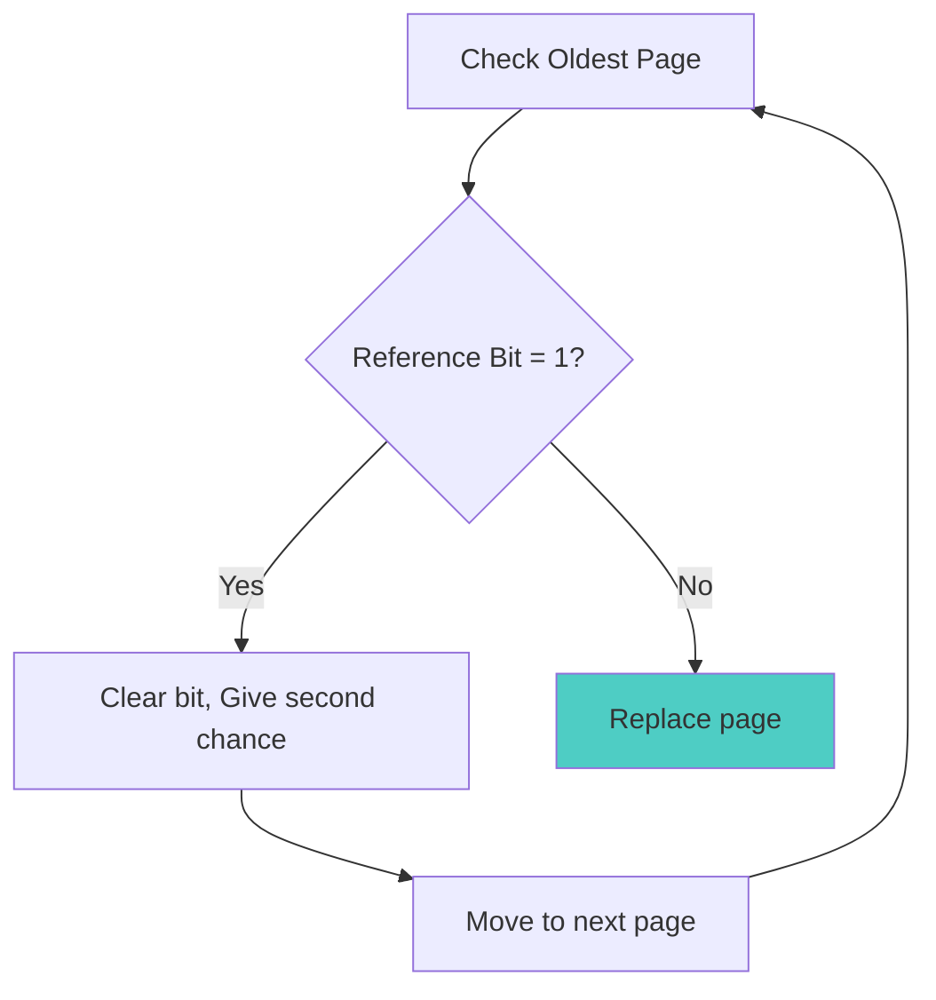
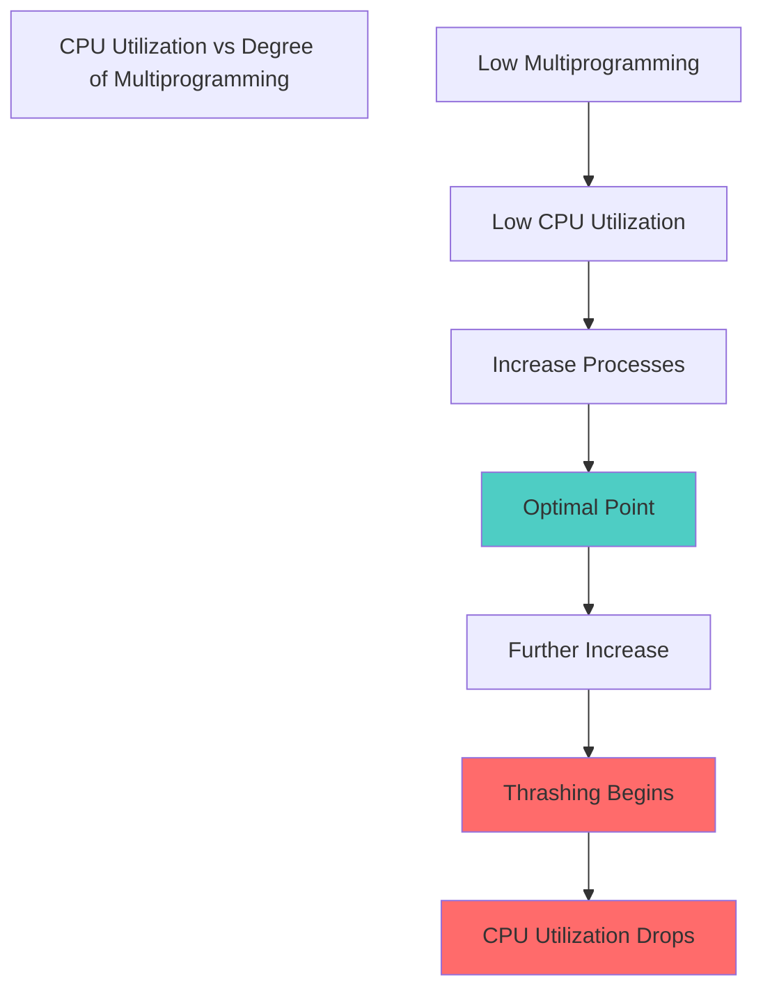
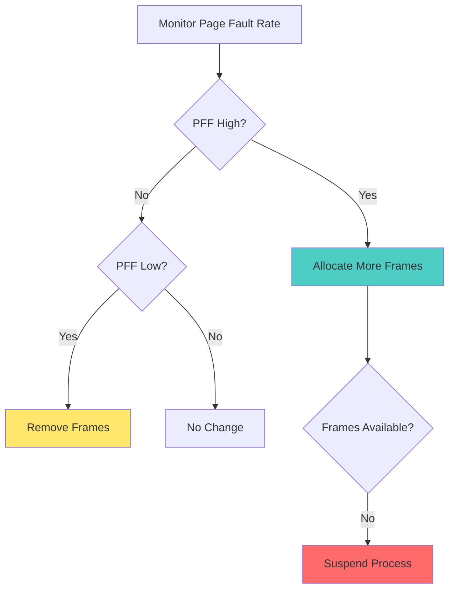

# Session 8: Virtual Memory

## What is Virtual Memory?

**Virtual Memory** is a memory management technique that provides an abstraction of the storage resources, allowing programs to use more memory than physically available.



### Key Concepts

> [!IMPORTANT]
> Virtual memory allows:
> - Programs larger than physical memory
> - More processes in memory simultaneously
> - Efficient memory utilization
> - Process isolation and protection

**Benefits:**
1. **Large Address Space**: Process can use more memory than RAM
2. **Multiprogramming**: More processes can run concurrently
3. **Protection**: Each process has isolated address space
4. **Sharing**: Pages can be shared between processes
5. **Flexibility**: Programs don't need contiguous physical memory

---

## How Virtual Memory Works



### Virtual vs Physical Address

| Virtual Address | Physical Address |
|----------------|------------------|
| Generated by CPU | Actual RAM location |
| Large address space | Limited by RAM size |
| Contiguous for process | May be scattered |
| Process view | Hardware view |
| Example: 0x00400000 | Example: 0x12345678 |

---

## Demand Paging

Load pages into memory only when needed (on demand).

### Demand Paging Process



### Valid-Invalid Bit

Indicates whether page is in memory.

| Page # | Frame # | Valid Bit |
|--------|---------|-----------|
| 0 | 5 | 1 (in memory) |
| 1 | - | 0 (on disk) |
| 2 | 3 | 1 (in memory) |
| 3 | - | 0 (on disk) |
| 4 | 7 | 1 (in memory) |

**Valid bit:**
- **1**: Page is in physical memory
- **0**: Page is on disk (page fault if accessed)

### Advantages of Demand Paging

1. **Less I/O**: Only load needed pages
2. **Less Memory**: Don't load entire program
3. **Faster Response**: Program starts quickly
4. **More Processes**: Better multiprogramming

### Disadvantages

1. **Page Faults**: Slow when page not in memory
2. **Overhead**: Page fault handling
3. **Complexity**: More complex than simple paging

---

## Page Faults

**Page Fault** occurs when process accesses page not in physical memory.

### Page Fault Handling Steps



**Steps:**
1. **Trap to OS**: CPU generates page fault interrupt
2. **Save State**: Save process state
3. **Check Validity**: Verify address is valid
4. **Find Free Frame**: Look for empty frame
5. **Page Replacement**: If no free frame, select victim
6. **Load Page**: Read page from disk to RAM
7. **Update Page Table**: Set valid bit, update frame number
8. **Restart Instruction**: Resume process execution

### Page Fault Rate

```
Effective Access Time (EAT) = (1 - p) × Memory Access Time + p × Page Fault Time

Where:
p = Page fault rate (0 ≤ p ≤ 1)
```

**Example:**
- Memory access time: 200 ns
- Page fault time: 8 ms = 8,000,000 ns
- Page fault rate: 0.001 (0.1%)

```
EAT = (1 - 0.001) × 200 + 0.001 × 8,000,000
    = 0.999 × 200 + 0.001 × 8,000,000
    = 199.8 + 8,000
    = 8,199.8 ns ≈ 8.2 μs
```

> [!WARNING]
> Even a small page fault rate significantly increases access time!

---

## Page Replacement Algorithms

When no free frames available, must select victim page to replace.

### 1. First-In-First-Out (FIFO)

Replace oldest page in memory.



**Example:** Reference string: 7, 0, 1, 2, 0, 3, 0, 4, 2, 3, 0, 3, 2
Frames: 3

```
Reference: 7  0  1  2  0  3  0  4  2  3  0  3  2
Frame 1:   7  7  7  2  2  2  2  4  4  4  0  0  0
Frame 2:   -  0  0  0  0  0  0  0  2  2  2  2  2
Frame 3:   -  -  1  1  1  3  3  3  3  3  3  3  3
Fault:     ✓  ✓  ✓  ✓  -  ✓  -  ✓  ✓  -  ✓  -  -

Total Page Faults: 9
```

**Advantages:**
- Simple to implement
- Fair (oldest replaced first)

**Disadvantages:**
- Poor performance
- **Belady's Anomaly**: More frames may cause more faults!
- Doesn't consider page usage

### 2. Optimal Page Replacement

Replace page that won't be used for longest time in future.

**Example:** Same reference string, 3 frames

```
Reference: 7  0  1  2  0  3  0  4  2  3  0  3  2
Frame 1:   7  7  7  2  2  2  2  2  2  2  2  2  2
Frame 2:   -  0  0  0  0  0  0  4  4  4  0  0  0
Frame 3:   -  -  1  1  1  3  3  3  3  3  3  3  3
Fault:     ✓  ✓  ✓  ✓  -  ✓  -  ✓  -  -  ✓  -  -

Total Page Faults: 7
```

**Advantages:**
- **Minimum page faults** (optimal)
- Best possible algorithm

**Disadvantages:**
- **Impossible to implement** (requires future knowledge)
- Used only for comparison/benchmarking

### 3. Least Recently Used (LRU)

Replace page that hasn't been used for longest time.



**Example:** Same reference string, 3 frames

```
Reference: 7  0  1  2  0  3  0  4  2  3  0  3  2
Frame 1:   7  7  7  2  2  2  2  4  4  4  0  0  0
Frame 2:   -  0  0  0  0  0  0  0  0  3  3  3  3
Frame 3:   -  -  1  1  1  3  3  3  2  2  2  2  2
Fault:     ✓  ✓  ✓  ✓  -  ✓  -  ✓  ✓  ✓  ✓  -  -

Total Page Faults: 10
```

**Implementation Methods:**

#### a) Counter Method
- Each page has counter
- Update counter on access
- Replace page with smallest counter

#### b) Stack Method
- Maintain stack of page numbers
- On access, move page to top
- Bottom page is LRU

**Advantages:**
- Good performance
- Approximates optimal
- No Belady's Anomaly

**Disadvantages:**
- Expensive to implement
- Requires hardware support
- Overhead for tracking

### 4. Least Frequently Used (LFU)

Replace page with smallest reference count.

| Page | Reference Count |
|------|----------------|
| 1 | 5 |
| 2 | 2 ← Replace (LFU) |
| 3 | 7 |
| 4 | 3 |

**Advantages:**
- Considers usage frequency
- Keeps frequently used pages

**Disadvantages:**
- Page used heavily in past but not now stays in memory
- Overhead to maintain counters
- Slow to respond to changes

### 5. Most Frequently Used (MFU)

Replace page with largest reference count (opposite of LFU).

**Reasoning:** Page with smallest count probably just brought in and will be used.

**Disadvantages:**
- Generally performs poorly
- Rarely used in practice

### 6. Second Chance (Clock) Algorithm

Enhanced FIFO using reference bit.



**Algorithm:**
1. Check oldest page
2. If reference bit = 1:
   - Clear bit to 0
   - Move to end of queue (second chance)
3. If reference bit = 0:
   - Replace page

**Advantages:**
- Better than FIFO
- Simple to implement
- Considers recent usage

### Comparison of Algorithms

| Algorithm | Page Faults | Implementation | Belady's Anomaly |
|-----------|------------|----------------|------------------|
| **FIFO** | High | Easy | Yes |
| **Optimal** | Minimum | Impossible | No |
| **LRU** | Low | Difficult | No |
| **LFU** | Medium | Medium | No |
| **Second Chance** | Medium | Easy | Yes |

---

## Belady's Anomaly

Increasing number of frames increases page faults (counterintuitive!).

### Example

**Reference String:** 1, 2, 3, 4, 1, 2, 5, 1, 2, 3, 4, 5

**With 3 Frames (FIFO):**
```
Reference: 1  2  3  4  1  2  5  1  2  3  4  5
Frame 1:   1  1  1  4  4  4  4  1  1  1  1  5
Frame 2:   -  2  2  2  2  2  5  5  5  3  3  3
Frame 3:   -  -  3  3  3  3  3  3  2  2  4  4
Faults:    ✓  ✓  ✓  ✓  -  -  ✓  ✓  ✓  ✓  ✓  ✓

Total: 10 page faults
```

**With 4 Frames (FIFO):**
```
Reference: 1  2  3  4  1  2  5  1  2  3  4  5
Frame 1:   1  1  1  1  1  1  1  1  1  1  1  5
Frame 2:   -  2  2  2  2  2  2  2  2  2  2  2
Frame 3:   -  -  3  3  3  3  3  3  3  3  3  3
Frame 4:   -  -  -  4  4  4  5  5  5  5  4  4
Faults:    ✓  ✓  ✓  ✓  -  -  ✓  -  -  -  ✓  ✓

Total: 11 page faults (MORE!)
```

> [!WARNING]
> Belady's Anomaly occurs only with FIFO and some other algorithms. LRU and Optimal do NOT suffer from this anomaly.

**Algorithms with Belady's Anomaly:**
- FIFO
- Second Chance
- Random

**Algorithms WITHOUT Belady's Anomaly:**
- LRU
- Optimal
- LFU

---

## Thrashing

Condition where system spends more time paging than executing.


### Thrashing Diagram



### Causes of Thrashing

1. **Insufficient Memory**: Too many processes for available RAM
2. **Poor Locality**: Process doesn't exhibit locality of reference
3. **High Degree of Multiprogramming**: Too many processes active
4. **Small Working Set**: Process needs more pages than allocated

### Working Set Model

**Working Set**: Set of pages process is currently using.

```
Working Set W(t, Δ) = Set of pages referenced in time interval [t-Δ, t]
```

**Example:**
- Reference string: 1, 2, 3, 4, 1, 2, 5, 1, 2, 3, 4, 5
- Δ = 4 (window size)
- At time t=8: W(8, 4) = {1, 2, 5} (pages referenced in last 4 accesses)

### Preventing Thrashing

1. **Local Replacement**: Process replaces only its own pages
2. **Working Set Model**: Allocate enough frames for working set
3. **Page Fault Frequency**: Monitor and adjust frame allocation
4. **Suspend Processes**: Reduce degree of multiprogramming
5. **Increase Memory**: Add more RAM

### Page Fault Frequency (PFF) Scheme



---

## Frame Allocation

How many frames to allocate to each process?

### Allocation Strategies

#### 1. Equal Allocation

Each process gets equal number of frames.

```
Frames per process = Total Frames / Number of Processes
```

**Example:**
- 100 frames, 5 processes
- Each gets: 100 / 5 = 20 frames

**Disadvantages:**
- Doesn't consider process size
- Unfair for different-sized processes

#### 2. Proportional Allocation

Allocate based on process size.

```
Frames for process i = (Size of process i / Total size) × Total Frames
```

**Example:**
- Process A: 10 KB
- Process B: 127 KB
- Total: 137 KB
- Total frames: 64

```
Frames for A = (10 / 137) × 64 ≈ 5
Frames for B = (127 / 137) × 64 ≈ 59
```

#### 3. Priority Allocation

Allocate based on process priority.

- High priority: More frames
- Low priority: Fewer frames

### Global vs Local Replacement

#### Global Replacement

Process can replace pages from any process.

**Advantages:**
- Better overall throughput
- Flexible allocation

**Disadvantages:**
- Process performance unpredictable
- One process can affect others

#### Local Replacement

Process can only replace its own pages.

**Advantages:**
- Predictable performance
- Process isolation

**Disadvantages:**
- May not utilize memory efficiently
- Fixed allocation

---

## Prepaging

Load multiple pages before they're needed.

**Advantages:**
- Reduces page faults
- Better performance if prediction accurate

**Disadvantages:**
- Wastes I/O if pages not needed
- Difficult to predict accurately

---

## Page Size Considerations

### Small Pages

**Advantages:**
- Less internal fragmentation
- Better memory utilization
- Finer granularity

**Disadvantages:**
- Large page table
- More page faults
- More overhead

### Large Pages

**Advantages:**
- Smaller page table
- Fewer page faults
- Less overhead

**Disadvantages:**
- More internal fragmentation
- Waste memory

**Typical Page Sizes:**
- x86: 4 KB (standard), 2 MB, 1 GB (huge pages)
- ARM: 4 KB, 16 KB, 64 KB

---

## Practice Questions

### Multiple Choice Questions

1. **What is a page fault?**
   - A) Hardware error
   - B) Page not in physical memory
   - C) Invalid page reference
   - D) Disk error
   
   **Answer: B**

2. **Which algorithm has minimum page faults?**
   - A) FIFO
   - B) LRU
   - C) Optimal
   - D) LFU
   
   **Answer: C**

3. **Belady's Anomaly occurs in:**
   - A) FIFO
   - B) LRU
   - C) Optimal
   - D) All algorithms
   
   **Answer: A**

4. **Thrashing occurs when:**
   - A) CPU is 100% utilized
   - B) Too much paging, little execution
   - C) Memory is full
   - D) Disk is full
   
   **Answer: B**

5. **Working set is:**
   - A) All pages of a process
   - B) Pages currently being used
   - C) Pages on disk
   - D) Free pages
   
   **Answer: B**

### Calculation Problems

**Problem 1:** Calculate page faults for FIFO

Reference string: 1, 2, 3, 4, 1, 2, 5, 1, 2, 3, 4, 5
Frames: 3

**Solution:**
```
Reference: 1  2  3  4  1  2  5  1  2  3  4  5
Frame 1:   1  1  1  4  4  4  4  1  1  1  1  5
Frame 2:   -  2  2  2  2  2  5  5  5  3  3  3
Frame 3:   -  -  3  3  3  3  3  3  2  2  4  4
Fault:     ✓  ✓  ✓  ✓  -  -  ✓  ✓  ✓  ✓  ✓  ✓

Total: 10 page faults
```

**Problem 2:** Calculate EAT

- Memory access time: 100 ns
- Page fault time: 10 ms
- Page fault rate: 0.01%

**Solution:**
```
Page fault time = 10 ms = 10,000,000 ns
p = 0.01% = 0.0001

EAT = (1 - p) × MAT + p × PFT
    = (1 - 0.0001) × 100 + 0.0001 × 10,000,000
    = 0.9999 × 100 + 0.0001 × 10,000,000
    = 99.99 + 1,000
    = 1,099.99 ns ≈ 1.1 μs
```

---

## Important Points to Remember

> [!IMPORTANT]
> **For CCEE Exam:**
> - Understand virtual memory concept and benefits
> - Know all page replacement algorithms
> - Remember Belady's Anomaly (FIFO only)
> - Understand thrashing and prevention
> - Calculate page faults for different algorithms
> - Know EAT formula

> [!TIP]
> **Study Strategy:**
> - Practice page replacement algorithm simulations
> - Draw reference string diagrams
> - Calculate EAT for different scenarios
> - Understand working set concept
> - Compare all algorithms in a table
> - Remember which algorithms have Belady's Anomaly

---

## Summary Table

| Algorithm | Complexity | Performance | Belady's Anomaly | Practical |
|-----------|-----------|-------------|------------------|-----------|
| **FIFO** | Low | Poor | Yes | Yes |
| **Optimal** | N/A | Best | No | No (theoretical) |
| **LRU** | High | Good | No | Yes (with hardware) |
| **LFU** | Medium | Medium | No | Rarely |
| **Second Chance** | Low | Medium | Yes | Yes |

---

*End of Session 8 Notes*
