# Session 9: Deadlock

## What is Deadlock?

**Deadlock** is a situation where a set of processes are blocked because each process is holding a resource and waiting for another resource acquired by some other process.

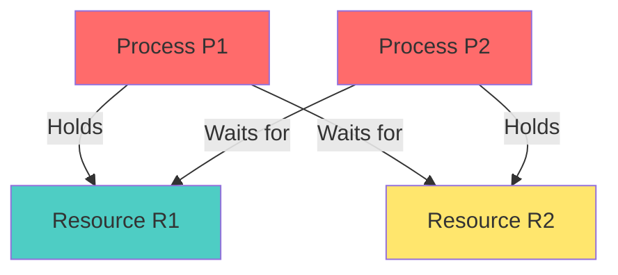

### Real-World Example

**Traffic Deadlock:**
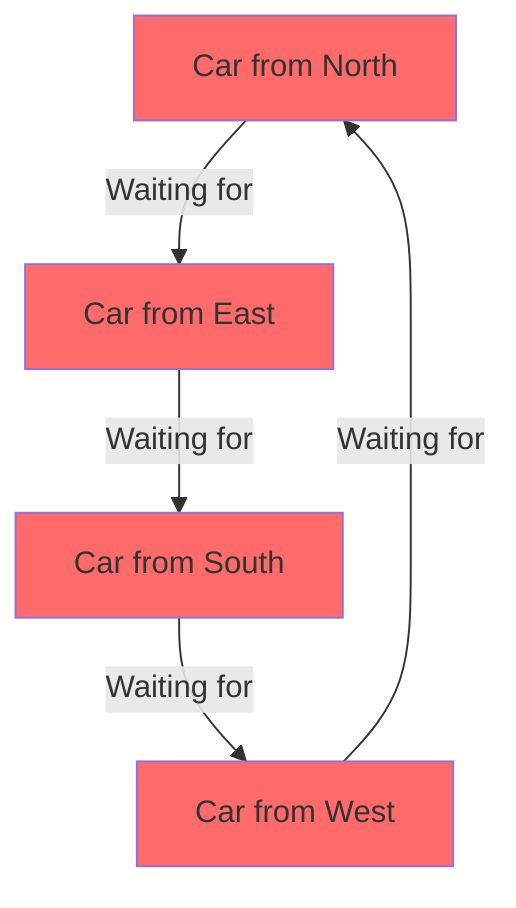

All cars waiting for each other → Deadlock!

---

## Necessary Conditions for Deadlock

Deadlock occurs **only if** all four conditions hold simultaneously:

### 1. Mutual Exclusion

At least one resource must be non-sharable (only one process can use at a time).

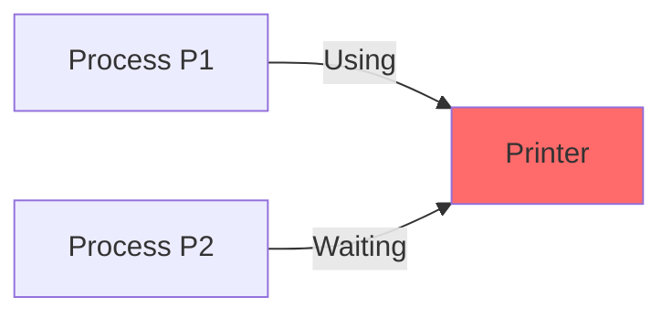

**Example:** Printer, Write access to file

### 2. Hold and Wait

Process holding at least one resource is waiting to acquire additional resources held by other processes.

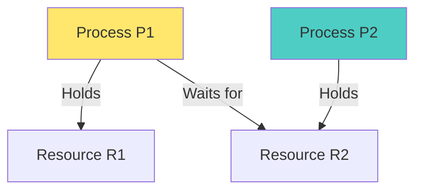

### 3. No Preemption

Resources cannot be forcibly taken away; must be released voluntarily.

```
Process P1 has Resource R1
OS cannot take R1 from P1
P1 must release R1 voluntarily
```

### 4. Circular Wait

Set of processes {P0, P1, ..., Pn} where:
- P0 waits for resource held by P1
- P1 waits for resource held by P2
- ...
- Pn waits for resource held by P0

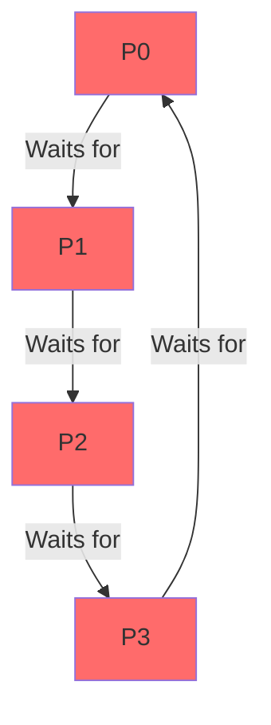

> [!IMPORTANT]
> All four conditions must be present for deadlock to occur. If any one is prevented, deadlock cannot happen.

---

## Resource Allocation Graph (RAG)

Visual representation of resource allocation and requests.

### Components

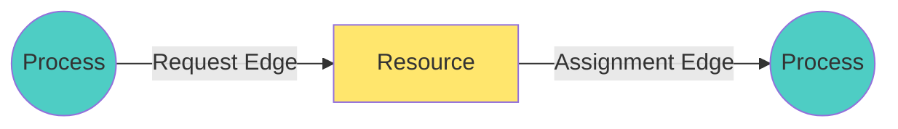

**Notation:**
- **Circle**: Process
- **Rectangle**: Resource type
- **Dots inside rectangle**: Resource instances
- **Arrow from Process to Resource**: Request
- **Arrow from Resource to Process**: Assignment

### Example: No Deadlock

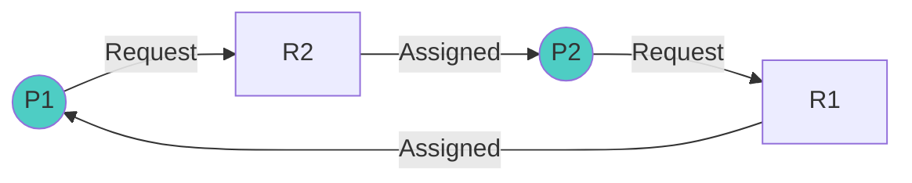

No cycle → No deadlock

### Example: Deadlock

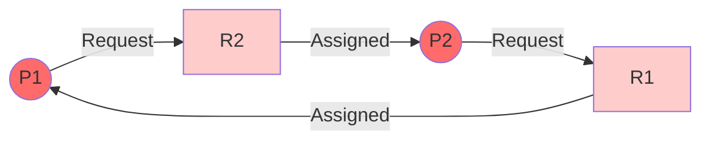

Cycle exists: P1 → R2 → P2 → R1 → P1 → Deadlock!

---

## Deadlock Handling Strategies

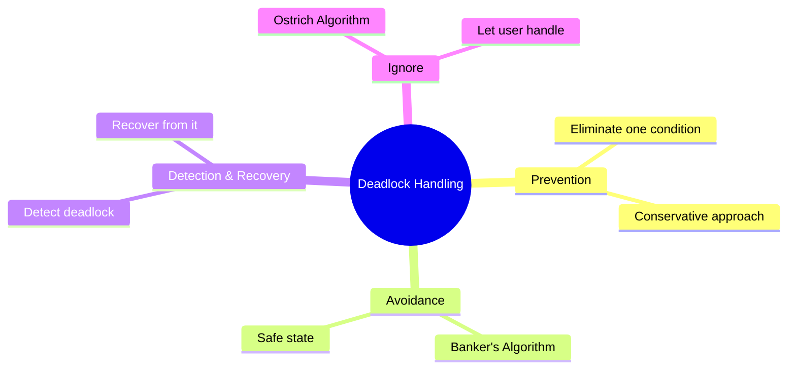

---

## Deadlock Prevention

Ensure at least one necessary condition cannot hold.

### 1. Eliminate Mutual Exclusion

Make resources sharable.

**Problem:** Not possible for non-sharable resources (printer, write access)

**Example:**
- ✓ Read-only files (sharable)
- ✗ Printer (non-sharable)

### 2. Eliminate Hold and Wait

Require process to request all resources at once before execution.

**Method 1:** Request all resources at start
```c
// Request all resources before starting
request(R1, R2, R3);
use_resources();
release(R1, R2, R3);
```

**Method 2:** Release all before requesting new
```c
hold(R1);
// Need R2 now
release(R1);
request(R1, R2);
```

**Advantages:**
- Prevents deadlock

**Disadvantages:**
- Low resource utilization
- Starvation possible
- May not know all resources needed in advance

### 3. Allow Preemption

Allow resources to be taken away.

**Methods:**
- If process requests unavailable resource, release all held resources
- Preempt resources from waiting processes

**Problem:** Not practical for all resources (printer can't be preempted mid-job)

**Works for:** CPU, memory (can be saved and restored)

### 4. Eliminate Circular Wait

Impose ordering on resource requests.

**Method:** Number all resources, request in increasing order

```c
// Resource ordering: R1=1, R2=2, R3=3

// Correct (increasing order)
request(R1);  // Order 1
request(R2);  // Order 2
request(R3);  // Order 3

// Incorrect (would be prevented)
request(R2);  // Order 2
request(R1);  // Order 1 - NOT ALLOWED!
```

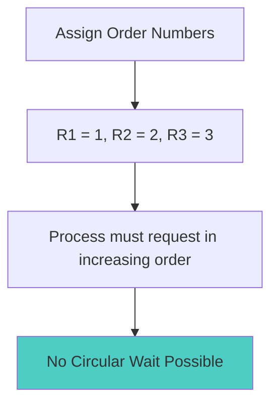

**Advantages:**
- Prevents circular wait
- Relatively practical

**Disadvantages:**
- May be inconvenient
- Difficult to find optimal ordering

---

## Deadlock Avoidance

System has additional information about resource requests and makes intelligent decisions.

### Safe State

System is in **safe state** if there exists a sequence of processes that can complete.

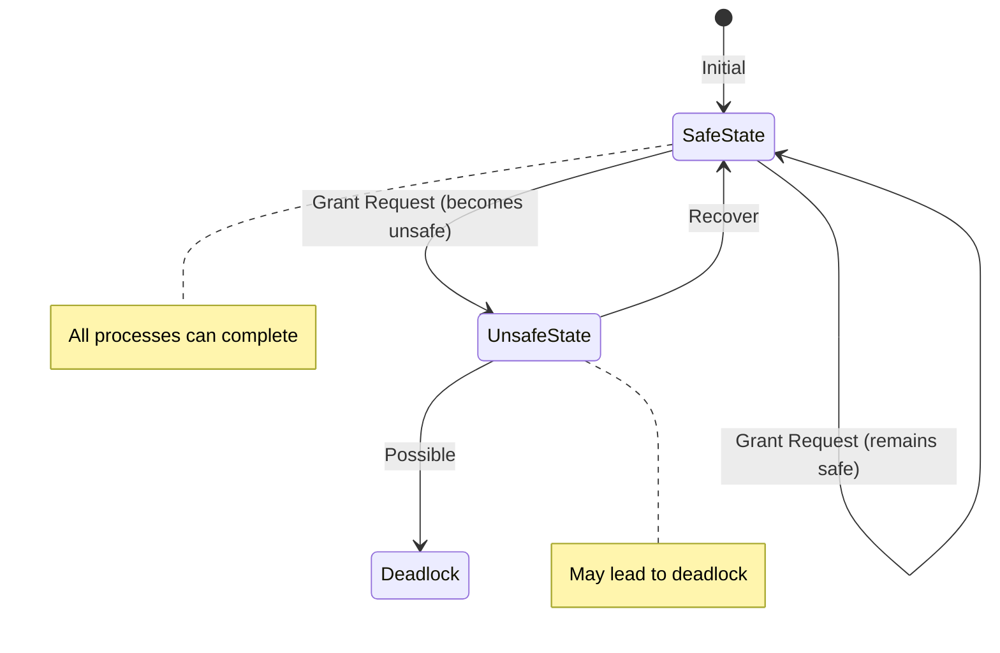

**Safe State:** Sequence exists where all processes can complete
**Unsafe State:** No such sequence exists (may lead to deadlock)

> [!NOTE]
> Unsafe state ≠ Deadlock (but may lead to it)

### Banker's Algorithm

Deadlock avoidance algorithm for multiple resource types.

#### Data Structures

```c
n = number of processes
m = number of resource types

Available[m]      // Available instances of each resource
Max[n][m]         // Maximum demand of each process
Allocation[n][m]  // Currently allocated to each process
Need[n][m]        // Remaining need of each process

Need[i][j] = Max[i][j] - Allocation[i][j]
```

#### Example

**System State:**
- Processes: P0, P1, P2, P3, P4
- Resources: A=10, B=5, C=7

| Process | Allocation (A,B,C) | Max (A,B,C) | Need (A,B,C) |
|---------|-------------------|-------------|--------------|
| P0 | 0, 1, 0 | 7, 5, 3 | 7, 4, 3 |
| P1 | 2, 0, 0 | 3, 2, 2 | 1, 2, 2 |
| P2 | 3, 0, 2 | 9, 0, 2 | 6, 0, 0 |
| P3 | 2, 1, 1 | 2, 2, 2 | 0, 1, 1 |
| P4 | 0, 0, 2 | 4, 3, 3 | 4, 3, 1 |

**Available:** A=3, B=3, C=2

#### Safety Algorithm

```
1. Work = Available = (3, 3, 2)
2. Finish[i] = false for all i

Find process Pi where:
  - Finish[i] = false
  - Need[i] ≤ Work

If found:
  - Work = Work + Allocation[i]
  - Finish[i] = true
  - Repeat

If all Finish[i] = true → Safe state
```

**Execution:**

```
Step 1: Check P0: Need(7,4,3) > Work(3,3,2) ✗
        Check P1: Need(1,2,2) ≤ Work(3,3,2) ✓
        Execute P1
        Work = (3,3,2) + (2,0,0) = (5,3,2)
        Finish[P1] = true

Step 2: Check P0: Need(7,4,3) > Work(5,3,2) ✗
        Check P2: Need(6,0,0) > Work(5,3,2) ✗
        Check P3: Need(0,1,1) ≤ Work(5,3,2) ✓
        Execute P3
        Work = (5,3,2) + (2,1,1) = (7,4,3)
        Finish[P3] = true

Step 3: Check P0: Need(7,4,3) ≤ Work(7,4,3) ✓
        Execute P0
        Work = (7,4,3) + (0,1,0) = (7,5,3)
        Finish[P0] = true

Step 4: Check P2: Need(6,0,0) ≤ Work(7,5,3) ✓
        Execute P2
        Work = (7,5,3) + (3,0,2) = (10,5,5)
        Finish[P2] = true

Step 5: Check P4: Need(4,3,1) ≤ Work(10,5,5) ✓
        Execute P4
        Work = (10,5,5) + (0,0,2) = (10,5,7)
        Finish[P4] = true

All processes finished!
Safe sequence: <P1, P3, P0, P2, P4>
System is in SAFE STATE
```

#### Resource Request Algorithm

When process requests resources:

```
Request[i] = request vector for process Pi

1. If Request[i] ≤ Need[i], go to step 2
   Else error (exceeds maximum claim)

2. If Request[i] ≤ Available, go to step 3
   Else wait (resources not available)

3. Pretend to allocate:
   Available = Available - Request[i]
   Allocation[i] = Allocation[i] + Request[i]
   Need[i] = Need[i] - Request[i]

4. Run safety algorithm
   If safe → grant request
   Else → restore old state, wait
```

**Advantages:**
- Guarantees no deadlock
- Less restrictive than prevention

**Disadvantages:**
- Requires advance knowledge of maximum needs
- Processes must state maximum resources
- Number of processes must be fixed
- Resources must be fixed

---

## Deadlock Detection and Recovery

Allow deadlocks to occur, detect them, and recover.

### Detection Algorithm

Similar to Banker's algorithm but without Max/Need.

```
1. Work = Available
2. Finish[i] = false if Allocation[i] ≠ 0

Find process Pi where:
  - Finish[i] = false
  - Request[i] ≤ Work

If found:
  - Work = Work + Allocation[i]
  - Finish[i] = true
  - Repeat

If any Finish[i] = false → Deadlock exists
```

### Recovery from Deadlock

#### 1. Process Termination

**Method 1:** Abort all deadlocked processes
- Simple
- Expensive (lose all work)

**Method 2:** Abort one process at a time until deadlock eliminated
- Less expensive
- Overhead of detection after each termination

**Selection Criteria:**
- Process priority
- Computation time
- Resources held
- Resources needed
- Number of processes to terminate

#### 2. Resource Preemption

**Steps:**
1. **Select victim**: Which process to preempt?
2. **Rollback**: Return to safe state
3. **Starvation**: Ensure same process not always victim

**Issues:**
- Which resources to preempt?
- How far to rollback?
- How to prevent starvation?

---

## Synchronization Mechanisms

### Semaphore

Integer variable accessed through two atomic operations: wait() and signal().

```c
// Semaphore definition
typedef struct {
    int value;
    struct process *list;  // Waiting queue
} semaphore;

// Wait operation (P operation)
wait(semaphore *S) {
    S->value--;
    if (S->value < 0) {
        // Add process to S->list
        block();
    }
}

// Signal operation (V operation)
signal(semaphore *S) {
    S->value++;
    if (S->value <= 0) {
        // Remove process from S->list
        wakeup(P);
    }
}
```

### Types of Semaphores

#### 1. Binary Semaphore (Mutex)

Value: 0 or 1

```c
semaphore mutex = 1;

// Critical section
wait(mutex);
// ... critical section ...
signal(mutex);
```

#### 2. Counting Semaphore

Value: Any non-negative integer

```c
semaphore resource = 5;  // 5 instances

wait(resource);
// Use resource
signal(resource);
```

### Example: Mutual Exclusion

```c
semaphore mutex = 1;

// Process P1
wait(mutex);
// Critical Section
signal(mutex);

// Process P2
wait(mutex);
// Critical Section
signal(mutex);
```

---

## Mutex

**Mutex** (Mutual Exclusion) is a locking mechanism.

```c
pthread_mutex_t lock;

pthread_mutex_init(&lock, NULL);

pthread_mutex_lock(&lock);
// Critical section
pthread_mutex_unlock(&lock);

pthread_mutex_destroy(&lock);
```

### Semaphore vs Mutex

| Aspect | Semaphore | Mutex |
|--------|-----------|-------|
| **Type** | Signaling mechanism | Locking mechanism |
| **Value** | Integer (0, 1, 2, ...) | Binary (locked/unlocked) |
| **Ownership** | No ownership | Owned by thread |
| **Release** | Any thread can signal | Only owner can unlock |
| **Use Case** | Synchronization, Resource counting | Mutual exclusion |
| **Operations** | wait(), signal() | lock(), unlock() |

---

## Producer-Consumer Problem

Classic synchronization problem.


**Problem:**
- Producer produces items, puts in buffer
- Consumer takes items from buffer
- Buffer has limited size
- Must synchronize access

### Solution Using Semaphores

```c
#define BUFFER_SIZE 10

semaphore mutex = 1;       // Mutual exclusion for buffer
semaphore empty = BUFFER_SIZE;  // Count of empty slots
semaphore full = 0;        // Count of full slots

int buffer[BUFFER_SIZE];
int in = 0, out = 0;

// Producer
void producer() {
    int item;
    while (true) {
        item = produce_item();
        
        wait(empty);       // Wait for empty slot
        wait(mutex);       // Enter critical section
        
        buffer[in] = item;
        in = (in + 1) % BUFFER_SIZE;
        
        signal(mutex);     // Exit critical section
        signal(full);      // Increment full count
    }
}

// Consumer
void consumer() {
    int item;
    while (true) {
        wait(full);        // Wait for full slot
        wait(mutex);       // Enter critical section
        
        item = buffer[out];
        out = (out + 1) % BUFFER_SIZE;
        
        signal(mutex);     // Exit critical section
        signal(empty);     // Increment empty count
        
        consume_item(item);
    }
}
```

**Explanation:**
- `mutex`: Ensures only one process accesses buffer
- `empty`: Counts empty slots (producer waits if 0)
- `full`: Counts full slots (consumer waits if 0)

---

## Deadlock vs Starvation

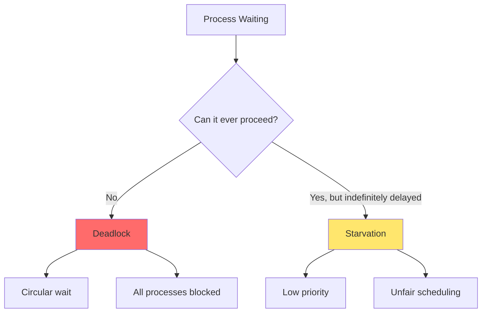

| Aspect | Deadlock | Starvation |
|--------|----------|------------|
| **Definition** | Processes waiting for each other | Process waiting indefinitely |
| **Cause** | Circular wait | Unfair resource allocation |
| **Processes Affected** | Multiple (circular) | Usually one |
| **Can Proceed?** | Never | Eventually (theoretically) |
| **Solution** | Prevention, Avoidance, Detection | Aging, Fair scheduling |
| **Example** | P1 waits for P2, P2 waits for P1 | Low-priority process never gets CPU |

### Starvation Example

```
High priority processes keep arriving
Low priority process never gets CPU
→ Starvation
```

**Solution: Aging**
- Gradually increase priority of waiting processes
- Eventually, even low-priority process gets high priority

---

## Practice Questions

### Multiple Choice Questions

1. **Which is NOT a necessary condition for deadlock?**
   - A) Mutual Exclusion
   - B) Hold and Wait
   - C) Preemption
   - D) Circular Wait
   
   **Answer: C** (No Preemption is the condition, not Preemption)

2. **Banker's algorithm is used for:**
   - A) Deadlock prevention
   - B) Deadlock avoidance
   - C) Deadlock detection
   - D) Deadlock recovery
   
   **Answer: B**

3. **In Producer-Consumer problem, what does 'full' semaphore represent?**
   - A) Number of empty slots
   - B) Number of full slots
   - C) Buffer size
   - D) Mutex lock
   
   **Answer: B**

4. **Difference between deadlock and starvation:**
   - A) Deadlock is permanent, starvation is temporary
   - B) Deadlock affects one process, starvation affects many
   - C) No difference
   - D) Starvation is worse
   
   **Answer: A**

5. **Which can signal a semaphore?**
   - A) Only the process that waited
   - B) Any process
   - C) Only the OS
   - D) Only the owner
   
   **Answer: B**

### Banker's Algorithm Problem

**Given:**
- Processes: P0, P1, P2
- Resources: A=10, B=5, C=7

| Process | Allocation | Max | Available |
|---------|-----------|-----|-----------|
| P0 | 0,1,0 | 7,5,3 | 3,3,2 |
| P1 | 2,0,0 | 3,2,2 | |
| P2 | 3,0,2 | 9,0,2 | |

**Question:** Is system in safe state? If yes, find safe sequence.

**Solution:**

Calculate Need:
- P0: (7,4,3)
- P1: (1,2,2)
- P2: (6,0,0)

```
Work = (3,3,2)

P1: Need(1,2,2) ≤ Work(3,3,2) ✓
Work = (3,3,2) + (2,0,0) = (5,3,2)

P0: Need(7,4,3) > Work(5,3,2) ✗
P2: Need(6,0,0) > Work(5,3,2) ✗

No process can proceed → UNSAFE STATE
```

---

## Important Points to Remember

> [!IMPORTANT]
> **For CCEE Exam:**
> - Know all four necessary conditions for deadlock
> - Understand difference between prevention and avoidance
> - Be able to solve Banker's algorithm problems
> - Know semaphore operations (wait/signal)
> - Understand Producer-Consumer problem
> - Differentiate deadlock vs starvation
> - Remember mutex vs semaphore differences

> [!TIP]
> **Study Strategy:**
> - Practice Banker's algorithm with different scenarios
> - Draw resource allocation graphs
> - Understand each deadlock handling method
> - Memorize semaphore code patterns
> - Create comparison tables for concepts
> - Practice identifying deadlock conditions

---

## Summary

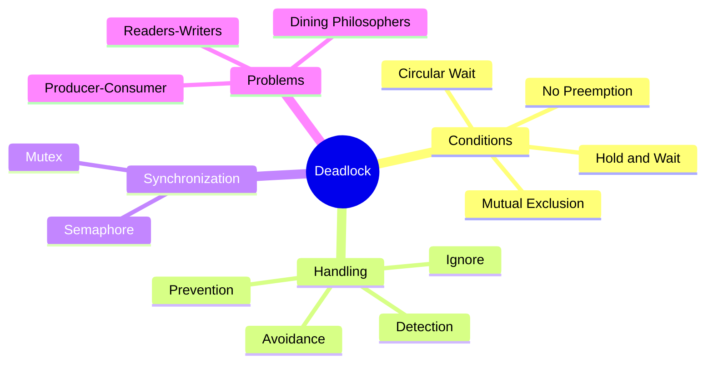

---

*End of Session 9 Notes*
